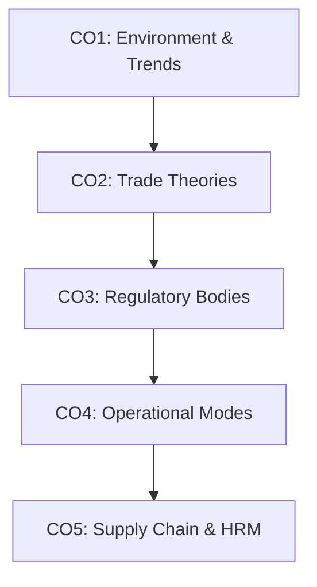

# MGN220 — Introduction to International Business
> **Complete World-Class University Notes & Exam Preparation System**
> Designed for Lovely Professional University (LPU) Students to secure maximum marks (A+ Grade) and master the global economy.

---

## 📖 Course Overview & Outcomes
This repository contains a structured, beginner-friendly, and academically rigorous study system for **MGN220: Introduction to International Business**. It is designed by educational experts to take you from absolute zero to topper-level conceptual mastery.

### Course Outcomes Mapping
*   **CO1**: Analyze the international business environment and global trends using framework analysis (PESTLE, SWOT).
*   **CO2**: Apply classical and modern international trade theories to evaluate country trade patterns.
*   **CO3**: Explain the regulatory and financial roles of major international bodies like WTO, IMF, World Bank, and ADB.
*   **CO4**: Discuss operational modes, entry strategies, and strategic configurations of MNCs.
*   **CO5**: Explain global supply chain management, international logistics, and international human resource management (IHRM).

---

## 🗂️ Study Directory Index

### 🗺️ Syllabus & Exam Pattern
*   [Course Overview](file:///c:/LPU_Study/MGN-220/syllabus/course-overview.md) — Objectives and outcomes.
*   [Detailed Syllabus](file:///c:/LPU_Study/MGN-220/syllabus/syllabus.md) — Topic-by-topic breakdown.
*   [Course Outcomes & Mapping](file:///c:/LPU_Study/MGN-220/syllabus/course-outcomes.md) — CO definitions and mapping.
*   [LPU Exam Pattern](file:///c:/LPU_Study/MGN-220/syllabus/exam-pattern.md) — Marks distribution and scoring guides.

---

### 📘 Unit-Wise Notes (With Real-World Cases & Diagrams)

| Unit | Title | Core Topics | Key Resources |
| :--- | :--- | :--- | :--- |
| **Unit 1** | **Business Environment** | Globalization, PESTLE, Legal systems, AI in IB | [Unit 1 Folder](file:///c:/LPU_Study/MGN-220/unit-1-international-business-environment/) \| [Detailed Notes](file:///c:/LPU_Study/MGN-220/unit-1-international-business-environment/01-detailed-notes.md) |
| **Unit 2** | **International Trade** | Mercantilism, Comparative Advantage, WTO, EU | [Unit 2 Folder](file:///c:/LPU_Study/MGN-220/unit-2-international-trade/) \| [Detailed Notes](file:///c:/LPU_Study/MGN-220/unit-2-international-trade/01-detailed-notes.md) |
| **Unit 3** | **Global Monetary System** | Foreign Exchange (Forex), IMF, World Bank, ADB | [Unit 3 Folder](file:///c:/LPU_Study/MGN-220/unit-3-global-monetary-system/) \| [Detailed Notes](file:///c:/LPU_Study/MGN-220/unit-3-global-monetary-system/01-detailed-notes.md) |
| **Unit 4** | **Strategy & Structure** | Integration-Responsiveness, Entry Modes, Alliances | [Unit 4 Folder](file:///c:/LPU_Study/MGN-220/unit-4-strategy-and-structure/) \| [Detailed Notes](file:///c:/LPU_Study/MGN-220/unit-4-strategy-and-structure/01-detailed-notes.md) |
| **Unit 5** | **Business Operations** | Exporting, Letter of Credit, Outsourcing, Sourcing | [Unit 5 Folder](file:///c:/LPU_Study/MGN-220/unit-5-international-business-operations/) \| [Detailed Notes](file:///c:/LPU_Study/MGN-220/unit-5-international-business-operations/01-detailed-notes.md) |
| **Unit 6** | **Marketing & GHRM** | 4Ps Adaptation, R&D, Staffing (Ethno/Poly/Geo) | [Unit 6 Folder](file:///c:/LPU_Study/MGN-220/unit-6-global-marketing-and-hrm/) \| [Detailed Notes](file:///c:/LPU_Study/MGN-220/unit-6-global-marketing-and-hrm/01-detailed-notes.md) |

---

### 📝 Exam Preparation & Topper Resources
*   [Previous Year Questions](file:///c:/LPU_Study/MGN-220/previous-year-questions/) — Fully solved PYQs (2022 - 2024).
*   [Topper Answer Sheets](file:///c:/LPU_Study/MGN-220/topper-answer-sheets/) — Sample answers for 2, 5, 8, and 10 mark questions to understand presentation strategies.
*   [Cheat Sheets](file:///c:/LPU_Study/MGN-220/cheat-sheets/) — Final night notes, memory tricks, and quick formula cards.
*   [Case Studies](file:///c:/LPU_Study/MGN-220/case-studies/) — Deep dives on Apple, Amazon, Tesla, Netflix, and McDonald's.
*   [Exam Preparation Guide](file:///c:/LPU_Study/MGN-220/exam-preparation/) — Top 50 questions, definitions glossary, and writing strategy.
*   [Current Affairs & Trends](file:///c:/LPU_Study/MGN-220/current-affairs/) — WTO updates, IMF policies, and AI trends.

---

## ⚡ Topper's Exam Strategy (LPU Exam Specific)
1.  **Structure is Key**: Never write huge blocks of text. Divide answers into:
    - *Definition / Key Term*
    - *Introduction / Core Idea*
    - *Schematic/Flowchart representation*
    - *Detailed explanation points*
    - *Real-life corporate example (e.g. McDonald's or Apple)*
    - *Conclusion / Strategic Insight*
2.  **Draw Diagrams**: In every 5 and 10 mark question, draw at least one visual layout (e.g. the Integration-Responsiveness Matrix or Export Flowchart).
3.  **Use Mnemonics**: Memorize structures using the cheatsheets (e.g. **EPG** for Staffing Policies: Ethnocentric, Polycentric, Geocentric).

---

## 🛠️ How to Use This Repository
- **Step 1**: Review the [Detailed Syllabus](file:///c:/LPU_Study/MGN-220/syllabus/syllabus.md) and [Exam Pattern](file:///c:/LPU_Study/MGN-220/syllabus/exam-pattern.md).
- **Step 2**: Study chapter notes unit-by-unit, leveraging the **Mermaid Diagrams** and **Comparison Matrices**.
- **Step 3**: Review the **Topper Answer Sheets** to learn how to present answers.
- **Step 4**: Use the **One-Page Revision Sheets** the night before the exam to lock in key concepts.

---
*All content complies with the Lovely Professional University curriculum guidelines for MGN220.*