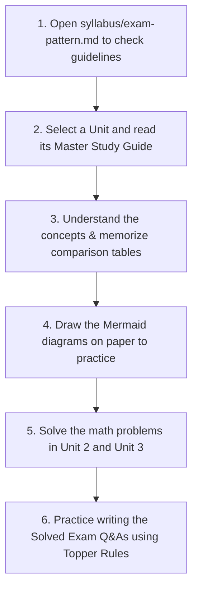

# MGN220 — Introduction to International Business
> **Complete World-Class University Study System & Exam Preparation Guide**
> Designed for Lovely Professional University (LPU) Students to master the global economy and secure a perfect A+ Grade.

---

## 🗺️ Welcome to the New Reorganized Repository!
We have completely restructured this repository to make studying simple, direct, and distraction-free. 
Instead of forcing you to hunt through dozens of fragmented directories (`cheat-sheets`, `current-affairs`, `case-studies`, `topper-answer-sheets`, etc.), we have merged all relevant content into **6 Master Study Guides**—one for each unit.

Each **Master Study Guide** contains:
1.  **Concept Lectures (Zero-to-Hero)**: Written from absolute basics with clear definitions and daily-life analogies.
2.  **Visual Mermaid Diagrams**: Flowcharts and matrix structures for visual learners.
3.  **Solved Corporate Case Studies**: Deep dives into companies like Apple, Tesla, McDonald's, and Amazon.
4.  **Integrated Current Affairs**: Global trade trends, geopolitical events, and AI applications.
5.  **Rapid Revision Cheat Sheets**: Mnemonics, comparison tables, and quick glossary terms.
6.  **Solved Exam Question Banks**: Classified by LPU marks distribution (2-Mark compulsory, 5-Mark medium, 10-Mark long topper-style answers, and solved calculations).

---

## 🗂️ Course Study Index

### 🗺️ Syllabus & Exam Pattern
- [Course Overview](file:///c:/LPU_Study/MGN-220/syllabus/course-overview.md) — Objectives and course outcomes.
- [Detailed Syllabus](file:///c:/LPU_Study/MGN-220/syllabus/syllabus.md) — Topic-by-topic curriculum breakdown.
- [Course Outcomes & Mapping](file:///c:/LPU_Study/MGN-220/syllabus/course-outcomes.md) — How topics map to COs.
- [LPU Exam Pattern](file:///c:/LPU_Study/MGN-220/syllabus/exam-pattern.md) — Marks distribution, sections, and scoring weights.

---

### 📘 Unit-Wise Master Study Guides

| Unit | Title | Core Syllabus Topics | Master Study Link |
| :--- | :--- | :--- | :--- |
| **Unit 1** | **Business Environment** | Globalization, PESTLE framework, Political systems, Common/Civil/Theocratic Law, Economic systems, HDI, Technological diffusion, AI in IB. | [Unit 1 Master Guide](file:///c:/LPU_Study/MGN-220/unit-1-international-business-environment/study-guide.md) |
| **Unit 2** | **International Trade** | Classical trade theories, Porter's Diamond, Factor Mobility, Stages of Integration, WTO, EU, Brexit. *Includes solved math problems.* | [Unit 2 Master Guide](file:///c:/LPU_Study/MGN-220/unit-2-international-trade/study-guide.md) |
| **Unit 3** | **Global Monetary System** | Forex functions, exchange rate determination, Hedging vs. Speculation vs. Arbitrage, IMF, World Bank, ADB. *Includes bid-ask spread math.* | [Unit 3 Master Guide](file:///c:/LPU_Study/MGN-220/unit-3-global-monetary-system/study-guide.md) |
| **Unit 4** | **Strategy & Structure** | Integration-Responsiveness GLIT Grid, foreign entry modes, strategic alliances, vertical/horizontal differentiation, global structures. | [Unit 4 Master Guide](file:///c:/LPU_Study/MGN-220/unit-4-strategy-and-structure/study-guide.md) |
| **Unit 5** | **Business Operations** | Export/Import steps, Bill of Lading, Letter of Credit, Countertrade, Make-or-Buy, Global production location, logistics. | [Unit 5 Master Guide](file:///c:/LPU_Study/MGN-220/unit-5-international-business-operations/study-guide.md) |
| **Unit 6** | **Marketing & GHRM** | 4Ps adaptation vs. standardization, global R&D centers, EPG staffing policies (PCN/HCN/TCN), expatriate failure, repatriation. | [Unit 6 Master Guide](file:///c:/LPU_Study/MGN-220/unit-6-global-marketing-and-hrm/study-guide.md) |

---

## ⚡ Topper's Exam Writing Strategy (For Full Marks)

LPU examiners value structure, presentation, and practical application. When writing 5-mark and 10-mark answers, always follow this structure:

1.  **Define Key Terms**: Start with a formal definition or quick description (e.g., *"According to David Ricardo, comparative advantage..."*).
2.  **Draw the Flowchart/Diagram**: Draw a clean diagram (like the GLIT matrix or Letter of Credit flow). A diagram makes your sheet look professional immediately.
3.  **Use Bulleted Headings**: Never write large paragraphs. Break points down using bold headers with 2-3 explanatory lines.
4.  **Cite Corporate Examples**: Mention real-world corporations (e.g., *"Tesla using Wholly Owned Subsidiaries in China"* or *"McDonald's using a localization marketing mix in India"*).
5.  **Write a Strategic Conclusion**: Summarize in 2 sentences the strategic choice a manager must make.

---

## 🚀 How to Study This Repo to Get 100% Marks

*All content is designed to align with the Lovely Professional University curriculum guidelines for MGN220.*