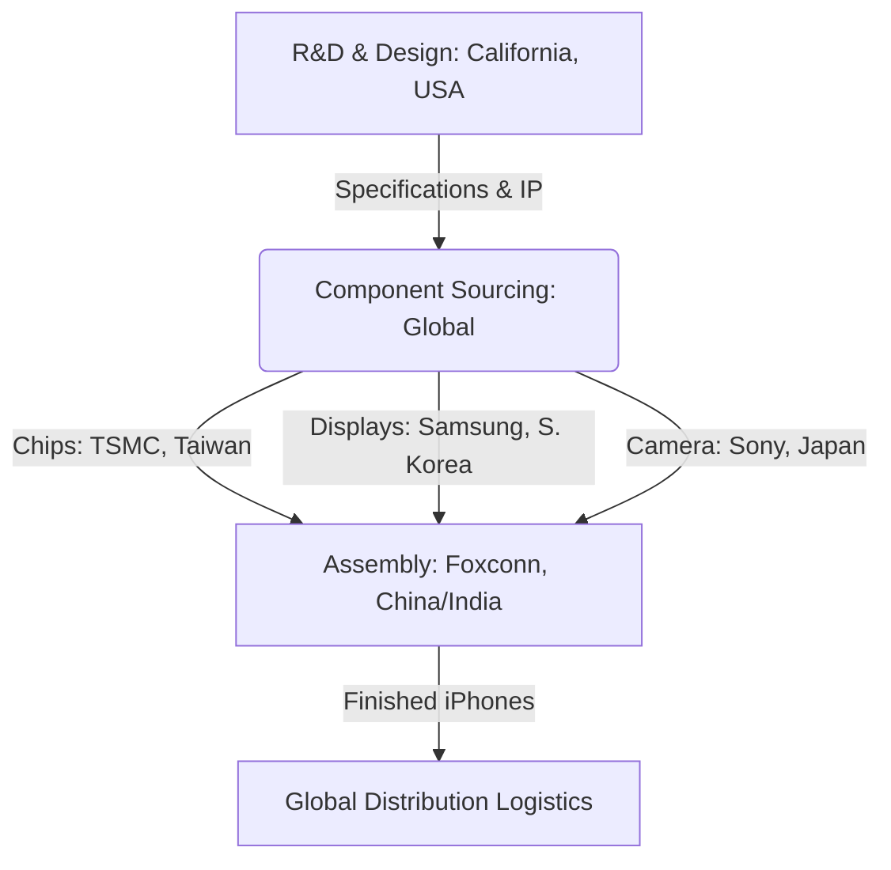

# Case Study: Apple's Global Production and Supply Chain Configuration

## 1. Background & Context
Apple Inc. is renowned for its high-margin hardware products (iPhone, iPad, Mac). Rather than manufacturing these goods in-house in the US, Apple pioneered a highly coordinated global value chain. The products are "Designed by Apple in California" but "Assembled in China" (and increasingly India/Vietnam).

## 2. Supply Chain Architecture
Apple relies on a highly fragmented supply chain that leverages localized advantages:
- **Design & High-Value R&D**: Retained in Silicon Valley to protect intellectual property and leverage top engineering talent.
- **High-End Components**: Sourced from specialized global suppliers:
  - Microprocessors from **TSMC (Taiwan)**.
  - Displays from **Samsung/LG (South Korea)**.
  - Camera sensors from **Sony (Japan)**.
- **Assembly**: Contracted out to **Foxconn** and **Pegatron** in mainland China, utilizing massive labor pools, highly skilled manufacturing engineers, and extensive manufacturing clusters (Shenzhen/Zhengzhou).

## 3. Strategic Shifts & Geopolitical Risks
Recent trade disputes between the US and China, COVID-19 lockdowns (e.g., in "iPhone City" Zhengzhou), and rising labor costs in China have exposed the risks of over-centralization. 
- **China+1 Strategy**: Apple is diversifying production, relocating up to 25% of iPhone assembly to **India** (Foxconn plants in Tamil Nadu) and iPad/AirPods assembly to **Vietnam**.

## 4. Exam-Oriented Analysis & Solved Questions

### Q1: Explain how Apple applies Heckscher-Ohlin (Factor Proportions) Theory in its global operations. (5 Marks)
* **Topper's Answer**:
  - **Theory Explanation**: The Heckscher-Ohlin theory states that a country will export goods that use its abundant factors of production intensively.
  - **Application to Apple**:
    - **United States**: Abundant in highly skilled labor and capital (R&D, design, software engineering). Apple retains design in California.
    - **China/India**: Historically abundant in semi-skilled and skilled manufacturing labor. Apple outsources the assembly (labor-intensive phase) to these countries.
  - **Conclusion**: By splitting the value chain, Apple maximizes cost efficiencies by matching each production stage to the country with the most abundant and cost-effective factor of production.

### Q2: Evaluate the benefits and risks of Apple's outsourcing strategy. (5 Marks)
* **Topper's Answer**:
  - **Benefits**:
    - Focus on core competencies (marketing, software, design).
    - Reduced capital investment in physical factories.
    - Ability to scale production quickly to match product launch demands.
  - **Risks**:
    - Geopolitical vulnerability (Tariffs, trade wars).
    - Intellectual property theft risk.
    - Supply chain disruptions (lockdowns, labor strikes).
    - Ethical labor concerns (Foxconn worker welfare issues impact Apple's brand value).
