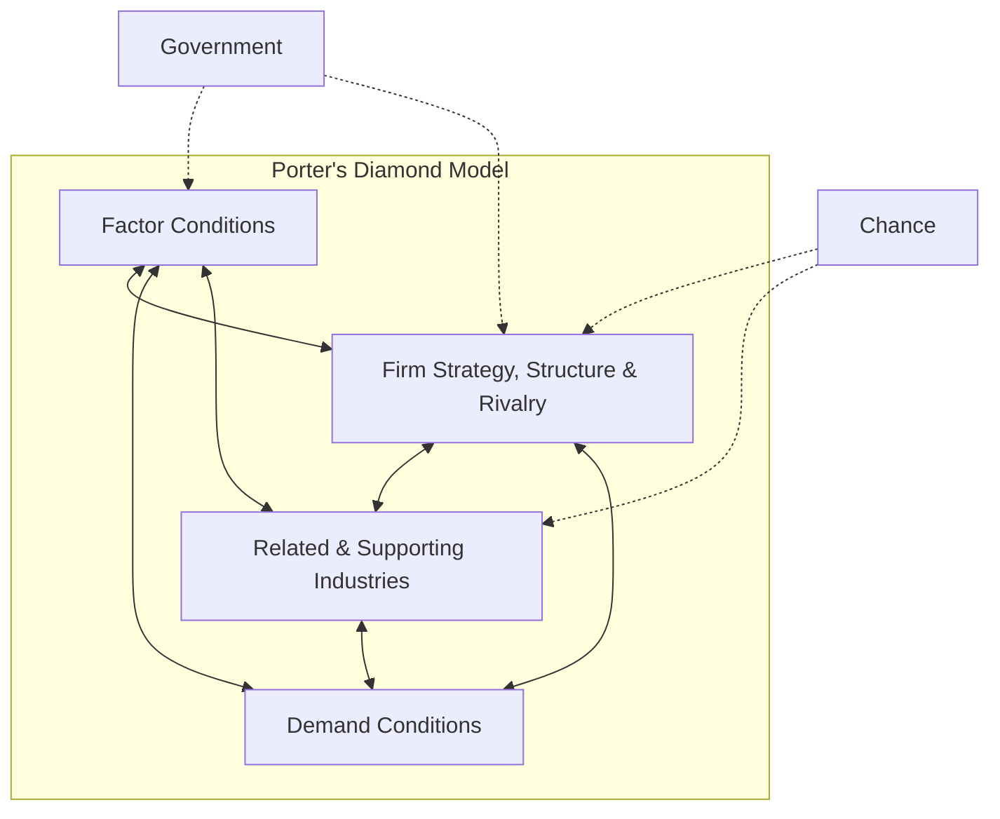

# Topper Solved Answers: 10-Mark Questions (Comprehensive Analysis)

> [!TIP]
> **Exam Strategy**: Target 300-450 words. Must contain:
> 1. Clear theoretical framework definition.
> 2. Structured, labeled headings.
> 3. Large, clear diagrams (ASCII/Mermaid).
> 4. Detailed comparison tables.
> 5. Real-life business cases.
> 6. Strategic evaluation summary.

---

### Q1: Critically evaluate Michael Porter's National Competitive Advantage (Porter's Diamond Model) with a diagram.
**Topper's Answer**:

#### 1. Theoretical Concept & Origin
Proposed by Michael Porter in 1990, the Diamond Model explains why a nation achieves international success in a particular industry. It argues that the home country environment plays a critical role in shaping the competitiveness of domestic firms.

#### 2. The Four Attributes of the Diamond
The diamond consists of four mutually reinforcing factors:
1. **Factor Conditions**: A nation's position in factors of production (e.g., skilled labor, infrastructure). Porter distinguishes between *Basic Factors* (natural resources, climate) and *Advanced Factors* (R&D facilities, highly educated engineers). Advanced factors are critical for competitive advantage.
2. **Demand Conditions**: The nature of home demand for the industry's product. Demanding and sophisticated domestic consumers push firms to innovate and improve quality (e.g., Japanese electronic buyers).
3. **Related and Supporting Industries**: The presence of supplier industries that are internationally competitive. Having local, world-class suppliers provides early access to inputs and collaborative innovation (e.g., Italy's leather supply chain for shoes).
4. **Firm Strategy, Structure, and Rivalry**: How companies are created, organized, and managed, and the nature of domestic rivalry. Intense domestic competition breeds tough competitors that are ready for global markets (e.g., German automotive rivalry between BMW, Mercedes, and Audi).

#### 3. Support Factors
- **Government**: Can influence the four attributes through tax policy, subsidies, education investment, and safety regulations.
- **Chance**: Random events (wars, scientific breakthroughs, resource discoveries) that can disrupt competitive configurations.

#### 4. Mermaid Structural Diagram

#### 5. Critical Evaluation & Limitations
- **Focus on Home Country**: The model assumes that competitive advantage is rooted in a single country. Modern MNCs utilize global networks (assembly in China, software in India, design in US), weakening the influence of the domestic home base.
- **Inapplicability to Small Nations**: Small economies like Singapore or Switzerland succeed internationally without massive domestic demand conditions, by catering to global markets from day one.

#### 6. Case Study: German Premium Automobile Industry
- **Factor Conditions**: Highly skilled engineers trained via Germany's dual vocational system.
- **Demand Conditions**: High-speed Autobahns demand highly durable, high-performance cars.
- **Supporting Industries**: Advanced steel, machining, and engineering component networks.
- **Strategy/Rivalry**: Fierce domestic competition between Mercedes, BMW, and Audi.

#### 7. Conclusion
While Porter's Diamond remains a fundamental tool for national policy design, contemporary managers must evaluate it in a globalized context where resource acquisition is borderless.
