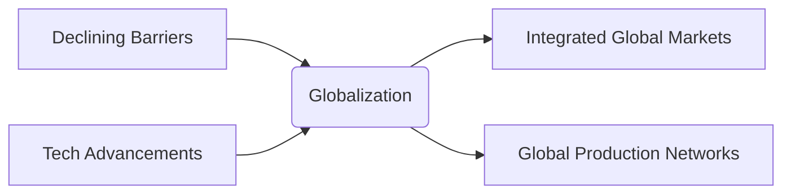

# Unit 1 — Globalization

## 1. Introduction & Conceptual Foundation
Globalization is the process of increasing integration and interdependence among national economies. It involves the integration of markets, technologies, policies, and cultures across international boundaries.

## 2. Drivers of Globalization
1. **Declining Barriers to Trade and Investment**: Reductions in tariff rates and removal of restrictions on FDI since WWII (facilitated by GATT/WTO).
2. **Technological Change**: Advances in microprocessors, telecommunications, the Internet, and transportation logistics (containerization).

## 3. Real-World Business Example
- **Apple Inc.**: Leverages globalization by designing products in California, sourcing components from S. Korea/Japan, and assembling in China/India.

## 4. Visual Diagram

## 5. Solved Scenario-Based Question (LPU Exam Style)
> **Scenario**: *TechVeda Ltd., an Indian software company, wants to establish a customer support center. It is debating between setting up a local team in Bangalore or using an AI-based virtual support agency located in the Philippines to handle its European clients.*
> 
> **Question**: Analyze how the drivers of globalization impact TechVeda's decision and recommend the best course of action. (10 Marks)
> 
> **Topper's Answer**:
> - **Definition**: Globalization drivers include technological diffusion and cost-efficiency sourcing.
> - **Analysis of Drivers**:
>   1. *Technological Change*: High-speed internet and cloud-based AI enable real-time communication across Europe, India, and the Philippines.
>   2. *Cost Sourcing*: The Philippines offers lower labor costs for English-speaking agents relative to Europe.
> - **Recommendation**: TechVeda should adopt a **hybrid approach** (Transnational). Use the AI-based Philippine agency for basic queries (Level 1 support) to save costs, while retaining a specialized Bangalore team for complex software debugging (Level 2 support). This minimizes cost while maintaining quality.
