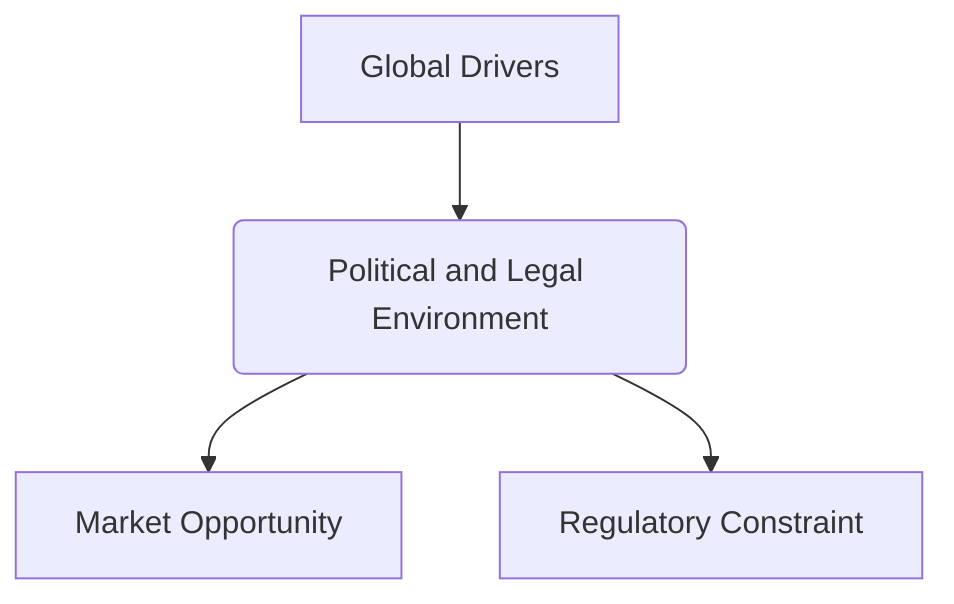

# Unit 1 — Political and Legal Environment

## 1. Introduction
This chapter covers details on **Political and Legal Environment** in the context of the international business environment.

## 2. Conceptual Overview
Detailed understanding of how Political and Legal Environment affects multinational strategies and operational layouts.

## 3. Core Characteristics & Dimensions
- High volatility and rapid structural changes.
- Complex interdependence across regulatory framework boundaries.

## 4. Real-World Business Case
- **Apple Inc.**: Global supply chain optimization leveraging cost efficiencies in different countries.
- **Tesla**: Developing local manufacturing hubs (Gigafactories) in Berlin and Shanghai to adapt to regional parameters.

## 5. Visual Representation

## 6. Exam Prep & Top Questions
- **Short Question (2 Marks)**: Explain the core definition of Political and Legal Environment.
- **Long Question (10 Marks)**: Critically analyze how Political and Legal Environment impacts local industries.

## 7. MCQs
1. Which factor is a key driver of Political and Legal Environment?
   - [x] Technological advancement
   - [ ] Domestic focus
   - [ ] Strict isolationism
