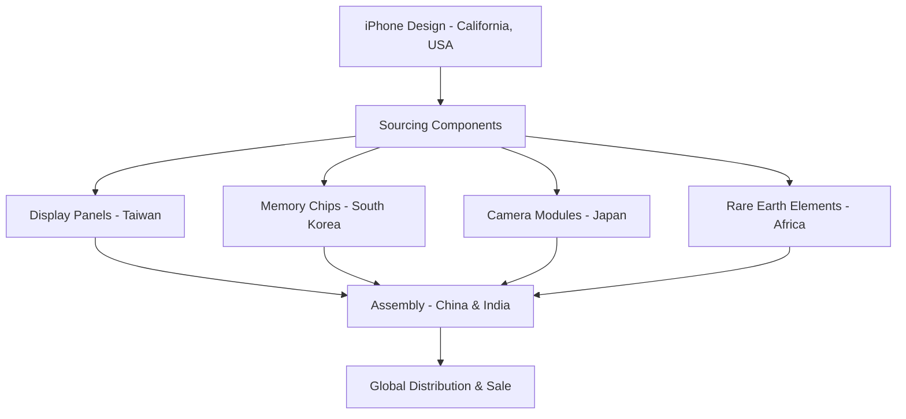
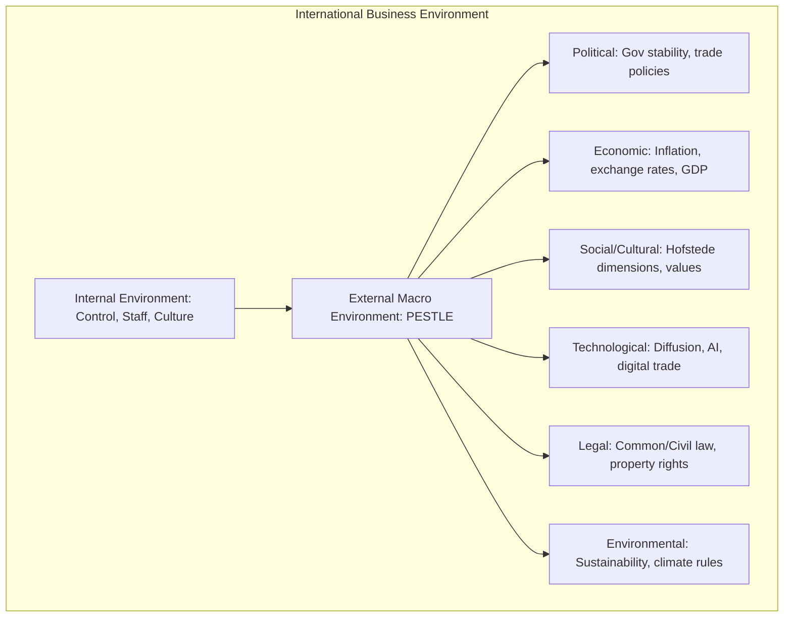
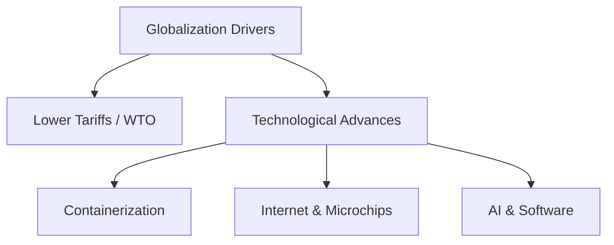
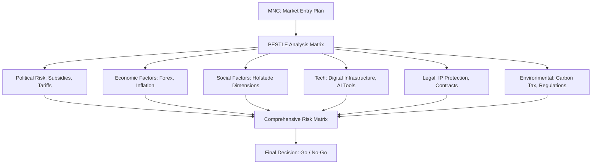
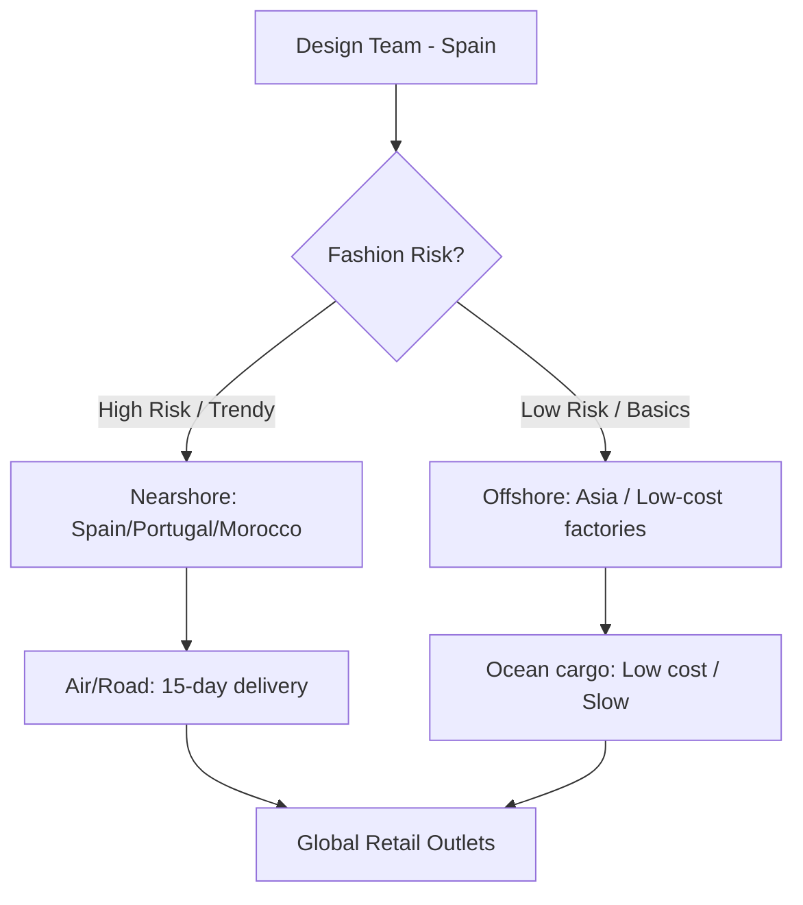

# Unit 1 — International Business Environment: Master Study Guide

Welcome to your ultimate companion for Unit 1. This guide is structured to take you from absolute zero to conceptual mastery. It integrates detailed theory, relatable everyday analogies, real-world corporate cases, current affairs, rapid revision cheat sheets, and a complete question bank based on LPU exam patterns to help you secure a perfect 100% score (A+ Grade).

---

## 📌 Table of Contents
1. [Core Lectures: Concept Explanations](#1-core-lectures-concept-explanations)
   - [What is International Business?](#what-is-international-business)
   - [Globalization: Meaning, Drivers, and Impact](#globalization-meaning-drivers-and-impact)
   - [The IB Environment & PESTLE Framework](#the-ib-environment--pestle-framework)
   - [Globalization & Society: Social Challenges & Ethics](#globalization--society-social-challenges--ethics)
   - [Political & Legal Environments](#political--legal-environments)
   - [Economic Environment & Development Indices](#economic-environment--development-indices)
   - [Technological Environment & AI in IB](#technological-environment--ai-in-ib)
2. [Solved Corporate Case Studies](#2-solved-corporate-case-studies)
   - [Case 1: Apple Inc.'s Global Production Shift](#case-1-apple-incs-global-production-shift)
   - [Case 2: Netflix's Global Expansion & Adaptation](#case-2-netflixs-global-expansion--adaptation)
3. [Rapid Revision Cheat Sheet](#3-rapid-revision-cheat-sheet)
   - [PESTLE Summary & Mnemonics](#pestle-summary--mnemonics)
   - [Comparison Matrix: Legal & Economic Systems](#comparison-matrix-legal--economic-systems)
   - [Key Glossary Definitions](#key-glossary-definitions)
4. [Exam Practice Q&A Bank](#4-exam-practice-qa-bank)
   - [2-Mark Short Compulsory Questions](#2-mark-short-compulsory-questions)
   - [5-Mark Medium-Length Questions](#5-mark-medium-length-questions)
   - [10-Mark Long/Analytical Questions (Topper Answers)](#10-mark-longanalytical-questions-topper-answers)
   - [Case-Based Exam Questions](#case-based-exam-questions)

---

## 1. Core Lectures: Concept Explanations

### What is International Business?

#### 💡 The Cookie Analogy (Relate & Feel)
Imagine you bake delicious chocolate chip cookies in your kitchen and sell them to your neighbor next door. You deal in your domestic currency, speak the same language, and know exactly what they like. This is **Domestic Business**. 
Now, imagine you mail those same cookies to a buyer in Paris. Suddenly, you have to ship them across ocean borders, pay French customs duties, price them in Euros (€), translate the packaging ingredients into French, and make sure they comply with European Union food safety laws. This is **International Business (IB)**. 

#### 🎓 Formal Academic Definition
> **International Business** consists of all commercial transactions—including sales, investments, transportation, and services—that take place between two or more countries or regions outside of their political boundaries. It involves not just multinational corporations (MNCs) but also governments and small-to-medium enterprises (SMEs).

#### Why do companies engage in IB?
1. **Sales Expansion**: Markets like the US or Europe may be saturated. Developing nations (e.g., India, Brazil) present massive middle-class customer bases.
2. **Resource Acquisition**: Accessing cheaper labor, advanced technologies, or raw materials not available domestically (e.g., tech companies sourcing cobalt from the Democratic Republic of Congo).
3. **Risk Diversification**: If one country's economy enters a recession, profits from other growing markets can offset the loss.

---

### Globalization: Meaning, Drivers, and Impact

#### What is Globalization?
Globalization is the shift toward a more integrated and interdependent world economy. It has two main components:
1. **The Globalization of Markets**: Merging historically distinct and separate national markets into one huge global marketplace (e.g., Coca-Cola, Apple iPhones, and Starbucks coffee are sold and recognized worldwide).
2. **The Globalization of Production**: Sourcing goods and services from locations around the globe to take advantage of national differences in the cost and quality of factors of production (such as labor, energy, land, and capital).

#### 🚘 Corporate Example: The Apple iPhone
An iPhone is not "Made in California"—it is only *designed* there. Its components are sourced worldwide:

#### What Drives Globalization?
- **Declining Trade & Investment Barriers**: Since WWII, GATT (now WTO) has successfully pushed governments to lower tariffs (taxes on imports) and remove non-tariff barriers, making cross-border trade cheaper.
- **Technological Advances**:
  - **Containerization**: Standardized shipping containers revolutionized logistics. Moving goods from a factory in Shanghai to a warehouse in Chicago is now incredibly cheap and fast.
  - **Microprocessors and Telecommunications**: High-speed internet allows real-time global coordination of offices and supply chains.
  - **Artificial Intelligence (AI)**: Instantly translates contract documents, manages stock, and automates supply chains.

---

### The IB Environment & PESTLE Framework

A business operates inside a complex environment. Unlike the domestic environment where factors are relatively predictable, the international environment contains multiple layers of macro-environmental forces.

#### PESTLE Dimensions Explained:
*   **Political**: Government stability, risk of nationalization, tax policy, trade tariffs.
*   **Economic**: Currency exchange rates, inflation rates, interest rates, economic growth stages.
*   **Social (Cultural)**: Demographics, consumer lifestyles, and cultural norms (e.g., using **Hofstede’s Cultural Dimensions** like Power Distance or Individualism to understand employee behavior).
*   **Technological**: The pace of innovation, infrastructure quality, intellectual property protection online.
*   **Legal**: The type of legal system (e.g., Common Law, Civil Law, Theocratic Law) and local labor regulations.
*   **Environmental**: Climate change regulations, carbon tax policies, green energy initiatives.

---

### Globalization & Society: Social Challenges & Ethics

While globalization increases economic efficiency, it poses severe cultural, social, and ethical dilemmas:

1. **Job Displacement vs. Wealth Creation**: Manufacturing jobs often move from high-wage countries (like the US) to low-wage countries (like Vietnam). While this creates wealth in developing countries, it causes industrial decline in the home country.
2. **Labor Exploitation (The Sweatshop Dilemma)**: MNCs are often accused of exploiting weak labor laws in developing nations (e.g., Nike's sweatshop crisis in the 1990s or child labor in cocoa farming).
3. **Environmental Degradation**: Pollution and carbon emissions rise as manufacturing is outsourced to countries with loose environmental regulations (a phenomenon known as the "Pollution Haven Hypothesis").
4. **Cultural Homogenization**: Critics argue globalization leads to "Americanization" or "McDonaldization"—where local cultures and traditions are erased by global consumer brands.

---

### Political & Legal Environments

Every country has its own political and legal structures that dictate how business is conducted.

#### Political Systems
- **Democracy**: Citizens elect representatives to govern. Businesses enjoy high freedom, protection of individual rights, and clear regulatory predictability.
- **Totalitarianism**: A single political party, dictator, or group controls all aspects of life. Businesses face high risk of sudden policy changes, corruption, or nationalization of assets (e.g., Venezuela nationalizing oil companies).

#### Legal Systems
1. **Common Law**: Based on tradition, past practices, and legal precedents set by courts. Judges interpret the law flexibly (e.g., USA, UK, India).
2. **Civil Law**: Based on a detailed set of written laws organized into codes. Judges have less flexibility; they apply the code exactly as written (e.g., France, Germany, Japan).
3. **Theocratic Law**: Based on religious teachings. For example, Islamic Law (Shariah) prohibits charging interest (*Riba*), forcing banks to use profit-sharing models (e.g., Saudi Arabia, Iran).

---

### Economic Environment & Development Indices

Firms categorize nations by their economic systems to evaluate market attractiveness:

1. **Market Economy**: Goods and services are privately owned. Production and prices are determined by supply and demand via the price mechanism.
2. **Command Economy**: The government plans and controls all economic activity, setting production quotas and prices (e.g., North Korea).
3. **Mixed Economy**: A blend of market and command elements. Key sectors (like infrastructure or healthcare) are state-controlled, while others are left to private enterprise (e.g., India, Sweden).

#### Economic Development Indices:
- **GDP (Gross Domestic Product)**: Total value of goods and services produced *within* a nation’s borders.
- **GNI (Gross National Product/Income)**: GDP plus income earned by citizens working abroad, minus income earned by foreigners domestically.
- **HDI (Human Development Index)**: Created by the UN, it measures quality of life based on:
  1. Life expectancy at birth (health)
  2. Average years of schooling (education)
  3. GNI per capita at purchasing power parity (standard of living)

---

### Technological Environment & AI in IB

#### Technological Diffusion
This is the speed at which technology spreads across national borders. In the modern era, technological diffusion is almost instantaneous due to digital networks. 

#### Digital Trade & AI Applications in International Business:
- **AI-Powered Macro-Risk Monitoring**: Algorithms crawl news, social media, and regulatory updates in real-time to warn MNCs of impending political protests or currency crashes.
- **Predictive Logistics**: Machine learning predicts port congestion, custom clearance delays, and optimizes container shipping routes.
- **Automated Translation & Compliance**: GenAI tools translate legal contracts across local dialects and check them against regional compliance documents automatically.

---

## 2. Solved Corporate Case Studies

### Case 1: Apple Inc.'s Global Production Shift

**Background**: Apple Inc. has historically assembled over 95% of its iPhones in China, relying on assembly giants like Foxconn. However, between 2022 and 2026, geopolitical friction (US-China trade war) and severe domestic supply chain lockdowns in China forced Apple to re-evaluate its concentration risk.

**The Action**: Apple implemented a **China+1 strategy**, shifting significant manufacturing capacity to India and Vietnam. By 2025, Apple was assembling nearly 14% of its global iPhones in India (Tamil Nadu/Karnataka).

**PESTLE Factors Analyzed**:
*   **Political/Legal**: Tariff threats from the US government on China-made electronics, balanced by India’s **Production Linked Incentive (PLI)** scheme, which offered cash subsidies to Apple manufacturers.
*   **Economic**: Rising labor wages in China vs. competitive labor costs in India.
*   **Technological**: Foxconn transferring advanced manufacturing knowledge and training local Indian workers in precision electronics.

---

### Case 2: Netflix's Global Expansion & Adaptation

**Background**: When Netflix expanded internationally, it faced a dilemma: should it stream its exact US catalog globally, or customize content for every single country?

**The Response**: Netflix adopted a glocal strategy. It used its standardized, world-class streaming platform (technology) but heavily adapted its product (content) by funding local productions in regional languages (e.g., *Squid Game* in South Korea, *Money Heist* in Spain, *Sacred Games* in India).

**Key Takeaways**:
- **Social/Cultural Alignment**: Translating content and understanding local humor and storytelling norms is crucial to capture local consumers.
- **Technological Environment**: In countries with slower internet speeds (e.g., parts of Southeast Asia), Netflix optimized its compression algorithms to stream video smoothly over low-bandwidth mobile networks.

---

## 3. Rapid Revision Cheat Sheet

### PESTLE Summary & Mnemonics

| Letter | Environmental Force | Key LPU Exam Keywords to Include | Mnemonic / Memory Hook |
| :---: | :--- | :--- | :--- |
| **P** | **Political** | Government stability, tariffs, trade policy | **P**arliament (Govt) |
| **E** | **Economic** | Exchange rates, inflation, mixed/market economies | **E**uros & Dollars (Money) |
| **S** | **Social** | Cultural values, Hofstede, language barriers | **S**ociety & Beliefs |
| **T** | **Technological**| AI logistics, technological diffusion, internet speed| **T**ech & AI |
| **L** | **Legal** | Common, Civil, Theocratic law systems | **L**awsuits & Codes |
| **E** | **Environmental** | Carbon tax, green logistics, climate compliance | **E**arth (Eco-rules) |

---

### Comparison Matrix: Legal & Economic Systems

#### Legal Systems Comparison:
*   **Common Law**: Based on judicial precedents. Flexible. Source: Courts. (e.g., USA, India).
*   **Civil Law**: Based on codified statues. Rigid. Source: Legislators. (e.g., Germany, France).
*   **Theocratic Law**: Based on religious texts. Non-negotiable. Source: Clergy. (e.g., Shariah law).

#### Economic Systems Comparison:
*   **Market Economy**: Private ownership. Prices set by supply/demand. Low government intervention.
*   **Command Economy**: State ownership. Prices set by government planning. Total government control.
*   **Mixed Economy**: Joint private-state ownership. Prices set by market but regulated. Moderate control.

---

### Key Glossary Definitions
- **Globalization**: The expansion and intensification of social relations and consciousness across world-time and world-space.
- **PESTLE**: A strategic framework used by organizations to identify, analyze, and monitor macro-environmental factors.
- **Human Development Index (HDI)**: A summary measure of average achievement in key dimensions of human development: health, knowledge, and standard of living.
- **Sweatshop**: A factory or workshop, especially in the clothing industry, where manual workers are employed at very low wages for long hours under poor and under-regulated conditions.
- **China+1 Strategy**: A business strategy to avoid investing only in China and diversify businesses into other countries.

---

## 4. Exam Practice Q&A Bank

### 2-Mark Short Compulsory Questions

#### Q1. Define the term 'GNI per Capita'.
*   **Topper's Answer**: Gross National Income (GNI) per capita is the total income earned by a nation's people and businesses divided by its population. It measures the average purchasing power of a citizen and helps determine the economic development stage of a country.

#### Q2. Distinguish between Common Law and Civil Law.
*   **Topper's Answer**: 
    - **Common Law** is based on historical judicial precedents (judge-made law) allowing high flexibility.
    - **Civil Law** is based on a structured, written civil code leaving little room for judicial interpretation.

#### Q3. What is meant by the 'China+1' strategy?
*   **Topper's Answer**: It is a global supply chain strategy where multinational firms diversify their production centers away from China to alternative low-cost, politically stable nations (like India or Vietnam) to mitigate geopolitical concentration risks.

#### Q4. Define Hofstede's dimension of 'Power Distance'.
*   **Topper's Answer**: Power Distance Index (PDI) measures the extent to which less powerful members of organizations and institutions accept and expect that power is distributed unequally.

#### Q5. Name the three indicators used to calculate the Human Development Index (HDI).
*   **Topper's Answer**:
    1. Life expectancy at birth (indicator of health).
    2. Mean and expected years of schooling (indicator of education).
    3. GNI per capita at Purchasing Power Parity (indicator of standard of living).

---

### 5-Mark Medium-Length Questions

#### Q6. Explain the primary drivers that have accelerated Globalization over the last few decades.
*   **Topper's Answer**:
    Globalization has accelerated due to two primary drivers:
    1.  **Decline in Barriers to Free Flow of Goods, Services, and Capital**: Since 1947, the reduction in tariffs (under GATT and WTO) has made international trade cheap and predictable. Removing investment barriers has allowed foreign direct investment (FDI) to flow freely.
    2.  **Technological Innovations**:
        - **Transportation (Containerization)**: Standardized steel cargo containers lowered trans-shipment costs, enabling rapid ocean and rail logistics.
        - **Information Processing & Telecommunications**: Microprocessors and high-speed internet allow companies to coordinate production globally in real-time.
        - **Generative AI & E-commerce**: AI tools streamline custom checks and translate contract languages, reducing transaction costs.

---

#### Q7. Compare and contrast Market, Command, and Mixed economic systems. Include a clean comparison table.
*   **Topper's Answer**:
    
    | Feature | Market Economy | Command Economy | Mixed Economy |
    | :--- | :--- | :--- | :--- |
    | **Ownership** | 100% Private | 100% Government Owned | Joint (Private and State) |
    | **Price Mechanism** | Determined by Supply & Demand | Fixed by Government Planning | Market-driven but regulated |
    | **Primary Goal** | Profit Maximization | Social Equality / State Control | Balanced economic & social goals |
    | **Example** | United States, Hong Kong | North Korea, Cuba | India, France, Sweden |
    
    *Strategic Conclusion*: While a pure market economy promotes efficiency and innovation, it can lead to high wealth inequality. Conversely, command economies stifle innovation. Most modern nations use a mixed economy to balance state-sponsored welfare and private capitalism.

---

### 10-Mark Long/Analytical Questions (Topper Answers)

#### Q8. Describe how a Multinational Corporation (MNC) evaluates a new foreign market using the PESTLE framework. Provide a detailed diagram and write-up showing how AI has changed this evaluation.

**Topper's Answer**:

##### 1. Introduction
Evaluating a foreign market is a highly complex task. A PESTLE analysis provides a structured approach to evaluate the macro-external environmental factors that can influence an MNC's entry success and profitability.

##### 2. The PESTLE Framework Components
*   **Political (P)**: Evaluates factors like government stability, tax rules, trade policies, and political risk (like nationalization).
*   **Economic (E)**: Includes currency stability, inflation, interest rates, and consumer purchasing power.
*   **Social (S)**: Evaluates cultural beliefs, demographics, consumer preferences, and Hofstede's cultural dimensions.
*   **Technological (T)**: Evaluates internet access, digital payment systems, infrastructure reliability, and technological diffusion.
*   **Legal (L)**: Evaluates the local legal system (Common vs. Civil vs. Theocratic), intellectual property (IP) protection, and labor regulations.
*   **Environmental (E)**: Evaluates green rules, waste disposal regulations, and weather hazards.

##### 3. Mermaid PESTLE Integration Flow

##### 4. How Artificial Intelligence (AI) Has Revolutionized PESTLE Evaluations
Traditionally, PESTLE was a static, manual quarterly report. AI has transformed it into a dynamic, real-time decision tool:
1.  **AI Risk Prediction (Political & Economic)**: Machine learning models monitor real-time news feeds, legislative bills, and social media signals in the target country to predict protests or currency devaluation days before they occur.
2.  **Predictive Social Analytics**: GenAI analyzes millions of local consumer reviews and social media posts to map cultural tastes and localized sentiment towards a brand.
3.  **Automated Regulatory & Legal Mapping**: Natural Language Processing (NLP) tools automatically compare local civil/common laws with the MNC's standard compliance policies to flag potential legal violations.

##### 5. Conclusion
A dynamic, AI-driven PESTLE analysis allows MNCs to identify opportunities and mitigate high-risk elements before committing capital to foreign operations.

---

### Case-Based Exam Questions

#### Scenario: The Zara Fashion Global Supply Network
Zara, the flagship brand of the Spanish retail giant Inditex, uses a highly responsive globalization of production model. Instead of outsourcing all production to low-wage countries like Bangladesh, Zara manufactures its most fashionable items in-house at automated factories in Spain and Portugal. Only basic, commodity-like clothes (like basic t-shirts) are outsourced to Asia. This allows Zara to design, produce, and deliver a new fashion line to stores in New York or Tokyo in under 15 days, responding instantly to consumer trends.

#### Q9. Analyze Zara's strategy using the concepts of Globalization of Markets and Globalization of Production. (10 Marks)

**Topper's Answer**:

##### 1. Overview of Zara's Strategy
Zara balances the **Globalization of Markets** with a highly strategic, hybrid model of the **Globalization of Production**. It treats the entire world as its marketplace (Markets) but divides production strategically based on responsiveness requirements.

##### 2. Applying Globalization of Markets
Zara sells identical fashion concepts globally but monitors store sales in real-time. By observing what sells in London, Tokyo, and Mumbai, Zara aggregates global consumer demand. This is a classic example of market globalization, where consumer preferences across different nations are unified under one brand identity.

##### 3. Applying Globalization of Production
Unlike competitors (like H&M) who outsource almost all production to low-cost Asian factories, Zara uses a hybrid model:
- **High-End Fashion Items (Nearshored)**: Produced in company-owned, highly automated factories in Spain, Portugal, and Morocco. This minimizes transport time, allowing quick delivery to European and Western stores.
- **Basic Apparel Items (Offshored)**: Standard t-shirts and jeans, which have predictable demand and low fashion risk, are outsourced to low-wage factories in Bangladesh, India, and China to minimize cost.

##### 4. Visual Matrix of Zara's Production Logistics

##### 5. Evaluation of Advantages & Trade-Offs
- **Advantages**: 
  - *No Inventory Risk*: Zara rarely has unsold clothes; it only produces what sells.
  - *Quick Adaptation*: If a fashion trend changes, Zara shifts production within a week.
- **Trade-Offs**:
  - *Higher Labor Costs*: Manufacturing in Europe is far more expensive than in Bangladesh.
  - *Energy Risk*: European factory operations are susceptible to high regional energy costs.

##### 6. Conclusion
Zara's hybrid strategy proves that the "Globalization of Production" does not mean simply finding the cheapest labor. It means strategically aligning production locations with speed-to-market requirements to maximize overall profitability.
