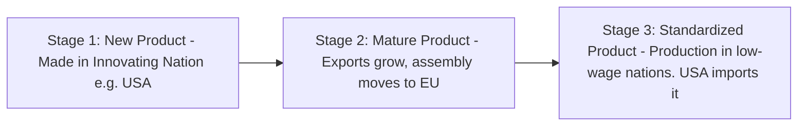
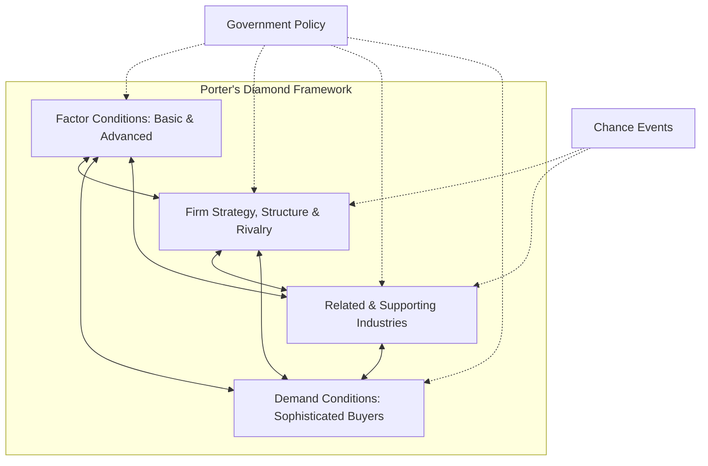
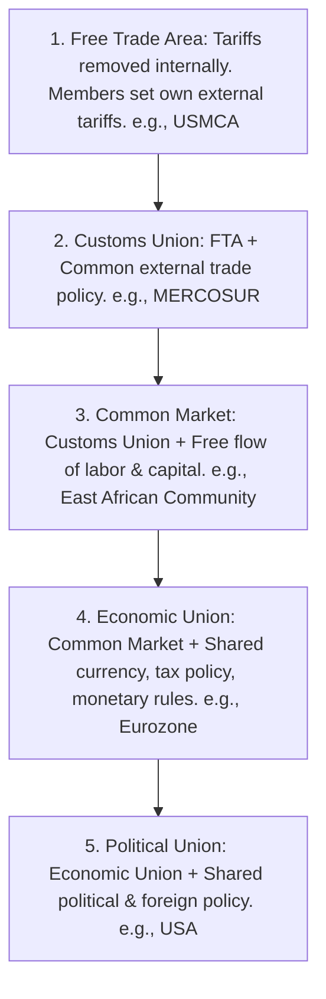

# 📘 UNIT 2: INTERNATIONAL TRADE
### Master Study Notes | Core & Extended Curriculum

---

## 📌 TABLE OF CONTENTS

### PART 1: CORE LECTURE NOTES (BASED ON COURSE PPT)
1. [Introduction & Meaning of International Trade](#1-introduction--meaning-of-international-trade)
2. [Importance of International Trade](#2-importance-of-international-trade)
3. [Mercantilism & Its Limitations](#3-mercantilism--its-limitations)
4. [Theory of Absolute Advantage](#4-theory-of-absolute-advantage)
5. [Theory of Comparative Advantage](#5-theory-of-comparative-advantage)
6. [Factor Mobility Theory](#6-factor-mobility-theory)
7. [Regional Economic Integration & Benefits](#7-regional-economic-integration--benefits)
8. [World Trade Organization (WTO) Overview](#8-world-trade-organization-wto-overview)
9. [European Union (EU) Objectives](#9-european-union-eu-objectives)
10. [Case Study: China's Growth through International Trade](#10-case-study-chinas-growth-through-international-trade)

### PART 2: EXTENDED LECTURE NOTES (ADVANCED TOPICS)
11. [Advanced Trade Theories (Heckscher-Ohlin & PLC)](#11-advanced-trade-theories-heckscher-ohlin--plc)
12. [Michael Porter's Diamond Model of Competitive Advantage](#12-michael-porters-diamond-model-of-competitive-advantage)
13. [Detailed Levels of Economic Integration](#13-detailed-levels-of-economic-integration)
14. [WTO Detailed Principles & Dispute Settlement](#14-wto-detailed-principles--dispute-settlement)
15. [European Union (EU) & Brexit Detailed Impact](#15-european-union-eu--brexit-detailed-impact)
16. [Solved Corporate Case Studies (Airbus vs Boeing & Brexit)](#16-solved-corporate-case-studies-airbus-vs-boeing--brexit)

### PART 3: SELF-TEST PRACTICE
17. [Flashcards & Fill in the Blanks Practice](#17-flashcards--fill-in-the-blanks-practice)

---

## PART 1: CORE LECTURE NOTES (BASED ON COURSE PPT)

### 1. Introduction & Meaning of International Trade

#### Meaning
**International Trade** refers to the exchange of goods, services, and capital across national borders. It involves the buying and selling of products between countries through exporting (selling goods to foreign markets) and importing (buying goods from foreign markets). 

```
DOMESTIC MARKET ◄─────────► INTERNATIONAL TRADE ◄─────────► FOREIGN MARKET
   (Production)                (Export / Import)               (Consumption)
```

Nations engage in trade because no single country is completely self-sufficient. Trade allows countries to:
* Access goods and services not available domestically.
* Obtain resources that can be produced more efficiently elsewhere.
* Specialize in industries where they have natural, technological, or labor advantages.

#### Example
India exporting information technology (IT) services and textiles to the United States while importing crude oil from Middle Eastern nations like Saudi Arabia is a classic example of international trade.

---

### 2. Importance of International Trade
According to the course PPT, international trade is vital for modern economic development due to six main reasons:
1.  **Expansion of Markets**: Businesses are not limited by domestic boundaries. They can sell products globally, increasing sales, revenue, and growth options.
2.  **Efficient Use of Resources**: Trade allows countries to specialize in producing goods where they possess natural or acquired advantages, improving resource productivity.
3.  **Economic Growth**: International trade directly contributes to national income (GDP), creates new employment opportunities, and supports overall development.
4.  **Access to Technology and Innovation**: Importing advanced machinery and software allows developing countries to adopt modern production techniques.
5.  **Improved Product Variety for Consumers**: Consumers have access to a wider variety of high-quality products from different countries at competitive prices.
6.  **Strengthening International Relations**: Cross-border trade encourages mutual interdependence, economic cooperation, and stronger diplomatic relationships between nations.

---

### 3. Mercantilism & Its Limitations

#### Meaning
**Mercantilism** is one of the oldest economic trade theories, dominant in Europe from the 16th to the 18th centuries. 

```
Goal: Accumulate Gold/Silver ──► Maintain Trade Surplus (Exports > Imports) ──► Gov. Trade Restrictions
```

*   **Core Doctrine**: A nation's wealth and power are measured solely by its holdings of precious metals (gold and silver).
*   **Strategy**: A country must maintain a trade surplus by maximizing exports and minimizing imports ($Exports > Imports$).
*   **Government Intervention**: Governments heavily regulated trade by imposing high import tariffs, setting import quotas, and subsidizing domestic export industries.
*   **Colonialism**: Colonial powers used their colonies as cheap sources of raw materials and exclusive markets for finished manufactured goods.

#### Example
During the colonial era, Britain applied mercantilist policies to India. Britain imported raw cotton and spices at low prices from India, manufactured textiles in British mills, and exported the finished cloth back to India, while restricting Indian domestic textile production. This drained wealth from India and accumulated it in Britain.

#### Limitations of Mercantilism
1.  **Encourages Trade Restrictions**: By promoting high tariffs and quotas, mercantilism stifles free trade, reducing the global benefits of open markets.
2.  **Creates Conflicts Between Countries**: Since wealth was seen as fixed, trade was viewed as a **zero-sum game** (one country's gain is another's loss). This caused intense economic and political rivalry and wars among European powers (e.g., Britain, France, Spain) over colonies and shipping lanes.
3.  **Ignores Mutual Benefits of Trade**: Modern trade theory shows that trade is a **positive-sum game** where all trading partners can benefit simultaneously through specialization.
4.  **Focuses Only on Precious Metals**: Mercantilism ignored productive capacity, technology, and human resources. For example, Spain accumulated massive gold and silver reserves from the Americas but failed to develop domestic manufacturing, leading to inflation and long-term economic decline.
5.  **Limits Economic Growth**: By restricting imports, mercantilism shields domestic industries from competition, reducing their incentive to innovate or improve efficiency.

---

### 4. Theory of Absolute Advantage

#### Meaning
Developed by **Adam Smith** in his landmark book *The Wealth of Nations* (1776), the **Theory of Absolute Advantage** was a direct attack on mercantilism. 

Smith argued that a country has an **absolute advantage** when it can produce a good more efficiently (using fewer resources or less labor) than another country. He suggested that:
* Countries should specialize in producing goods where they have an absolute advantage.
* They should import goods in which they have an absolute disadvantage.
* Trade should be unregulated (Laissez-faire) to maximize global output.

```
Country A (Efficient in Wheat) ────(Exports Wheat)────► Country B
Country B (Efficient in Cloth) ────(Exports Cloth)────► Country A
Result: Both countries consume more of both goods.
```

#### Example
Suppose India can produce 20 units of wheat per worker/day but only 10 units of cloth. The UK can produce 10 units of wheat per worker/day but 20 units of cloth. India has an absolute advantage in wheat, and the UK has an absolute advantage in cloth. Both countries will benefit if India specializes in wheat, the UK specializes in cloth, and they trade.

#### Advantages of Absolute Advantage Theory
1.  **Encourages Specialization**: Focuses national energy on industries where the country has the best resources, skills, or climate. (e.g., Brazil specializing in coffee due to its ideal climate and soil).
2.  **Improves Productivity**: Specialization leads to labor skill development and more efficient use of machinery. (e.g., Germany specializing in advanced engineering and automobiles like BMW and Mercedes-Benz).
3.  **Increases Global Production**: When every country produces what it is best at, the total global output of goods increases. (e.g., China producing cheap electronics and Saudi Arabia producing oil increases global availability of both).
4.  **Promotes International Trade**: Specialization builds international market links and economic cooperation. (e.g., Japan exporting cars and importing raw materials).
5.  **Better Utilization of Resources**: Natural resources are utilized efficiently. (e.g., Saudi Arabia using oil reserves to export petroleum while importing food and machinery).

---

### 5. Theory of Comparative Advantage

#### Meaning
The **Theory of Comparative Advantage** was proposed by **David Ricardo** in 1817. 

Ricardo addressed a major loophole in Adam Smith's theory: *What if one country has an absolute advantage in producing ALL goods?*

Ricardo proved that trade is still mutually beneficial. A country should specialize in producing goods in which it has the **lowest opportunity cost** (meaning it is relatively more efficient at producing that good compared to other goods), and import goods where its opportunity cost is higher.

```
OPPORTUNITY COST = What you sacrifice to produce one unit of a good.
Nations must specialize where Opportunity Cost is LOWEST.
```

#### Example
If Country A is more efficient than Country B at producing both wheat and cloth, but Country A is *three times* more efficient in wheat and only *one-and-a-half times* more efficient in cloth, Country A has a comparative advantage in wheat. Country B has a comparative advantage in cloth because its efficiency disadvantage is least in cloth.

#### Benefits of Comparative Advantage Theory
1.  **Efficient Use of Resources**: Capital and labor flow to their most productive relative uses. (e.g., India specializing in IT services due to its large pool of skilled, English-speaking engineers).
2.  **Increased Global Production**: Encourages global specialization, raising total global output. (e.g., China focusing on manufacturing and Saudi Arabia on oil).
3.  **Lower Production Costs**: Specialization lowers manufacturing costs, reducing final prices for global consumers. (e.g., Vietnam producing textiles at lower costs due to competitive labor rates).
4.  **Expansion of International Trade**: Creates trade flows even between highly advanced and developing nations. (e.g., Japan exporting cars and importing raw materials).
5.  **Improved Standard of Living**: Consumers gain access to a wider variety of global goods at competitive prices.

---

### 6. Factor Mobility Theory

#### Meaning
Unlike classical trade theories (Smith, Ricardo) which assume factors of production (labor, capital, technology) are stationary and cannot move across borders, **Factor Mobility Theory** explains how the movement of these factors between countries influences international trade.

When factors move freely:
* Businesses locate production facilities where resources are cheapest or most efficient.
* Labor migrates to countries offering higher wages and better job prospects.
* Capital flows to foreign markets with higher returns on investment (FDI).
* Technology transfers across borders, improving global productivity.

```
CAPITAL & TECHNOLOGY (MNCs) ────► FLOW TO ────► LOW-COST LABOR MARKETS (e.g., China/India)
```

#### Example
Multinational companies like Apple establish assembly plants in China and India. Apple moves its capital and advanced manufacturing technology to these countries to leverage their abundant skilled labor and lower assembly costs. This demonstrates factor mobility replacing or supplementing direct trade in finished goods.

---

### 7. Regional Economic Integration & Benefits

#### Meaning
**Regional Economic Integration** refers to agreements between countries in a geographic region to reduce or eliminate tariff and non-tariff barriers to the free flow of goods, services, capital, and labor among themselves.

The primary objective is to create a larger, unified market that encourages regional trade, economic cooperation, and stability.

#### Example
The **European Union (EU)** is the world's most integrated regional trade bloc. Member states like Germany, France, and Italy allow the free, tariff-free movement of goods, services, capital, and people across their borders.

#### Benefits of Regional Economic Integration
1.  **Increase in Trade**: Eliminating trade barriers like tariffs and quotas makes regional trade cheaper and faster. (e.g., EU countries trading freely without border tariffs).
2.  **Economic Growth and Development**: Expanded trade opportunities attract FDI, boost local industries, and fund infrastructure projects.
3.  **Larger Market Access**: Local firms gain access to a larger pool of consumers, allowing them to capture economies of scale. (e.g., EU firms selling to 450+ million consumers).
4.  **Improved Resource Utilization**: Countries specialize in what they produce best and trade within the regional bloc.
5.  **Increased Competition and Efficiency**: Exposure to regional competitors forces local firms to innovate and operate efficiently.
6.  **Stronger Political and Economic Cooperation**: Close economic ties build diplomatic trust, reducing the risk of regional political conflicts.

---

### 8. World Trade Organization (WTO) Overview

#### Meaning
The **World Trade Organization (WTO)** is the only global international organization dealing with the rules of trade between nations. Established on **January 1, 1995**, it replaced the **General Agreement on Tariffs and Trade (GATT)** which was created in 1947. Headquartered in Geneva, Switzerland, it currently has 164 member countries.

```
GATT (1947) ──────────────► Replaced in 1995 by ──────────────► WTO (Geneva)
(Goods Trade Only)                                           (Goods, Services, IP)
```

#### Objectives of WTO
*   **Reduce Trade Barriers**: Negotiate the reduction of tariffs, import quotas, and non-tariff barriers globally.
*   **Promote Free and Fair Trade**: Establish a stable, predictable, and non-discriminatory international trading system.
*   **Resolve Disputes**: Provide a structured dispute settlement mechanism to resolve trade conflicts between member states.
*   **Monitor Trade Policies**: Review national trade policies to ensure transparency and compliance with WTO agreements.

#### Example
If the US government imposes illegal tariffs on Indian steel exports, India cannot retaliate unilaterally without violating rules. Instead, India files a complaint with the WTO Dispute Settlement Body. The WTO hears the case, issues a legally binding ruling, and if the US loses and refuses to comply, authorizes India to impose retaliatory tariffs.

---

### 9. European Union (EU) Objectives

#### Meaning
The **European Union (EU)** is a political and economic union of 27 European countries. It was established after World War II to foster economic cooperation, prevent conflicts, and establish political stability in Europe. The EU created a single European market and introduced a common currency, the **Euro (€)**, which is used by 20 member states (collectively known as the Eurozone).

#### Objectives of the EU
1.  **Promote Economic Integration**: Create a single, borderless market where the "Four Freedoms" (free movement of goods, services, capital, and people) are guaranteed.
2.  **Encourage Free Trade Among Members**: Eliminate all internal tariffs and customs duties between member states.
3.  **Strengthen Political Cooperation**: Formulate common foreign, security, and environmental policies to maintain regional peace.
4.  **Improve Economic Growth and Stability**: Coordinate economic policies and leverage a shared currency to simplify regional trade and finance.
5.  **Promote Social and Regional Development**: Use structural funds to support infrastructure and education in less developed European regions (e.g., Eastern European member states).

---

### 10. Case Study: China's Growth through International Trade

#### Background
Over the last four decades, China transformed from a closed, agrarian economy into the "world's factory" and the second-largest economy globally. This growth was driven primarily by an export-led manufacturing strategy.

```
Manufacturing Focus ──► Low Labor Cost ──► WTO Entry (2001) ──► Massive FDI ──► World's Largest Exporter
```

#### Core Strategy & Actions
1.  **Specialization in Manufacturing**: China leveraged its large, low-cost, and disciplined labor force to specialize in assembly and manufacturing of electronics, textiles, machinery, and consumer goods.
2.  **Open Door Policy & SEZs**: China set up Special Economic Zones (SEZs) along its coastline (like Shenzhen) with tax holidays and relaxed regulations to attract foreign multinational investment.
3.  **WTO Accession (2001)**: Joining the WTO in 2001 was the turning point. It forced China to lower import tariffs and regulatory barriers, while gaining secure, non-discriminatory access to global markets.
4.  **Attracting FDI**: Multinationals relocated their manufacturing plants to China to take advantage of its supply chain clusters, skilled engineers, and scale.

#### Outcome
China’s export-led trade strategy created millions of jobs, lifted over 800 million people out of poverty, accumulated trillions in foreign exchange reserves, and upgraded the country's technological capabilities.

---

#### Solved Case Discussion Questions:

##### Q1. Why did China focus on manufacturing industries to expand its international trade?
*   **Topper's Answer**: 
    China focused on manufacturing because of its unique factor endowments: an abundant, low-cost, and relatively skilled labor force. Manufacturing allowed China to absorb millions of agricultural workers into productive industrial jobs, generate rapid export revenues, and capture economies of scale. Unlike services, manufacturing allowed for rapid technology transfer from foreign investors, helping China build global competitiveness quickly.

##### Q2. How did joining the World Trade Organization (WTO) help China increase its global trade?
*   **Topper's Answer**: 
    Joining the WTO in 2001 integrated China into the rules-based global trading system. It granted China Most-Favored-Nation (MFN) status, reducing tariffs on Chinese exports in major markets like the US and Europe. It removed the annual political reviews of China’s trade status, giving foreign investors the long-term predictability needed to build massive factories in China.

##### Q3. What role did China's large labor force play in its success in international trade?
*   **Topper's Answer**: 
    China’s large labor force provided an elastic supply of low-cost, highly disciplined labor. This kept manufacturing wages low for decades, making Chinese exports highly cost-competitive globally. Furthermore, as the workforce received training, they developed specialized skills in electronics assembly and precision engineering, allowing China to transition from basic textiles to high-tech manufacturing.

##### Q4. Why do multinational companies establish manufacturing units in countries like China?
*   **Topper's Answer**: 
    Multinationals invest in China due to:
    - **Cost Advantages**: Lower labor and manufacturing overhead costs.
    - **Supply Chain Clusters**: Unmatched concentration of raw material and component suppliers, reducing transit times.
    - **Infrastructure Quality**: World-class deepwater ports, high-speed rail, and reliable power grids.
    - **Market Size**: Access to China's large domestic consumer market.

---

## PART 2: EXTENDED LECTURE NOTES (ADVANCED TOPICS)

### 11. Advanced Trade Theories (Heckscher-Ohlin & PLC)

#### Heckscher-Ohlin (Factor Endowments) Theory
Developed by Swedish economists Eli Heckscher and Bertil Ohlin, this theory states that comparative advantage arises from differences in national factor endowments (land, labor, capital).

*   **The Rule**: Countries will export goods that make intensive use of factors of production that are locally abundant, and import goods that make intensive use of factors that are locally scarce.
*   *Application*: A capital-abundant country (e.g., Germany) will export capital-intensive goods (e.g., heavy machinery, cars). A labor-abundant country (e.g., Bangladesh) will export labor-intensive goods (e.g., ready-made garments).

```
   FACTORY ENDOWMENT                INTENSITY OF PRODUCT             TRADE FLOW
Capital-Abundant Nation  ──► Produces Capital-Intensive Goods ──► Exports to Labor-Abundant
Labor-Abundant Nation    ──► Produces Labor-Intensive Goods   ──► Exports to Capital-Abundant
```

#### The Leontief Paradox
In 1953, economist Wassily Leontief tested the Heckscher-Ohlin theory using US trade data. 
*   *The Expectation*: Since the US was highly capital-abundant, it should export capital-intensive goods and import labor-intensive goods.
*   *The Finding*: Leontief discovered the opposite — the US exported labor-intensive goods and imported capital-intensive goods.
*   *The Explanation*: The paradox is resolved by separating labor into *skilled labor* (human capital) and *unskilled labor*. The US exported goods requiring high levels of R&D and highly skilled engineers (human capital), while importing basic manufactured goods that required heavy physical capital plants (steel, simple assembly).

#### Product Life Cycle Theory (Raymond Vernon, 1966)
Raymond Vernon proposed that as a product matures, its optimal production location shifts from the innovating nation to lower-cost foreign locations.



1.  **New Product Stage**: The product is innovative and targeted at high-income consumers. Production is located in the home country (e.g., USA) to maintain close collaboration between R&D, manufacturing, and local buyers.
2.  **Maturing Product Stage**: Demand expands rapidly in other developed nations (e.g., Europe). The innovating firm sets up manufacturing plants in Europe to bypass tariffs and logistics costs. Exports from the home country peak.
3.  **Standardized Product Stage**: Product designs become standardized, and production becomes highly price-sensitive. Manufacturing shifts entirely to low-cost developing countries (e.g., Vietnam, China). The innovating country stops domestic production and imports the product.

---

### 12. Michael Porter's Diamond Model of Competitive Advantage

Michael Porter (1990) studied why specific nations succeed in particular industries (e.g., Japan in consumer electronics, Switzerland in pharmaceuticals). He identified four attributes that create the "Diamond" of competitive success:



1.  **Factor Conditions**: Porter divides factors into *Basic* (natural resources, climate, unskilled labor) and *Advanced* (digital infrastructure, specialized university research, skilled engineers). He argues that **Advanced Factors** are created, not inherited, and are critical for competitive advantage.
2.  **Demand Conditions**: The presence of sophisticated and demanding domestic buyers forces local firms to innovate, upgrade product quality, and anticipate global customer needs.
3.  **Related and Supporting Industries**: The presence of world-class, locally concentrated supplier networks (clusters) allows rapid innovation and exchange of ideas (e.g., Silicon Valley tech clusters).
4.  **Firm Strategy, Structure, and Rivalry**: Intense competition in the home market forces companies to improve operational efficiencies, creating strong competitors capable of surviving global markets.

#### Auxiliary Factors
*   **Government Policy**: Governments can influence the diamond through subsidies, education spending, antitrust laws, and trade policies.
*   **Chance Events**: Unpredictable events (such as wars, natural disasters, or major technological breakthroughs) that disrupt established market structures.

---

### 13. Detailed Levels of Economic Integration

Regional economic integration is structured in five progressive levels:



1.  **Free Trade Area (FTA)**: All barriers to the trade of goods and services among member countries are removed. However, each member is free to determine its own trade policies with non-member nations. (e.g., USMCA - US-Mexico-Canada Agreement).
2.  **Customs Union**: Eliminates trade barriers between member countries and adopts a common external tariff policy toward non-members. (e.g., MERCOSUR in South America).
3.  **Common Market**: A Customs Union that also allows the free movement of factors of production (labor and capital) between member countries. There are no immigration or capital controls internally. (e.g., East African Community).
4.  **Economic Union**: A Common Market that requires members to coordinate economic policies, share a common currency, and harmonize tax rates. (e.g., The European Union/Eurozone).
5.  **Political Union**: A central political apparatus coordinates the economic, social, and foreign policy of all member states. (e.g., The United States of America).

---

### 14. WTO Detailed Principles & Dispute Settlement

The WTO enforces two core non-discrimination principles that form the foundation of global trade:

#### 1. Most-Favored-Nation (MFN) Treatment
Under this principle, member countries cannot discriminate between their trading partners. If a country grants a trade favor (e.g., lower import tariff on a product) to one nation, it must immediately and unconditionally extend that same favor to all other WTO members.
*   *Exception*: Free Trade Agreements (FTAs) and Customs Unions are allowed to offer lower internal rates.

#### 2. National Treatment
Once foreign goods have entered a country’s market (after paying customs duties at the border), they must be treated no less favorably than domestic goods. Governments cannot impose higher domestic sales taxes or stricter regulations on foreign products.

#### The Dispute Settlement Mechanism (DSM)
The WTO acts as an international trade court to resolve disputes.
1.  **Consultation**: The complaining country requests talks with the violating country. They have 60 days to resolve the issue.
2.  **Dispute Panel**: If consultations fail, a panel of three trade experts is appointed to hear the case and write a report.
3.  **Appellate Body**: The panel's ruling can be appealed by either party to the WTO Appellate Body.
4.  **Implementation**: If a country is found in violation, it must change its laws. If it refuses, the WTO can authorize the winning country to impose retaliatory tariffs.

---

### 15. European Union (EU) & Brexit Detailed Impact

#### The EU Single Market
The EU Single Market is a trade zone based on the "Four Freedoms":
*   **Free Movement of Goods**: No tariffs or customs checks at internal borders.
*   **Free Movement of Services**: Businesses can offer services anywhere in the EU.
*   **Free Movement of Capital**: Investments and money can move freely.
*   **Free Movement of People**: EU citizens can live, work, and study in any member state.

#### Brexit and its Economic Impact
On January 31, 2020, the United Kingdom formally left the European Union (Brexit). The UK left the Single Market and Customs Union, replacing it with the EU-UK Trade and Cooperation Agreement.

```
       BREXIT IMPACTS
       ├── Customs checks re-established (delays at ports)
       ├── Non-tariff barriers (sanitary certificates for food)
       ├── Loss of labor mobility (shortages of drivers & harvest workers)
       └── Loss of financial passporting (banks moved offices to Amsterdam/Frankfurt)
```

---

### 16. Solved Corporate Case Studies

#### Case 1: The Boeing vs. Airbus WTO Subsidy Dispute

**Background**: For over two decades, US-based Boeing and EU-based Airbus dominated the global commercial aircraft market. In 2004, the US filed a case with the WTO, claiming European governments provided Airbus with unfair "launch aid" (interest-free or low-interest loans that only had to be repaid if the aircraft was commercially successful). The EU counter-sued, claiming Boeing received billions in hidden subsidies through NASA research contracts and tax breaks from Washington state.

**The Action**: The WTO spent over 15 years investigating both claims. 

**The Ruling**: The WTO ruled that both parties had received billions in illegal subsidies. In 2019, the WTO authorized the US to impose 10% tariffs on $7.5 billion of EU imports. In 2020, the WTO authorized the EU to impose retaliatory tariffs on $4 billion of US imports. Both parties finally agreed to suspend the tariffs in 2021 to cooperate against emerging Chinese competition.

**Key Takeaways**:
- Illustrates how governments subsidize domestic "national champions" to build competitive advantage, violating free-market theories.
- Demonstrates the power and slow timeline of the **WTO Dispute Settlement Body**.

---

#### Case 2: The Economic Reality of Brexit

**Background**: Following Brexit, the UK re-established a hard border with the EU.

**The Reality**:
*   **Border Friction**: British exporters of perishable goods (like fish and meat) faced complex health inspections and customs paperwork at ports. Seafood shipments that once reached France in hours took days, causing cargo spoilage and contract cancellations.
*   **Labor Shortage**: The end of free movement of people led to worker shortages. Industries relying on European labor (e.g., truck drivers, farm harvesting, hospitality) faced acute recruitment crises, pushing up domestic inflation.
*   **Financial Services Shift**: London lost its financial "passporting rights" (the right for banks in London to sell services across the EU without local licenses). Banks relocated over $1 trillion in assets and thousands of jobs to Amsterdam, Dublin, and Frankfurt.

---

## PART 3: SELF-TEST PRACTICE

### 17. Flashcards & Fill in the Blanks Practice

#### PART A: FLASHCARDS

> **How to use:** Cover the Answer column. Read the Question. Say your answer aloud. Then reveal. Repeat until you get all correct without hesitation.

##### SECTION 1: Definitions Flashcards

| # | 🔴 QUESTION (Front of Card) | ✅ ANSWER (Back of Card) |
|---|-----------------------------|--------------------------|
| 1 | What is the International Business Environment? | All external factors (economic, political, legal, cultural, technological) that influence businesses operating across national borders |
| 2 | What is International Business? | All commercial activities between individuals, companies, or governments of different countries involving exchange of goods, services, technology, capital, and information |
| 3 | What is Globalization? | The process of increasing integration and interaction among countries through exchange of goods, services, technology, information, and culture |
| 4 | What is the Social Environment? | Cultural values, traditions, beliefs, lifestyles, education levels, and demographic characteristics of a society that influence business |
| 5 | What is the Political Environment? | The role of government, political stability, trade regulations, and government policies that influence business operations |
| 6 | What is the Legal Environment? | Laws and regulations governing business activities in a country including trade laws, labor laws, IP rights, and environmental regulations |
| 7 | What is the Economic Environment? | Economic conditions of a country (GDP, inflation, income levels, exchange rates, purchasing power) that influence business activities |
| 8 | What is the Technological Environment? | Level of technological development and innovation affecting business operations, production, and communication |
| 9 | What is WTO? | World Trade Organization — international body established in 1995 to set and enforce rules governing international trade |
| 10 | What is Absolute Advantage? | A country's ability to produce a good using fewer resources than another country (Adam Smith, 1776) |
| 11 | What is Comparative Advantage? | A country's ability to produce a good at a lower opportunity cost than another country (David Ricardo, 1817) |
| 12 | What is Franchising? | Mode of entry where franchisor grants franchisee right to operate using its brand, business model, and system in exchange for fees and royalties |
| 13 | What is a Joint Venture? | Two or more companies from different countries combining resources to form a new, jointly owned business entity |
| 14 | What is Foreign Direct Investment (FDI)? | Investment by a company or individual in business interests in another country, typically establishing operations or acquiring business assets |
| 15 | What is Entrepôt Trade? | Importing goods from one country and re-exporting them to another without significant processing |
| 16 | What is an Import Quota? | A physical limit on the quantity of a specific good that can be imported during a certain period |
| 17 | What is an Embargo? | A complete ban on trade with a specific country |
| 18 | What is MFN (Most Favoured Nation)? | WTO principle requiring that trade privileges given to one member must be extended to ALL WTO members |
| 19 | What is Opportunity Cost? | What you give up to produce one unit of a good — the basis of Comparative Advantage theory |
| 20 | What is a Strategic Alliance? | Cooperation between two or more independent companies toward a shared goal without forming a new legal entity |

##### SECTION 2: Examples Flashcards

| # | 🔴 CONCEPT | ✅ EXAMPLE |
|---|-----------|------------|
| 1 | Globalization | McDonald's operating in 100+ countries, adapting products to local cultures |
| 2 | International Business | Apple manufacturing in China, selling in USA, India, and Europe |
| 3 | Social Environment | McDonald's removing beef and adding McAloo Tikki for India |
| 4 | Political Environment | India offering SEZs and tax incentives to attract FDI |
| 5 | Legal Environment | Apple registering patents and trademarks in every country it operates in |
| 6 | Economic Environment | MNCs expanding into India and China for large, growing middle-class markets |
| 7 | Technological Environment | Amazon using AI, cloud, and e-commerce for global operations |
| 8 | AI for Efficiency | Amazon AI managing warehouses and optimizing delivery routes |
| 9 | AI for Cost Savings | Amazon AI managing inventory, reducing labor costs |
| 10 | AI for Customer Experience | Netflix recommending different content to users in different countries |
| 11 | Franchising | McDonald's, KFC, Subway operating through local franchisees |
| 12 | Joint Venture | Maruti Suzuki (India + Suzuki, Japan) |
| 13 | Strategic Alliance | Star Alliance (United Airlines, Lufthansa, Air India, etc.) |
| 14 | FDI / Acquisition | Walmart acquiring Flipkart for $16 billion |
| 15 | Absolute Advantage | Saudi Arabia producing oil cheaply due to vast reserves |
| 16 | Comparative Advantage | India specializing in IT services for the USA |
| 17 | Entrepôt Trade | Singapore and Dubai as global re-export hubs |
| 18 | Tariff Barrier | USA's 25% tariff on Chinese steel |
| 19 | Embargo | USA's trade embargo on Cuba |
| 20 | WTO Dispute | India and USA settling steel tariff disputes through WTO mechanism |

##### SECTION 3: Acronym & Memory Flashcards

| # | 🔴 WHAT IT STANDS FOR | ✅ FULL FORM / MEANING |
|---|----------------------|------------------------|
| 1 | SPLET | Social, Political, Legal, Economic, Technological (IBE Components) |
| 2 | WTO | World Trade Organization |
| 3 | GATT | General Agreement on Tariffs and Trade |
| 4 | GATS | General Agreement on Trade in Services |
| 5 | TRIPS | Trade-Related Intellectual Property Rights |
| 6 | MFN | Most Favoured Nation |
| 7 | FDI | Foreign Direct Investment |
| 8 | MNC | Multinational Corporation |
| 9 | SEZ | Special Economic Zone |
| 10 | NTB | Non-Tariff Barrier |
| 11 | VER | Voluntary Export Restraint |
| 12 | TRIMS | Trade-Related Investment Measures |
| 13 | AI | Artificial Intelligence |
| 14 | IBE | International Business Environment |
| 15 | IB | International Business |

---

#### PART B: FILL IN THE BLANKS

> **Instructions:** Fill in each blank without looking at notes. Check answers at the bottom of this section.

##### 📝 Exercise 1: Basic Concepts
1. The International Business Environment refers to all __________ factors that influence businesses operating across __________ borders.
2. International Business involves the exchange of goods, services, __________, capital, and __________ between different countries.
3. Globalization is driven by advancements in __________, communication, and __________ technologies.
4. The SPLET acronym stands for Social, Political, __________, Economic, and __________ environments.
5. Companies like __________, Samsung, and Toyota are examples of multinational corporations in International Business.
6. __________ refers to the process of increasing integration and interaction among countries through exchange of goods, services, technology, and culture.
7. The Social Environment affects consumer __________ and purchasing __________.
8. A stable __________ environment encourages businesses to invest in foreign markets.
9. Laws related to intellectual property, labor, and trade belong to the __________ environment.
10. GDP, inflation, and __________ rates are key factors of the Economic Environment.

##### 📝 Exercise 2: Globalization
11. The six features of Globalization include Integration of Markets, Free Flow of Goods, International Movement of __________, Technological Advancement, Growth of __________, and Cultural Exchange.
12. Cultural __________ is a negative impact of globalization where local cultures are overshadowed by global influences.
13. Globalization can lead to __________ inequality between rich and poor nations.
14. McDonald's operating in many countries and adapting its menu is an example of __________.
15. __________ and Dubai are famous examples of entrepôt trade hubs.

##### 📝 Exercise 3: WTO
16. WTO was established in __________ and is headquartered in __________, Switzerland.
17. WTO replaced the earlier __________ (General Agreement on Tariffs and Trade).
18. The __________ principle of WTO means trade privileges given to one member must be extended to all members.
19. TRIPS stands for Trade-Related __________ Property Rights.
20. The WTO agreement that covers international trade in services is called __________.
21. WTO currently has __________ member countries.
22. The WTO's __________ settlement body resolves trade conflicts between member nations.

##### 📝 Exercise 4: Modes of Entry
23. The mode of entry with the lowest investment and risk is __________.
24. In __________, a company grants the right to use its brand, system, and support to a local operator in a foreign country.
25. __________ Suzuki is a classic example of a Joint Venture between India and Japan.
26. When Walmart acquired Flipkart, it used the __________ mode of FDI entry.
27. __________ Alliance is an example of a Strategic Alliance between global airlines.
28. In __________, a company gives a foreign firm the right to use its patent or technology in exchange for royalties.

##### 📝 Exercise 5: Barriers & Trade Theories
29. Taxes imposed on imported goods are called __________ barriers.
30. A complete ban on trade with a specific country is called an __________.
31. Physical limits on the quantity of goods that can be imported are called import __________.
32. The Theory of Absolute Advantage was proposed by __________ in __________.
33. The Theory of __________ Advantage was proposed by David Ricardo in 1817.
34. According to Ricardo, countries should specialize in goods where they have the lowest __________ cost.
35. Saudi Arabia has an absolute advantage in __________ production due to its vast reserves.

##### 📝 Exercise 6: AI in International Business
36. AI improves efficiency by automating __________ tasks and processing large amounts of __________.
37. Amazon uses AI to manage __________ operations and optimize __________ routes.
38. AI chatbots provide __________ multilingual customer support across all time zones.
39. Netflix uses AI to recommend __________ content to users in different countries.
40. AI helps reduce costs by managing __________ and optimizing supply __________.

---

#### ✅ ANSWER KEY — FILL IN THE BLANKS

##### Exercise 1:
1. external / national
2. technology / information
3. transportation / digital
4. Legal / Technological
5. Apple
6. Globalization
7. preferences / behavior
8. political
9. legal
10. exchange

##### Exercise 2:
11. Capital / MNCs
12. homogenization
13. economic
14. globalization
15. Singapore

##### Exercise 3:
16. 1995 / Geneva
17. GATT
18. Most Favoured Nation (MFN)
19. Intellectual
20. GATS (General Agreement on Trade in Services)
21. 164
22. dispute

##### Exercise 4:
23. Exporting
24. Franchising
25. Maruti
26. Acquisition / Brownfield
27. Star
28. Licensing

##### Exercise 5:
29. tariff
30. embargo
31. quotas
32. Adam Smith / 1776
33. Comparative
34. opportunity
35. oil

##### Exercise 6:
36. repetitive / data
37. warehouse / delivery
38. 24/7
39. personalized
40. inventory / chain

---

#### 📊 Score Yourself

**Fill in the Blanks Score:**
- 38–40 correct → Excellent! Exam ready ⭐⭐⭐
- 32–37 correct → Good — review the gaps ⭐⭐
- 25–31 correct → Average — re-read extended notes ⭐
- Below 25 → Study all notes again carefully

---

*🃏 Flashcards + Fill-in-the-blanks = The fastest path to 100% exam confidence!*
