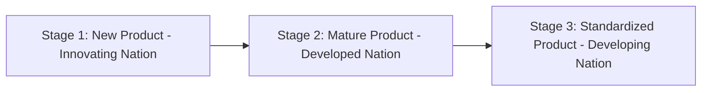
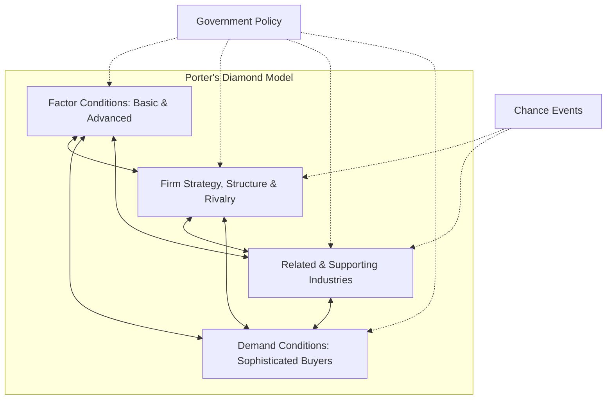

# 📝 UNIT 2 — ALL POSSIBLE SUBJECTIVE QUESTIONS WITH ANSWERS
### International Trade | Solved Question Bank

---

## 🔷 SECTION A: SHORT ANSWER QUESTIONS (2–4 Marks)

---

### Q1. Define the term 'Leontief Paradox'.
**Answer:**
The **Leontief Paradox** is an empirical finding by economist Wassily Leontief in 1953 that challenged the Heckscher-Ohlin (factor proportions) theory.
*   **The Paradox**: Since the United States was a capital-abundant country, it was expected to export capital-intensive goods and import labor-intensive goods. However, Leontief's data showed the opposite: the US exported labor-intensive goods and imported capital-intensive goods.
*   **Resolution**: The paradox is resolved by separating labor into *skilled labor* (human capital) and *unskilled labor*. The US has an abundance of highly educated engineers and research facilities, so it specializes in exporting high-tech, skill-intensive goods.

---

### Q2. What is 'Trade Diversion' in regional economic integration?
**Answer:**
**Trade Diversion** occurs when a regional economic integration agreement (like a Free Trade Agreement) causes a member country to import goods from a higher-cost supplier within the trading bloc rather than from a lower-cost external supplier.
*   **Why it happens**: Internal trade barriers are removed for member countries, while a common external tariff is maintained for non-member countries. The tariff makes non-member goods artificially more expensive, shifting demand to less efficient members.

---

### Q3. Explain the 'Most-Favored-Nation' (MFN) principle of the WTO.
**Answer:**
The **Most-Favored-Nation (MFN)** principle is a core pillar of the WTO that prohibits discrimination between trading partners.
*   **The Rule**: If a member country grants a special trade favor (such as a lower tariff rate on a specific product) to one nation, it must immediately and unconditionally extend that same favor to all other WTO members.
*   **Exceptions**: Allowed for regional trade agreements (like the EU) and special trade benefits for developing countries.

---

### Q4. What is 'National Treatment' under WTO guidelines?
**Answer:**
The **National Treatment** principle states that foreign goods must be treated no less favorably than domestically produced goods once they have crossed the border and cleared customs.
*   **Implementation**: Governments cannot impose higher domestic sales taxes (like GST or VAT) or implement stricter safety and technical regulations on imported products compared to local alternatives.

---

### Q5. What is the 'Gold Standard' in international monetary history?
**Answer:**
The **Gold Standard** was a monetary system where a country's currency or paper money had a value directly linked to gold.
*   **Mechanism**: Governments agreed to buy or sell gold at a fixed price in terms of their currency. This established fixed exchange rates between currencies, making international trade highly predictable.

---

## 🔷 SECTION B: MEDIUM ANSWER QUESTIONS (5 Marks)

---

### Q6. Differentiate between a Free Trade Area and a Customs Union with examples.
**Answer:**

| Basis of Comparison | Free Trade Area (FTA) | Customs Union |
| :--- | :--- | :--- |
| **Internal Tariffs** | Members remove all tariffs and barriers on trade among themselves. | Members remove all tariffs and barriers on trade among themselves. |
| **External Tariffs** | Each member nation sets its own tariff rates for trade with non-members. | Members adopt a **common external tariff** policy toward non-members. |
| **Border Controls** | Stricter border controls are needed to prevent trade deflection. | Internal customs borders can be simplified as external rates are identical. |
| **Example** | USMCA (US-Mexico-Canada Agreement). | MERCOSUR (consisting of Brazil, Argentina, etc.). |

*Strategic Conclusion*: While both levels eliminate internal trade barriers, a Customs Union represents a deeper stage of integration because member countries must surrender individual control of their external trade policies.

---

### Q7. Explain the three stages of Raymond Vernon's Product Life Cycle Theory.
**Answer:**
Vernon’s Product Life Cycle Theory explains how a product's optimal production location shifts globally as it matures.



1.  **New Product Stage (Introduction)**: The product is newly designed and targeted at high-income customers. Production occurs in the innovating country (e.g., USA) to maintain close contact with engineers and early buyers.
2.  **Maturing Product Stage (Growth)**: Demand expands in other developed countries (e.g., Europe). The innovating firm sets up assembly plants in those markets to bypass tariffs and logistics costs. Exports from the home country peak.
3.  **Standardized Product Stage (Maturity)**: Product designs become standardized, and production becomes highly cost-sensitive. Manufacturing shifts to low-wage developing nations. The innovating country ceases domestic production and imports the product.

---

### Q8. Briefly explain the WTO Dispute Settlement Process.
**Answer:**
The WTO Dispute Settlement Mechanism acts as an international court to resolve trade disputes and enforce compliance. The process follows these steps:

```
[ Consultation ] ──► [ Dispute Panel ] ──► [ Appellate Body ] ──► [ Implementation ]
 (Talks for 60 days)    (Panel of experts)    (Option to appeal)    (Compliance or Tariffs)
```

1.  **Consultations**: The complaining country requests talks with the violating country. They have 60 days to resolve the issue.
2.  **Establishment of a Panel**: If talks fail, a panel of three trade experts is appointed to hear arguments and issue a ruling report.
3.  **Appellate Review**: Either party can appeal the panel's legal interpretations to the WTO Appellate Body.
4.  **Implementation & Retaliation**: The losing country must bring its laws into compliance. If it refuses, the WTO can authorize the winning country to impose retaliatory tariffs on the violator's exports.

---

## 🔷 SECTION C: LONG/ANALYTICAL QUESTIONS (10 Marks)

---

### Q9. Solve the following trade numerical step-by-step. Show all opportunity cost calculations and explain how trade benefits both countries. (10 Marks)

#### Problem
Two countries, India and Germany, produce two goods: **Software (lines of code/day)** and **Automobiles (units/day)**. The output per worker per day is:

| Country | Software (per worker/day) | Automobiles (per worker/day) |
| :--- | :---: | :---: |
| **India** | 60 lines | 15 units |
| **Germany** | 20 lines | 20 units |

1. Determine which country has the **Absolute Advantage** in Software and Automobiles.
2. Calculate the **Opportunity Cost** of Software and Automobiles for both countries.
3. Determine which country has the **Comparative Advantage** in which good and show how trade benefits both at a Terms of Trade (ToT) of **1 Automobile = 2 lines of Software**.

---

#### Solved Solution

##### Step 1: Determining Absolute Advantage
*   **Software**: An Indian worker produces 60 lines of code, while a German worker produces only 20 lines. India has the Absolute Advantage in Software ($60 > 20$).
*   **Automobiles**: A German worker produces 20 units, while an Indian worker produces only 15 units. Germany has the Absolute Advantage in Automobiles ($20 > 15$).

##### Step 2: Calculating Opportunity Cost (OC)
*Formula*:
$$\text{Opportunity Cost of Good X} = \frac{\text{Good Y given up}}{\text{Good X gained}}$$

###### For India:
*   **OC of 1 line of Software** = $\frac{15\text{ Automobiles}}{60\text{ Software}} = \mathbf{0.25\text{ Automobiles}}$.
    *(India must sacrifice 0.25 automobiles to get 1 line of software)*
*   **OC of 1 Automobile** = $\frac{60\text{ Software}}{15\text{ Automobiles}} = \mathbf{4\text{ lines of Software}}$.
    *(India must sacrifice 4 lines of software to get 1 automobile)*

###### For Germany:
*   **OC of 1 line of Software** = $\frac{20\text{ Automobiles}}{20\text{ Software}} = \mathbf{1\text{ Automobile}}$.
    *(Germany must sacrifice 1 automobile to get 1 line of software)*
*   **OC of 1 Automobile** = $\frac{20\text{ Software}}{20\text{ Automobiles}} = \mathbf{1\text{ line of Software}}$.
    *(Germany must sacrifice 1 line of software to get 1 automobile)*

##### Summary Opportunity Cost Table:

| Country | Opportunity Cost of 1 line of Software | Opportunity Cost of 1 Automobile |
| :--- | :---: | :---: |
| **India** | **0.25 Automobiles** (Lower) | 4 lines of Software |
| **Germany** | 1 Automobile | **1 line of Software** (Lower) |

##### Step 3: Determining Comparative Advantage & Trade Benefits
*   **Comparative Advantage in Software**: India has the comparative advantage in Software because its opportunity cost is lower ($0.25 < 1$). India should specialize in and export Software.
*   **Comparative Advantage in Automobiles**: Germany has the comparative advantage in Automobiles because its opportunity cost is lower ($1 < 4$). Germany should specialize in and export Automobiles.

###### Showing Trade Benefits at Terms of Trade (ToT): 1 Automobile = 2 lines of Software
*   **Germany's Gain**: To get 2 lines of Software domestically, Germany would have to sacrifice 2 Automobiles (since its internal cost is 1:1). Under the trade agreement, Germany exports **1 Automobile** and receives **2 lines of Software**, saving **1 Automobile**.
*   **India's Gain**: To get 1 Automobile domestically, India would have to produce 4 lines of Software (its internal cost is 1:4). Under the trade agreement, India exports **2 lines of Software** to receive **1 Automobile**, saving **2 lines of Software**.
*   **Conclusion**: Both countries consume outside their production boundaries through specialization and trade.

---

### Q10. Explain Michael Porter's National Diamond of Competitive Advantage. Apply this model to a premium industry of your choice. (10 Marks)

**Topper's Answer**:

##### 1. Introduction
Porter's Diamond Model, introduced in 1990, explains why certain nations succeed internationally in specific industries. Unlike classical theories focusing on basic resource endowments (like land or raw labor), Porter’s theory is a modern, firm-based model that emphasizes innovation, quality, and strategy.

##### 2. The Four Attributes of the Diamond
The diamond consists of four mutually reinforcing factors:



1.  **Factor Conditions**: Porter distinguishes between *Basic Factors* (natural resources, climate) and *Advanced Factors* (R&D facilities, high-skilled human resources). He argues that advanced factors are created, not inherited, and are the true drivers of competitive advantage.
2.  **Demand Conditions**: A sophisticated, highly demanding domestic customer base forces local firms to innovate and upgrade their product quality before competing globally.
3.  **Related and Supporting Industries**: The presence of world-class, locally concentrated supplier networks (clusters) allows quick collaborative innovation.
4.  **Firm Strategy, Structure, and Rivalry**: Intense competition in the home market forces companies to improve operational efficiencies, creating strong competitors capable of surviving global markets.

##### 3. Auxiliary Factors
*   **Government**: Can influence the diamond via subsidies, antitrust regulations, or infrastructure investments.
*   **Chance**: Random events (such as wars, natural disasters, or major technological breakthroughs) that disrupt established market structures.

##### 4. Application: The German Premium Automotive Industry
*   **Factor Conditions**: Highly advanced engineers trained via Germany's specialized dual-educational system; advanced high-speed road infrastructure (Autobahns).
*   **Demand Conditions**: German drivers demand high-speed durability, premium handling, and high safety standards due to Autobahn speeds, forcing BMW and Mercedes to build superior cars.
*   **Related/Supporting Industries**: Local concentration of world-class parts suppliers like Bosch, Continental, and ZF.
*   **Rivalry**: Fierce domestic competition between BMW, Mercedes-Benz, and Audi drives continuous innovation.

##### 5. Conclusion
Porter's Diamond Model demonstrates that nations do not inherit competitive advantage; they create it through continuous upgrades to their advanced factors and domestic competitive environments.
