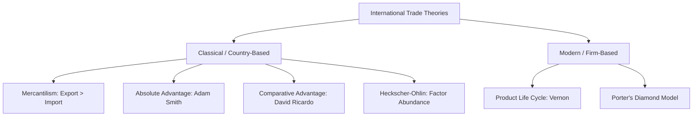
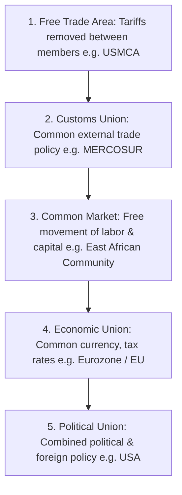
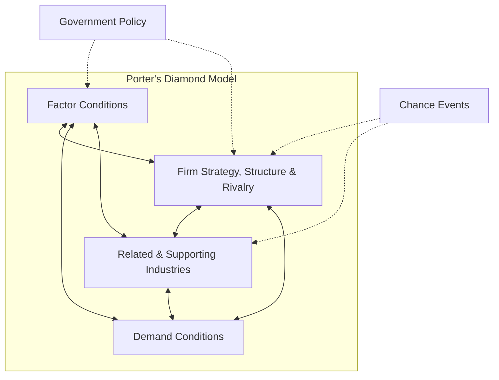

# Unit 2 — International Trade: Master Study Guide

Welcome to the ultimate preparation guide for Unit 2: International Trade. This guide covers 100% of the syllabus, written to take you from absolute zero to topper-level mastery. It integrates detailed conceptual lectures, solved numerical problems (critical for LPU exams), visual layouts, current affairs, rapid revision charts, and a comprehensive solved Q&A bank.

---

## 📌 Table of Contents
1. [Core Lectures: Concept Explanations](#1-core-lectures-concept-explanations)
   - [International Trade Theories (Classical & Modern)](#international-trade-theories-classical--modern)
   - [Factor Mobility Theory: Capital & Labor Movements](#factor-mobility-theory-capital--labor-movements)
   - [Regional Economic Integration: Levels, Benefits, & Costs](#regional-economic-integration-levels-benefits--costs)
   - [World Trade Organization (WTO)](#world-trade-organization-wto)
   - [European Union (EU) & Brexit Impact](#european-union-eu--brexit-impact)
2. [Solved Corporate Case Studies](#2-solved-corporate-case-studies)
   - [Case 1: The Boeing vs. Airbus WTO Subsidy Dispute](#case-1-the-boeing-vs-airbus-wto-subsidy-dispute)
   - [Case 2: The Economic Reality of Brexit](#case-2-the-economic-reality-of-brexit)
3. [Rapid Revision Cheat Sheet](#3-rapid-revision-cheat-sheet)
   - [Trade Theory Cheat Sheet Matrix](#trade-theory-cheat-sheet-matrix)
   - [Stages of Economic Integration Comparison](#stages-of-economic-integration-comparison)
4. [Exam Practice Q&A Bank](#4-exam-practice-qa-bank)
   - [Step-by-Step Solved Trade Theory Numerical (Opportunity Cost)](#step-by-step-solved-trade-theory-numerical-opportunity-cost)
   - [2-Mark Short Compulsory Questions](#2-mark-short-compulsory-questions)
   - [5-Mark Medium-Length Questions](#5-mark-medium-length-questions)
   - [10-Mark Long/Analytical Questions (Topper Answers)](#10-mark-longanalytical-questions-topper-answers)

---

## 1. Core Lectures: Concept Explanations

### International Trade Theories (Classical & Modern)

Why do nations trade? Over the centuries, economists have proposed various theories to explain this phenomenon.



#### 1. Mercantilism (16th Century)
- **Core Idea**: A nation's wealth is measured by its gold and silver holdings. To increase wealth, a country must maintain a trade surplus (Exports > Imports).
- **Government Action**: Tax imports heavily (tariffs) and subsidize exports.
- **Flaw**: It views trade as a **zero-sum game** (one country wins, the other loses). Adam Smith proved that trade is actually a **win-win (positive-sum) game**.

#### 2. Absolute Advantage (Adam Smith, 1776)
- **Core Idea**: A country has an absolute advantage when it can produce a good more efficiently (using fewer resources) than any other nation.
- **Outcome**: Nations should specialize in producing goods where they have an absolute advantage, and trade for other goods.
- **Flaw**: What if one country is more efficient at producing *everything*? Does it still trade? Yes, which leads to Ricardo's theory.

#### 3. Comparative Advantage (David Ricardo, 1817)
- **Core Idea**: Even if Country A is better at producing both goods than Country B, trade is still mutually beneficial. Country A should specialize in the good where it has a *greater* efficiency advantage (lowest opportunity cost), and Country B should produce the good where its efficiency disadvantage is *least*.
- **Key Concept**: **Opportunity Cost**—what you give up to produce one unit of a good.

#### 4. Heckscher-Ohlin (Factor Proportions) Theory
- **Core Idea**: Comparative advantage arises from differences in national factor endowments (land, labor, capital).
- **Rule**: Countries will export goods that make intensive use of factors that are locally abundant, and import goods that use factors that are locally scarce.
  - *Example*: India (labor abundant) exports software and textiles. Germany (capital abundant) exports high-tech machinery and automobiles.
- **Leontief Paradox**: Wassily Leontief tested the HO theory on US trade and found that the US (abundant in capital) exported labor-intensive goods and imported capital-intensive goods. This contradicted HO theory, showing that factors like labor skills (human capital) play a major role.

#### 5. Product Life Cycle Theory (Raymond Vernon, 1966)
- **Core Idea**: As a product matures, both its location of manufacture and its target market shift from the innovating country to lower-cost foreign nations.
- **Stages**:
  1. *New Product*: Developed and sold in the home market (e.g., US). Production is local due to high setup costs and user feedback.
  2. *Maturing Product*: Exports grow. Competitors emerge in foreign countries. Production starts expanding to European nations.
  3. *Standardized Product*: Production shifts completely to low-cost developing countries (e.g., Asia). The innovating country now becomes an *importer* of the product.

#### 6. Porter's Diamond Model (Michael Porter, 1990)
Explains why some nations succeed internationally in specific industries (e.g., Germany in cars, Italy in leather fashion). It identifies four attributes:
1. **Factor Conditions**: Basic (natural resources) vs. Advanced (R&D, skilled engineers). Advanced factors are critical.
2. **Demand Conditions**: Sophisticated and demanding local customers force domestic companies to innovate.
3. **Related and Supporting Industries**: Presence of world-class domestic suppliers (clusters).
4. **Firm Strategy, Structure, and Rivalry**: High domestic competition breeds tough global competitors.
- *Auxiliary Factors*: Government policy and Chance.

---

### Factor Mobility Theory: Capital & Labor Movements

Trade theories assume that factors of production (capital and labor) cannot move across borders. In reality, they are highly mobile.
- **Capital Mobility**: Foreign Direct Investment (FDI) and portfolio investments allow capital to chase high returns worldwide.
- **Labor Mobility**: Migration of workers (both high-skilled engineers moving to Silicon Valley and low-skilled workers moving to construction sectors in the Middle East).
- **Economic Impact**: Factor mobility can replace trade. Instead of Mexico exporting tomatoes to the US, Mexican farmworkers can migrate to the US to grow them, or US capital can flow to Mexico to build farms.

---

### Regional Economic Integration: Levels, Benefits, & Costs

Regional Economic Integration refers to agreements among countries in a geographic region to reduce tariff and non-tariff barriers to the free flow of goods, services, and factors of production.

#### Levels of Integration (The 5 Steps)


#### Benefits and Costs of Integration
*   **Benefits**:
    - **Trade Creation**: High-cost domestic production is replaced by low-cost producers within the free trade area.
    - **Economic Growth**: Larger market sizes allow firms to capture economies of scale.
*   **Costs**:
    - **Trade Diversion**: Low-cost external producers are replaced by higher-cost internal producers due to common external tariffs.
    - **Loss of Sovereignty**: Member nations must surrender control of monetary policy, currency, and border controls.

---

### World Trade Organization (WTO)

- **Origin**: Established in 1995 as the successor to the **General Agreement on Tariffs and Trade (GATT)** (established in 1947).
- **Core Principles**:
  1. **Most-Favored-Nation (MFN)**: Members cannot discriminate between their trading partners. If you lower tariffs for one country, you must do it for all.
  2. **National Treatment**: Foreign goods must be treated equally to domestic goods once they enter the local market (no internal discriminatory taxes).
- **Dispute Settlement Mechanism**: The WTO acts as an international court. If Country A believes Country B is dumping goods or subsidizing unfairly, it files a case. If Country B loses and refuses to comply, the WTO can authorize Country A to impose retaliatory tariffs.

---

### European Union (EU) & Brexit Impact

- **The European Union** is a unique economic and political partnership of 27 European countries. It established a single market where goods, services, capital, and labor move freely.
- **Eurozone**: A subset of 19 EU countries that use a single currency, the Euro (€), managed by the European Central Bank.
- **Brexit**: The United Kingdom's exit from the EU (effective Jan 2021). 
  - *Why*: Concerns over loss of political sovereignty, immigration control, and financial contributions to the EU.
  - *Impact*: Re-established custom checkpoints, trade delays, worker shortages in the UK, and added administrative paperwork for companies exporting between the UK and EU.

---

## 2. Solved Corporate Case Studies

### Case 1: The Boeing vs. Airbus WTO Subsidy Dispute

**Background**: For decades, US-based Boeing and EU-based Airbus have dominated the global commercial aircraft market. Both accused the other of receiving illegal government subsidies.

**The Case**: The US argued that European governments provided Airbus with low-interest "launch aid" loans, which Airbus never had to repay fully if an aircraft failed. The EU argued that Boeing received hidden subsidies via massive military and space research contracts from NASA and the US Department of Defense.

**WTO Ruling**: In a landmark decision, the WTO ruled that both parties had provided billions in illegal subsidies. It authorized both the US and EU to impose retaliatory tariffs on billions of dollars of imports (ranging from cheese and wine to tractor parts).

**Key Takeaways**:
- Illustrates the role of the **WTO Dispute Settlement Body** in enforcing fair trade rules.
- Demonstrates how governments use subsidies to build competitive advantage, violating free-market trade theories.

---

### Case 2: The Economic Reality of Brexit

**Background**: The UK left the EU Single Market, leading to a new trade agreement (the EU-UK Trade and Cooperation Agreement).

**The Reality**:
- **Border Friction**: British companies exporting food to the EU faced extensive sanitary controls, leading to long delays at the Dover port.
- **Labor Shortage**: The end of free movement of labor led to shortages in agricultural harvesting, truck driving, and hospitality in the UK, since European workers could no longer enter freely without visas.
- **Financial Sector Impact**: London-based banks lost "passporting rights," forcing them to set up offices in Frankfurt or Amsterdam to continue serving EU clients.

---

## 3. Rapid Revision Cheat Sheet

### Trade Theory Cheat Sheet Matrix

| Theory | Author | Core Focus | Exam Tip Diagram / Formula |
| :--- | :--- | :--- | :--- |
| **Mercantilism** | Thomas Mun | Accumulate gold; trade surplus | $Exports > Imports$ (Zero-sum) |
| **Absolute Advantage** | Adam Smith | Absolute efficiency | Focus on output per unit of input |
| **Comparative Advantage** | David Ricardo | Lowest Opportunity Cost | Calculation of Opportunity Cost ratio |
| **Heckscher-Ohlin** | HO / Leontief | Abundant factor usage | Capital-intensive vs. Labor-intensive |
| **Product Life Cycle** | Raymond Vernon | Shift in production location | New $\rightarrow$ Maturing $\rightarrow$ Standardized |
| **Porter's Diamond** | Michael Porter | National competitiveness | Diamond of 4 attributes + 2 support factors |

---

### Stages of Economic Integration Comparison

1. **Free Trade Area (FTA)**: Zero internal tariffs. (e.g., USMCA / NAFTA).
2. **Customs Union**: FTA + Common external tariffs. (e.g., MERCOSUR).
3. **Common Market**: Customs Union + Free flow of labor & capital. (e.g., EAC).
4. **Economic Union**: Common Market + Single currency & monetary policy. (e.g., Eurozone).
5. **Political Union**: Economic Union + Unified political/governmental structure. (e.g., United States).

---

## 4. Exam Practice Q&A Bank

### Step-by-Step Solved Trade Theory Numerical (Opportunity Cost)

> [!IMPORTANT]
> This is a highly repeated 10-Mark mathematical question in LPU examinations. Follow the steps exactly to secure full marks.

#### Problem Statement
Two countries, India and the UK, produce two goods: **Spices (kilograms)** and **Machinery (units)**. The output produced per worker per day is as follows:

| Country | Spices (per worker/day) | Machinery (per worker/day) |
| :--- | :--- | :--- |
| **India** | 40 kg | 10 units |
| **UK** | 10 kg | 20 units |

1. Identify which country has an **Absolute Advantage** in Spices and Machinery.
2. Calculate the **Opportunity Cost** of producing Spices and Machinery in both countries.
3. Determine which country has a **Comparative Advantage** in which good and show how trade benefits both.

---

#### Step-by-Step Solution

##### Part 1: Determining Absolute Advantage
- **Spices**: One Indian worker produces 40 kg, while a UK worker produces only 10 kg. India has the Absolute Advantage in Spices ($40 > 10$).
- **Machinery**: One UK worker produces 20 units, while an Indian worker produces only 10 units. The UK has the Absolute Advantage in Machinery ($20 > 10$).

##### Part 2: Calculating Opportunity Cost (OC)
*Formula*:
$$\text{Opportunity Cost of Good X} = \frac{\text{Quantity of Good Y given up}}{\text{Quantity of Good X gained}}$$
Or simply:
$$\text{OC of Good A} = \frac{\text{Good B}}{\text{Good A}}$$

###### For India:
- **OC of 1 unit of Spices** = $\frac{10\text{ Machinery}}{40\text{ Spices}} = \mathbf{0.25\text{ units of Machinery}}$.
  *(India must sacrifice 0.25 units of machinery to get 1 kg of spices)*
- **OC of 1 unit of Machinery** = $\frac{40\text{ Spices}}{10\text{ Machinery}} = \mathbf{4\text{ kg of Spices}}$.
  *(India must sacrifice 4 kg of spices to get 1 unit of machinery)*

###### For the UK:
- **OC of 1 unit of Spices** = $\frac{20\text{ Machinery}}{10\text{ Spices}} = \mathbf{2\text{ units of Machinery}}$.
  *(The UK must sacrifice 2 units of machinery to get 1 kg of spices)*
- **OC of 1 unit of Machinery** = $\frac{10\text{ Spices}}{20\text{ Machinery}} = \mathbf{0.5\text{ kg of Spices}}$.
  *(The UK must sacrifice 0.5 kg of spices to get 1 unit of machinery)*

##### Summary Opportunity Cost Table:

| Country | Opportunity Cost of 1 kg Spices | Opportunity Cost of 1 unit Machinery |
| :--- | :---: | :---: |
| **India** | **0.25 Machinery** (Lower) | 4 Spices |
| **UK** | 2 Machinery | **0.5 Spices** (Lower) |

##### Part 3: Determining Comparative Advantage & Trade Benefits
- **Comparative Advantage in Spices**: India has a lower opportunity cost ($0.25 < 2$) for Spices. India has the comparative advantage in Spices and must specialize in it.
- **Comparative Advantage in Machinery**: The UK has a lower opportunity cost ($0.5 < 4$) for Machinery. The UK has the comparative advantage in Machinery and must specialize in it.

###### Mutually Beneficial Terms of Trade (ToT):
For trade to benefit both, the exchange rate of Spices for Machinery must lie between their respective opportunity costs.
- For 1 unit of Machinery, the trading price must be between **0.5 Spices** (UK's cost) and **4 Spices** (India's cost). Let's set the ToT at:
  $$\mathbf{1\text{ unit of Machinery}} = \mathbf{2\text{ kg of Spices}}$$
- **UK's Gain**: Instead of spending resources to make 2 kg of spices domestically (which would cost them 4 units of machinery), they export 1 unit of machinery to India and get 2 kg of spices. They save 3 units of machinery.
- **India's Gain**: Instead of spending resources to make 1 unit of machinery domestically (which would cost them 4 kg of spices), they export 2 kg of spices to the UK and get 1 unit of machinery. They save 2 kg of spices.
- **Conclusion**: Specialization and trade lead to a positive-sum outcome where both nations consume outside their production possibilities frontier.

---

### 2-Mark Short Compulsory Questions

#### Q1. Define the 'Leontief Paradox'.
*   **Topper's Answer**: A finding by Wassily Leontief in 1953 that challenged the Heckscher-Ohlin theory. He discovered that the US (a capital-abundant nation) exported labor-intensive goods and imported capital-intensive goods, highlighting that factors like skilled labor (human capital) must be separated from raw labor.

#### Q2. What is 'Trade Diversion' in economic integration?
*   **Topper's Answer**: Trade diversion occurs when regional tariff agreements cause a member country to import goods from a higher-cost supplier within the trading bloc rather than from a lower-cost external supplier that faces high external tariffs.

#### Q3. What is the 'Most-Favored-Nation' (MFN) principle?
*   **Topper's Answer**: A core WTO principle stating that member countries cannot discriminate between trading partners. Any tariff concession or trade privilege granted to one nation must immediately be extended to all other WTO members.

#### Q4. Explain the 'Eurozone'.
*   **Topper's Answer**: The Eurozone is a currency union consisting of the European Union member states that have adopted the Euro (€) as their common currency and sole legal tender, with monetary policy controlled by the European Central Bank (ECB).

---

### 5-Mark Medium-Length Questions

#### Q5. Draw and explain the stages of Vernon's Product Life Cycle Theory.
*   **Topper's Answer**:
    Vernon’s Product Life Cycle Theory suggests that production location moves from the country of origin to lower-cost nations as a product matures.
    
    ```mermaid
    graph LR
        NewProduct[1. New Product: USA] --> MatureProduct[2. Mature Product: EU]
        MatureProduct --> StandardProduct[3. Standardized Product: Asia]
        StandardProduct --> ReImport[Innovating nation imports from Asia]
    ```
    
    1.  **New Product Stage (Introduction)**: High-income markets demand innovation. The product is manufactured in the home country (e.g., US) to maintain close contact with consumers and engineers. Profits are high.
    2.  **Maturing Product Stage (Growth)**: Demand spreads to other advanced countries (e.g., Europe). The company sets up local manufacturing plants in those markets to bypass tariffs and transport costs.
    3.  **Standardized Product Stage (Maturity/Decline)**: The technology becomes widely known. Production becomes highly cost-sensitive. Assembly shifts to low-wage developing nations. The innovating country now imports the product.

---

#### Q6. Differentiate between a Free Trade Area and a Common Market.
*   **Topper's Answer**:
    
    | Feature | Free Trade Area (FTA) | Common Market |
    | :--- | :--- | :--- |
    | **Internal Tariffs** | Zero tariffs among members | Zero tariffs among members |
    | **External Tariffs** | Members set their own external tariffs individually | Members set a unified common external tariff (Customs Union) |
    | **Factor Mobility** | Capital and labor cannot move freely | Free movement of capital and labor across borders |
    | **Example** | USMCA (US-Mexico-Canada) | East African Community (EAC) |
    
    *Strategic Insight*: An FTA is a basic stage of integration focusing only on trade in goods, whereas a Common Market represents a much deeper stage of integration where workers and capital can migrate across borders without restriction.

---

### 10-Mark Long/Analytical Questions (Topper Answers)

#### Q7. Critically analyze Michael Porter's National Diamond of Competitive Advantage. Explain why it is considered a 'Modern' trade theory and apply it to a corporate sector.

**Topper's Answer**:

##### 1. Introduction
Porter's Diamond Model, introduced in 1990, explains why certain nations achieve competitive success in specific industries. Unlike classical country-based theories (which focus on raw resource endowments like land or labor), Porter’s theory is a modern, firm-based theory focusing on innovation, quality, and strategy.

##### 2. The Four Attributes of the Diamond
The diamond consists of four mutually reinforcing factors:
1.  **Factor Conditions**: Porter distinguishes between *Basic Factors* (natural resources, climate) and *Advanced Factors* (R&D facilities, high-skilled human resources). He argues that advanced factors are created, not inherited, and are the true drivers of competitive advantage.
2.  **Demand Conditions**: A sophisticated, highly demanding domestic customer base forces local firms to innovate and upgrade their product quality before competing globally.
3.  **Related and Supporting Industries**: The presence of world-class, locally concentrated supplier networks (clusters) allows quick collaborative innovation.
4.  **Firm Strategy, Structure, and Rivalry**: Intense competition in the home market forces companies to improve operational efficiencies, creating strong competitors capable of surviving global markets.



##### 3. Auxiliary Factors
-   **Government**: Can influence the diamond via subsidies, antitrust regulations, or infrastructure investments.
-   **Chance**: Random events (such as wars, natural disasters, or major technological breakthroughs) that disrupt established market structures.

##### 4. Application: The German Premium Automotive Industry
-   **Factor Conditions**: Highly advanced engineers trained via Germany's specialized dual-educational system; advanced high-speed road infrastructure (Autobahns).
-   **Demand Conditions**: German drivers demand high-speed durability, premium handling, and high safety standards due to Autobahn speeds, forcing BMW and Mercedes to build superior cars.
-   **Related/Supporting Industries**: Local concentration of world-class parts suppliers like Bosch, Continental, and ZF.
-   **Rivalry**: Fierce domestic competition between BMW, Mercedes-Benz, and Audi drives continuous innovation.

##### 5. Criticisms & Limitations
-   **Home-Country Focus**: The model assumes that competitive advantage is rooted in a single country. Modern multinational corporations utilize global networks (acquiring R&D in Silicon Valley, manufacturing in China, and sourcing components globally), bypassing home-country constraints.
-   **Inapplicability to Small Nations**: Small economies like Singapore or Switzerland succeed globally without massive domestic demand, by designing products specifically for international markets from day one.

##### 6. Conclusion
Porter's Diamond Model remains a crucial framework for national policy design. It shows that nations do not inherit competitive advantage; they create it through continuous upgrades to their advanced factors and domestic competitive environments.
