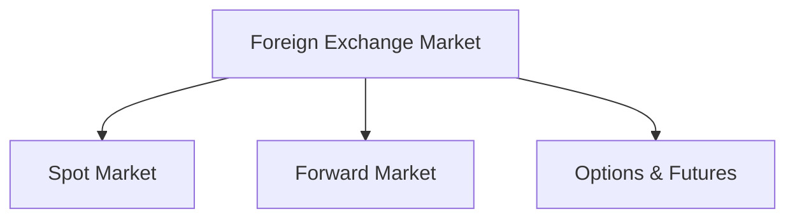

# Unit 3 — International Monetary System History

## 1. Introduction
Examining **International Monetary System History** and its position in stabilizing the global monetary and financial framework.

## 2. Key Mechanisms & Forex Principles
- Understanding hedging, arbitrage, and speculation.
- Floating vs Fixed exchange rate structures.

## 3. Real-World Case
- **1997 Asian Financial Crisis**: How speculative attacks led to IMF bailouts.
- **World Bank Projects**: Funding infrastructure developments in developing economies.

## 4. Visual Diagram

## 5. Exam prep
- **Short Question (2 Marks)**: Define Currency Arbitrage.
- **Long Question (10 Marks)**: Compare and contrast the roles of the IMF and the World Bank.
