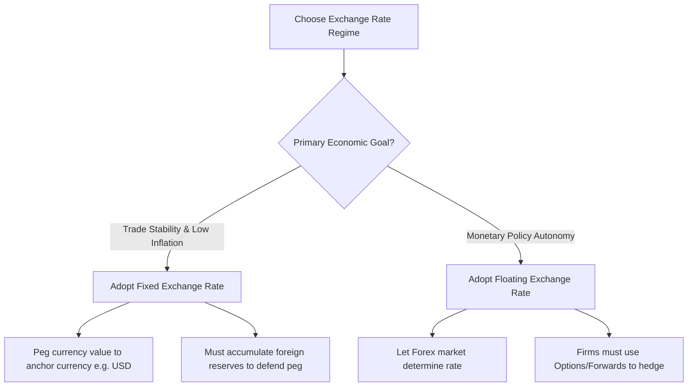

# 📝 UNIT 3 — ALL POSSIBLE SUBJECTIVE QUESTIONS WITH ANSWERS
### Global Monetary System | Solved Question Bank

---

## 🔷 SECTION A: SHORT ANSWER QUESTIONS (2–4 Marks)

---

### Q1. Define 'Bid-Ask Spread' and state its formula in the Forex market.
**Answer:**
The **Bid-Ask Spread** is the difference between the rate at which a bank or dealer sells a currency (Ask rate) and the rate at which they buy that currency (Bid rate). It represents the dealer's profit margin or transaction service fee.

* **Formula for Currency Spread**:
  $$\text{Spread} = \text{Ask Rate} - \text{Bid Rate}$$
* **Formula for Spread Percentage**:
  $$\text{Spread \%} = \frac{\text{Ask Rate} - \text{Bid Rate}}{\text{Ask Rate}} \times 100$$
* *Implication*: Liquid currencies (like USD/EUR) have very narrow spreads, while illiquid currencies have wide spreads, reflecting higher transaction risks.

---

### Q2. Differentiate between Transaction Exposure and Translation Exposure.
**Answer:**

| Feature | Transaction Exposure | Translation Exposure |
| :--- | :--- | :--- |
| **Nature** | Risk of change in cash value of outstanding contracts due to exchange rate shifts. | Accounting paper risk of balance sheet consolidation. |
| **Cash Flow Impact** | **Direct**: Leads to realized cash gains or losses on settlement. | **Indirect**: Non-cash paper adjustment; only realized if foreign subsidiary is sold. |
| **Time Horizon** | Short-to-medium-term. | Reporting cycle (quarterly/annually). |
| **Example** | An unpaid invoice of €10,000 due in 60 days. | Consolidation of Japanese subsidiary assets in US dollars. |

---

### Q3. Explain the concept of 'Lender of Last Resort' in the context of the IMF.
**Answer:**
The **International Monetary Fund (IMF)** acts as the **lender of last resort** for member countries experiencing severe balance-of-payments (BoP) crises. 
* **When it occurs**: When a country depletes its foreign exchange reserves, cannot pay for essential imports (food, fuel, medicine), and cannot borrow from commercial global markets.
* **The Action**: The IMF provides emergency short-to-medium-term financing to prevent currency default and stabilize the exchange rate, but demands strict economic policy reforms (conditionalities) in return.

---

### Q4. What is 'Triangular Arbitrage' in the foreign exchange market?
**Answer:**
**Triangular Arbitrage** (or three-point arbitrage) is the process of exploiting a price discrepancy between three different currencies in the forex market to generate a risk-free profit.
* **The Process**: An arbitrageur converts Currency A to Currency B, Currency B to Currency C, and then Currency C back to Currency A, ending up with more of Currency A than they started with.
* **Market Stability**: High-speed algorithmic trading quickly eliminates these discrepancies, returning the rates to equilibrium.

---

### Q5. What is the 'Law of One Price' and how does it relate to Purchasing Power Parity (PPP)?
**Answer:**
The **Law of One Price** states that in the absence of transaction costs and trade barriers, identical goods must sell for the exact same price in different countries when expressed in a common currency.
* **Relation to PPP**: Purchasing Power Parity is the macroeconomic extension of the Law of One Price. It argues that the exchange rate between two currencies must adjust so that a basket of goods has identical purchasing power in both economies.

---

## 🔷 SECTION B: MEDIUM ANSWER QUESTIONS (5 Marks)

---

### Q6. Differentiate between a Forward Contract and a Currency Option with a comparison matrix.
**Answer:**
Both Forwards and Options are used to hedge foreign exchange risk, but they offer different operational flexibilities.

| Basis of Comparison | Forward Contract | Currency Option |
| :--- | :--- | :--- |
| **Trading Market** | Over-the-Counter (OTC) / Banks directly. | Exchange-traded (standardized) or OTC. |
| **Obligation** | **Yes**: Both parties are legally bound to execute the exchange at maturity. | **No**: The buyer has the *right* to trade but is not obligated to execute it. |
| **Upfront Cost** | **Free**: No premium is charged at inception. | **Premium**: The buyer must pay an upfront, non-refundable fee. |
| **Upside Potential** | **None**: Locked-in rate prevents benefiting if spot rates improve. | **Unlimited**: If spot rates are better, buyer lets option expire and trades in spot market. |
| **Example** | Custom contract to buy €50,000 at $1.08 in 90 days. | Buying a USD Put Option with a strike price of 83.00 INR. |

*Strategic Conclusion*: Forward contracts are rigid and eliminate all variance (risk and reward), whereas currency options act like an insurance policy, eliminating downside risk while leaving upside gains open.

---

### Q7. Outline the key differences between the IMF and the World Bank using the "MIA" mnemonic.
**Answer:**
The IMF and the World Bank were both established at the 1944 Bretton Woods Conference, but they have distinct mandates. We use the mnemonic **"Money, Infrastructure, Asia" (MIA)** to distinguish global financial institutions (with ADB):

```
       MIA Framework:
       ├── M ──► Money (IMF): Short-term currency stability & crisis management
       ├── I ──► Infrastructure (World Bank): Long-term global development loans
       └── A ──► Asia-Pacific (ADB): Regional infrastructure loans
```

#### 1. International Monetary Fund (IMF) — "Money"
* **Focus**: Short-term macroeconomic stability.
* **Role**: Acts as a financial monitor (surveillance) and emergency lender of last resort.
* **Recipient**: Any country facing a balance-of-payments crisis.
* **Loans**: Short-to-medium-term balance-of-payments support loans conditional on policy reforms (austerity).

#### 2. World Bank Group — "Infrastructure"
* **Focus**: Long-term structural economic development and poverty reduction.
* **Role**: Finances physical and social infrastructure projects (dams, schools, energy grids).
* **Recipient**: Developing and low-income countries.
* **Loans**: Long-term loans and grants (often 20-30 years) with low interest rates.

---

### Q8. Briefly explain the causes and contagion effects of the 1997 Asian Financial Crisis.
**Answer:**
The 1997 Asian Financial Crisis was a severe economic shock that started in Southeast Asia and spread globally.

```
Hot Capital Inflows ──► Overvalued Currency Pegs ──► Speculative Attacks ──► Peg Collapses ──► Contagion
```

#### 1. Primary Causes:
* **Short-Term Foreign Debt**: East Asian businesses borrowed heavily in US Dollars because interest rates were lower in the US.
* **Fixed Exchange Rate Pegs**: Currencies like the Thai Baht were pegged to the USD, giving local firms a false sense of security regarding currency risk.
* **Real Estate Bubbles**: Cheap credit led to unproductive investments in real estate and infrastructure, leading to bad bank loans.
* **Speculative Attack**: Sensing that Thailand's central bank was running out of USD reserves, speculators sold Baht heavily.

#### 2. Contagion Effects:
* In July 1997, Thailand was forced to float the Baht, which crashed by 50%.
* Fear spread to neighboring countries (contagion). International investors panicked and pulled capital out of the entire region.
* The Indonesian Rupiah, Malaysian Ringgit, and South Korean Won collapsed.
* Because their currencies depreciated, domestic companies could no longer afford to service their USD debt, leading to massive bankruptcies and bank failures across Asia.

---

## 🔷 SECTION C: LONG/ANALYTICAL QUESTIONS (10 Marks)

---

### Q9. Solve the following Forex numerical step-by-step. Show all spread and cross-rate calculations. (10 Marks)

#### Problem
An international dealer quotes the following spot exchange rates:
* **Quote 1 (USD/INR)** = $83.40 / 83.60$
* **Quote 2 (USD/EUR)** = $0.91 / 0.93$

1. Identify the **Bid Rate** and **Ask Rate** for both quotes.
2. Calculate the **Bid-Ask Spread** and **Spread Percentage** for Quote 1 (USD/INR).
3. Calculate the **EUR/INR** cross-rate quote (Bid and Ask) for this dealer.
4. Show how much INR an Indian client will receive if they convert **€10,000** into INR using your calculated cross-rates.

---

#### Solved Solution

##### Step 1: Identifying Rates
* **Quote 1 (USD/INR)**:
  * **Bid Rate** (Rate at which bank buys USD and sells INR): **83.40 INR**
  * **Ask Rate** (Rate at which bank sells USD and buys INR): **83.60 INR**
* **Quote 2 (USD/EUR)**:
  * **Bid Rate** (Rate at which bank buys USD and sells EUR): **0.91 EUR**
  * **Ask Rate** (Rate at which bank sells USD and buys EUR): **0.93 EUR**

##### Step 2: Spread Calculations for Quote 1 (USD/INR)
* **Currency Bid-Ask Spread**:
  $$\text{Spread} = \text{Ask Rate} - \text{Bid Rate} = 83.60 - 83.40 = \mathbf{0.20\text{ INR}}$$
* **Spread Percentage**:
  $$\text{Spread \%} = \frac{\text{Ask Rate} - \text{Bid Rate}}{\text{Ask Rate}} \times 100$$
  $$\text{Spread \%} = \frac{0.20}{83.60} \times 100 \approx \mathbf{0.239\%}$$

##### Step 3: Calculating EUR/INR Cross-Rates
We need to find the `EUR/INR` quote (Bid / Ask), which represents the price of 1 EUR in INR.
* **EUR/INR (Bid)**: Rate at which bank buys EUR and sells INR. 
  *Formula*:
  $$\text{EUR/INR (Bid)} = \frac{\text{USD/INR (Bid)}}{\text{USD/EUR (Ask)}} = \frac{83.40}{0.93} \approx \mathbf{89.677\text{ INR}}$$
  *(The bank buys 1 EUR from the customer by giving 89.68 INR)*
* **EUR/INR (Ask)**: Rate at which bank sells EUR and buys INR.
  *Formula*:
  $$\text{EUR/INR (Ask)} = \frac{\text{USD/INR (Ask)}}{\text{USD/EUR (Bid)}} = \frac{83.60}{0.91} \approx \mathbf{91.868\text{ INR}}$$
  *(The bank sells 1 EUR to the customer for 91.87 INR)*

*Calculated Cross-Rate Quote*: **EUR/INR = 89.68 / 91.87**

##### Step 4: Converting €10,000 to INR
* **Scenario**: The customer has €10,000 and wants to convert it to INR. This means the customer is **selling EUR** to the bank.
* **Applicable Rate**: The bank will buy EUR from the customer at the **EUR/INR Bid Rate**.
* **Calculation**:
  $$\text{INR Received} = \text{Amount in EUR} \times \text{EUR/INR (Bid)}$$
  $$\text{INR Received} = 10,000 \times 89.677 = \mathbf{896,770\text{ INR}}$$
* **Conclusion**: The Indian client will receive **896,770 INR**.

---

### Q10. Critically evaluate the differences between Fixed and Floating exchange rate systems. Under what economic conditions should a developing nation adopt a pegged (fixed) exchange rate? (10 Marks)

**Topper's Answer**:

##### 1. Introduction
An exchange rate system is the mechanism by which a nation's currency value is determined relative to other currencies. The choice of exchange rate regime (Fixed vs. Floating) represents a fundamental policy choice, balancing trade stability against domestic monetary independence.

##### 2. Comparison Matrix: Fixed vs. Floating Systems

| Parameter | Fixed Exchange Rate System | Floating Exchange Rate System |
| :--- | :--- | :--- |
| **Rate Determination** | Fixed by the Central Bank via market intervention. | Determined by spot supply and demand in the Forex market. |
| **Monetary Autonomy** | **Low**: Interest rates must be adjusted to protect the currency peg (The Impossible Trinity). | **High**: Interest rates can be set to address domestic inflation or unemployment. |
| **Trade Predictability** | **High**: Eliminates currency risk, reducing transaction costs for exporters/importers. | **Low**: Continuous fluctuations make long-term trade pricing difficult. |
| **Reserve Requirements** | **High**: Central bank must hold vast foreign currency/gold reserves to defend the peg. | **Low**: Central bank rarely intervenes; reserves are kept for liquidity shocks. |
| **Trade Deficit Adjustments** | Slow; requires internal price adjustments (wage cuts, domestic deflation). | Automatic; trade deficits lead to currency depreciation, boosting exports. |

##### 3. Exchange Rate Regime Choice Flowchart


##### 4. Conditions for Adopting a Pegged (Fixed) Exchange Rate
A developing nation should adopt a pegged exchange rate system under the following economic conditions:
1. **Small, Trade-Dependent Economy**: Nations where international trade represents a large share of GDP (e.g., Hong Kong, Jordan) benefit from a fixed rate because it lowers transactional currency risk for international merchants.
2. **History of Hyperinflation & Weak Monetary Credibility**: Developing nations with weak central banks peg their currency to a stable anchor currency (like the US Dollar or Euro) to import monetary discipline, lower domestic inflation expectations, and build investor trust.
3. **High Trade Integration with a Single Major Partner**: If a developing country exports the majority of its goods to a single nation (e.g., Gulf nations exporting oil to the US), pegging to that partner's currency (USD) simplifies trade accounts.
4. **Possession of Large Foreign Reserves**: A peg is only credible if the central bank holds sufficient reserves to buy its own currency when speculative pressures attempt to devalue it.

##### 5. Conclusion
No single exchange rate regime fits all countries. Developing nations must weigh the trade benefits of stability (Fixed) against the flexibility of independent monetary policies (Floating).
