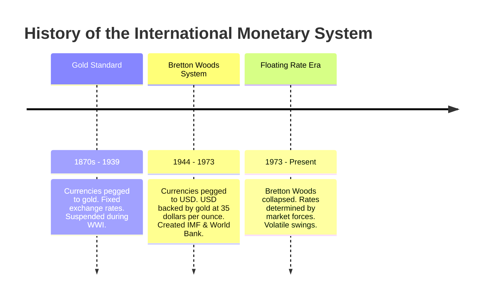
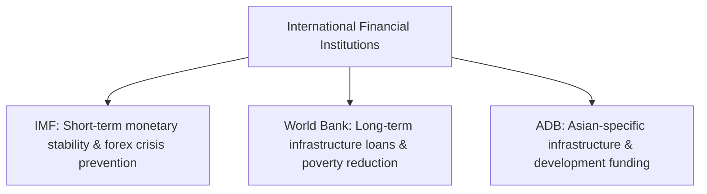
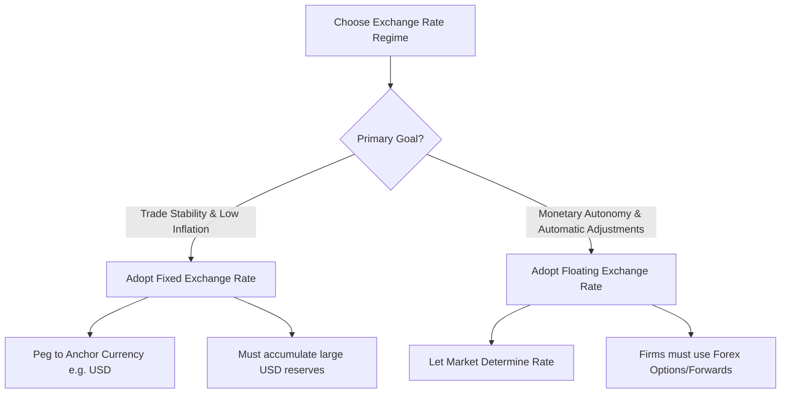

# Unit 3 — Global Monetary System: Master Study Guide

Welcome to the comprehensive master guide for Unit 3: Global Monetary System. This document is designed to take you from absolute beginner to exam-ready topper. It covers 100% of the syllabus, integrating conceptual lectures, mathematical examples of forex rates, real-world monetary cases, current affairs, quick-revision checklists, and fully solved questions.

---

## 📌 Table of Contents
1. [Core Lectures: Concept Explanations](#1-core-lectures-concept-explanations)
   - [The Foreign Exchange (Forex) Market](#the-foreign-exchange-forex-market)
   - [Managing Exchange Rate Risk: Hedging, Speculation, & Arbitrage](#managing-exchange-rate-risk-hedging-speculation--arbitrage)
   - [History of the International Monetary System](#history-of-the-international-monetary-system)
   - [International Financial Institutions: IMF, World Bank, & ADB](#international-financial-institutions-imf-world-bank--adb)
2. [Solved Corporate & Sovereign Case Studies](#2-solved-corporate--sovereign-case-studies)
   - [Case 1: The IMF Structural Adjustment Loan to Sri Lanka](#case-1-the-imf-structural-adjustment-loan-to-sri-lanka)
   - [Case 2: Porsche's Forex Hedging Strategy](#case-2-porsches-forex-hedging-strategy)
3. [Rapid Revision Cheat Sheet](#3-rapid-revision-cheat-sheet)
   - [Hedging Instruments Comparison Table](#hedging-instruments-comparison-table)
   - [IMF vs. World Bank vs. ADB Mnemonic Card](#imf-vs-world-bank-vs-adb-mnemonic-card)
   - [Currency Exposures (Transaction, Translation, Economic)](#currency-exposures-transaction-translation-economic)
4. [Exam Practice Q&A Bank](#4-exam-practice-qa-bank)
   - [Forex Calculations (Bid-Ask Spreads & Quotes)](#forex-calculations-bid-ask-spreads--quotes)
   - [2-Mark Short Compulsory Questions](#2-mark-short-compulsory-questions)
   - [5-Mark Medium-Length Questions](#5-mark-medium-length-questions)
   - [10-Mark Long/Analytical Questions (Topper Answers)](#10-mark-longanalytical-questions-topper-answers)

---

## 1. Core Lectures: Concept Explanations

### The Foreign Exchange (Forex) Market

#### What is the Forex Market?
The Foreign Exchange (Forex or FX) market is a global, decentralized network where currencies are traded. It is the largest financial market in the world, operating 24 hours a day, five days a week.

#### Functions of the Forex Market
1.  **Currency Conversion**: Converting the currency of one country into the currency of another (e.g., an Indian tourist converting Indian Rupees (INR) to US Dollars (USD) to spend in New York).
2.  **Providing Credit**: Facilitating trade by financing goods in transit (e.g., banks issuing letters of credit across currencies).
3.  **Exchange Rate Insurance (Hedging)**: Allowing businesses to protect themselves against the risk of adverse exchange rate movements.

#### How Exchange Rates are Determined
Exchange rates are prices. Like any other price, they are determined by the forces of **supply and demand** in a free-floating system:
- **Inflation Rates**: High domestic inflation causes a currency to depreciate because its purchasing power drops.
- **Interest Rates**: High relative interest rates attract foreign capital (investors seeking higher yields), increasing demand and appreciating the currency.
- **Balance of Payments**: A country running a trade deficit (importing more than exporting) has to sell its own currency to buy foreign currency, causing depreciation.

---

### Managing Exchange Rate Risk: Hedging, Speculation, & Arbitrage

When companies operate across borders, currency fluctuations can wipe out profit margins.

#### 💡 The Wine Importer Analogy (Relate & Feel)
Suppose you are a US wine importer. In January, you order 1,000 bottles of premium wine from Italy, costing €10,000. The invoice is due in June. 
- In January, the exchange rate is $1\text{ USD} = 1\text{ EUR}$ ($€1 = \$1$). You expect to pay **$10,000**.
- By June, the Euro appreciates significantly to $1\text{ EUR} = 1.30\text{ USD}$ ($€1 = \$1.30$). 
- When the invoice arrives, you must convert USD to €10,000. Now, it costs you **$13,000**! You just lost $3,000 simply due to currency shifts. To prevent this, you use **Hedging**.

#### 1. Hedging Instruments
- **Forward Contract**: A contract between a firm and a bank to exchange a specific amount of currency at a set rate on a specific future date (non-negotiable/customized).
- **Futures Contract**: Similar to a forward contract, but traded on public exchanges in standardized amounts and dates.
- **Currency Options**: Gives the buyer the *right*, but not the *obligation*, to buy/sell a currency at a set rate (Strike Price) before a specific date. This requires paying a premium.
- **Currency Swaps**: Simulating a trade where two parties exchange principal and interest payments in different currencies.

#### 2. Speculation
Taking on currency risk deliberately to profit from anticipated fluctuations in exchange rates (e.g., buying Japanese Yen hoping it will appreciate, then selling it for a profit).

#### 3. Arbitrage
The purchase of a currency in one market where the price is low, and its immediate sale in another market where the price is higher, pocketing a risk-free profit. Due to high-speed computerized trading, arbitrage opportunities last only seconds.

---

### History of the International Monetary System

The rules and institutions governing exchange rates have evolved through three main eras:

#### Fixed vs. Floating Exchange Rates
- **Fixed (Pegged) Exchange Rate**: The government/central bank ties the country's currency value to another major currency (e.g., USD) or to gold.
  - *Pros*: High stability for trade; low inflation.
  - *Cons*: Prevents the country from setting its own interest rates (monetary policy is constrained).
- **Floating Exchange Rate**: The value is determined solely by forex market forces of supply and demand.
  - *Pros*: Automatic adjustments to trade deficits; monetary policy independence.
  - *Cons*: High volatility makes long-term planning difficult for businesses.

---

### International Financial Institutions: IMF, World Bank, & ADB

These three institutions form the pillars of global development finance.

1.  **International Monetary Fund (IMF)**:
    - *Role*: Acts as a lender of last resort. It lends money to countries experiencing balance-of-payments crises (when a country runs out of foreign exchange reserves and cannot pay for imports).
    - *Criticisms*: Demands harsh **Structural Adjustment Programs (SAPs)** (austerity, tax hikes, privatization, and opening markets), which can harm social welfare in developing nations.
2.  **World Bank Group**:
    - *Role*: Promotes long-term economic development and poverty reduction by financing infrastructure projects (dams, roads, schools) in developing nations.
3.  **Asian Development Bank (ADB)**:
    - *Role*: Similar to the World Bank, but focused specifically on reducing poverty and financing social and economic development projects within the Asia-Pacific region (headquartered in Manila, Philippines).

---

## 2. Solved Corporate & Sovereign Case Studies

### Case 1: The IMF Structural Adjustment Loan to Sri Lanka

**Background**: In 2022, Sri Lanka faced a severe economic crisis. A depletion of foreign reserves meant the country could not import food, fuel, or medicines. Its currency, the Sri Lankan Rupee (LKR), collapsed.

**The Action**: Sri Lanka approached the IMF for a $2.9 billion bailout loan. 

**The Conditions (IMF Criticisms in Practice)**:
To receive the loan, the IMF demanded structural reforms:
- **Tax Increases**: Doubling personal income taxes and raising VAT to generate government revenue.
- **Austerity**: Removing state subsidies on electricity and fuel, causing utility prices to skyrocket for citizens.
- **Privatization**: Restructuring loss-making state-run enterprises (like SriLankan Airlines).

**Key Takeaways**:
- Illustrates the IMF’s role as the **lender of last resort** during foreign reserve depletion.
- Demonstrates why the IMF is criticized: its austerity measures can cause short-term inflation and public protests in recipient nations.

---

### Case 2: Porsche's Forex Hedging Strategy

**Background**: Porsche manufactures almost all its cars in Germany but sells over 45% of them in North America. Thus, its costs are in Euros (€) but its revenues are in US Dollars ($).

**The Challenge**: If the USD depreciates against the Euro, Porsche’s dollar revenues translate into fewer Euros, threatening its survival.

**The Response**: Porsche implemented one of the largest corporate hedging programs in history. It used **currency option contracts** to lock in a guaranteed minimum exchange rate for USD revenues up to 3 years in advance. In years when the USD collapsed, Porsche remained profitable, while competitors like BMW and Mercedes suffered massive losses.

---

## 3. Rapid Revision Cheat Sheet

### Hedging Instruments Comparison Table

| Instrument | Traded On | Contract Size | Obligation to Trade? | Pricing Cost |
| :--- | :--- | :--- | :--- | :--- |
| **Forward** | OTC (Over-the-Counter / Banks) | Customized | **Yes** (Both parties must trade) | Free (Implicit in rate spread) |
| **Futures** | Public Exchange (e.g., CME) | Standardized | **Yes** (Both parties must trade) | Transaction margin fee |
| **Option** | Public Exchange or OTC | Standardized or Custom | **No** (Buyer has choice) | Upfront **Premium** payment |

---

### IMF vs. World Bank vs. ADB Mnemonic Card

Use the mnemonic **"Money, Infrastructure, Asia" (MIA)**:
*   **IMF** = **M**onetary Stability (Short-term crises lender)
*   **World Bank** = **I**nfrastructure (Long-term global development)
*   **ADB** = **A**sian Regional Development

---

### Currency Exposures (Transaction, Translation, Economic)
- **Transaction Exposure**: Risk on existing contracts (e.g., an outstanding invoice in a foreign currency). *Felt in the short term.*
- **Translation Exposure**: Accounting risk when consolidating foreign subsidiary statements back to parent currency. *Felt on paper.*
- **Economic Exposure**: Risk to future competitiveness and long-term cash flows due to persistent exchange rate shifts. *Felt in the long term.*

---

## 4. Exam Practice Q&A Bank

### Forex Calculations (Bid-Ask Spreads & Quotes)

> [!TIP]
> Forex numericals are highly scoring in LPU exams. Practice these steps to secure full marks.

#### Problem 1: Bid-Ask Spread Calculation
A bank quotes the following exchange rate for USD/INR:
$$\text{USD/INR} = 83.40 / 83.60$$

1.  Identify the **Bid rate** and the **Ask rate**.
2.  Calculate the **Bid-Ask Spread** in currency terms.
3.  Calculate the **Bid-Ask Spread Percentage**.

##### Solution Step-by-Step:
1.  **Identifying Rates**:
    - **Bid Rate** (Rate at which the bank *buys* USD): **83.40 INR**
    - **Ask Rate** (Rate at which the bank *sells* USD): **83.60 INR**
2.  **Calculating Currency Spread**:
    $$\text{Spread} = \text{Ask Rate} - \text{Bid Rate} = 83.60 - 83.40 = \mathbf{0.20\text{ INR}}$$
3.  **Calculating Spread Percentage**:
    $$\text{Spread \%} = \frac{\text{Ask Rate} - \text{Bid Rate}}{\text{Ask Rate}} \times 100$$
    $$\text{Spread \%} = \frac{0.20}{83.60} \times 100 \approx \mathbf{0.239\%}$$

---

### 2-Mark Short Compulsory Questions

#### Q1. Define 'Arbitrage' in the forex market.
*   **Topper's Answer**: Arbitrage is the simultaneous purchase and sale of a currency in different markets to exploit price discrepancies and lock in a risk-free profit. 

#### Q2. What was the core feature of the 'Bretton Woods System'?
*   **Topper's Answer**: Established in 1944, it was an adjustable peg system where member currencies were pegged to the US Dollar ($), and the USD was fixed to and convertible into gold at $35 per ounce.

#### Q3. Explain the term 'Riba' and its relevance to Islamic finance.
*   **Topper's Answer**: *Riba* refers to interest charged on loans, which is prohibited under Islamic (Shariah) law. This forces Islamic financial systems to use equity-sharing or asset-backed leasing models instead of interest-bearing loans.

#### Q4. What is 'Translation Exposure'?
*   **Topper's Answer**: Translation (or accounting) exposure is the impact of exchange rate changes on the consolidated financial statements of a multinational company when translating foreign subsidiary assets and liabilities into the parent currency.

---

### 5-Mark Medium-Length Questions

#### Q5. Explain the differences between a Forward Contract and a Currency Option.
*   **Topper's Answer**:
    
    | Feature | Forward Contract | Currency Option |
    | :--- | :--- | :--- |
    | **Obligation** | Both parties are legally bound to execute the trade at maturity. | The buyer has the right to trade but is not obligated to do so. |
    | **Upfront Cost** | No premium payment is required. | The buyer must pay a non-refundable **Premium** to the seller. |
    | **Flexibility** | Rigid; customized but must be settled at the agreed rate. | Highly flexible; buyer can let it expire if market rates are better. |
    | **Customization** | High; negotiated directly with banks over-the-counter. | Standardized (if traded on exchanges) or customized (OTC). |

*Strategic Summary*: A forward contract locks in a rate and eliminates all upside/downside variance, whereas a currency option acts like an insurance policy, protecting against downside risk while leaving the upside open.

---

#### Q6. Outline the primary functions of the International Monetary Fund (IMF) and the criticisms it faces.
*   **Topper's Answer**:
    
    ##### Functions:
    1.  **Lender of Last Resort**: Provides short-to-medium-term loans to countries facing severe balance-of-payments deficits.
    2.  **Surveillance**: Monitors global exchange rate policies and economic health of member countries.
    3.  **Technical Assistance**: Offers training and advice to central banks and governments on managing monetary policy.
    
    ##### Criticisms:
    -   **One-Size-Fits-All Austerity**: The IMF demands structural adjustment programs (SAPs) involving tax hikes and public spending cuts, which often worsen recessions and impact low-income citizens.
    -   **Loss of Sovereignty**: Recipient governments must surrender control over their domestic budgets to meet IMF requirements.

---

### 10-Mark Long/Analytical Questions (Topper Answers)

#### Q7. Critically evaluate the differences between Fixed and Floating Exchange Rate systems. Under what conditions should a country adopt a fixed exchange rate?

**Topper's Answer**:

##### 1. Introduction
The choice of an exchange rate regime is a critical national economic policy decision. A fixed system pegs the currency value to a anchor currency, while a floating system lets market forces determine the rate.

##### 2. Comparison Matrix: Fixed vs. Floating

| Parameter | Fixed Exchange Rate System | Floating Exchange Rate System |
| :--- | :--- | :--- |
| **Rate Determination** | Fixed by Central Bank intervention | Market forces of Supply & Demand |
| **Monetary Autonomy** | Low (Interest rates must align with the peg anchor) | High (Interest rates set for domestic goals) |
| **Trade Predictability** | High (No exchange rate volatility for exporters) | Low (Constant fluctuation risks) |
| **Reserves Required** | High (Must maintain huge foreign reserves to defend peg) | Low (Central bank rarely intervenes) |
| **Adjustment to Deficits** | Requires domestic price adjustments (austerity) | Automatic depreciation boosts exports |

##### 3. Mermaid System Choice Flow

##### 4. Conditions for Adopting a Fixed Exchange Rate
A country should adopt a fixed exchange rate regime under the following circumstances:
1.  **Small, Open Economy**: Nations heavily reliant on trade (e.g., Hong Kong, Denmark) benefit from a fixed rate because it reduces transaction costs and exchange rate uncertainty for international merchants.
2.  **History of Hyperinflation**: Developing nations with weak central banks peg their currency to a stable foreign anchor (like the USD) to import monetary discipline, build trust, and lower domestic inflation.
3.  **High Trade Integration with a Major Partner**: Pegging to the currency of the primary trading partner (e.g., Gulf nations pegging to the USD due to oil pricing) simplifies transactions.

##### 5. Conclusion
There is no universally superior system. Countries must balance trade predictability (Fixed) against domestic monetary independence (Floating) based on their economic size and policy priorities.
