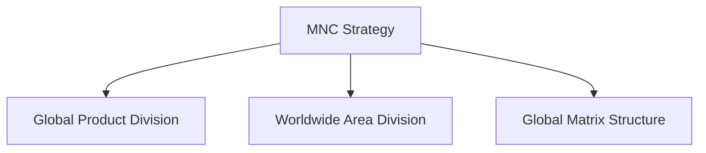

# Unit 4 — Organizational Structure of MNCs

## 1. Introduction
Understanding **Organizational Structure of MNCs** and how global integration vs local responsiveness pressure shapes organizational architecture.

## 2. Strategic Choices
- Localization Strategy.
- Global Standardization Strategy.
- Transnational Strategy.
- International Strategy.

## 3. Entry Strategies
- Exporting, Licensing, Franchising.
- Joint Ventures and Wholly Owned Subsidiaries.

## 4. Visual Diagram

## 5. Exam prep
- **Short Question (2 Marks)**: What is a Transnational strategy?
- **Long Question (10 Marks)**: Critically analyze vertical and horizontal differentiation in MNC structural configurations.
