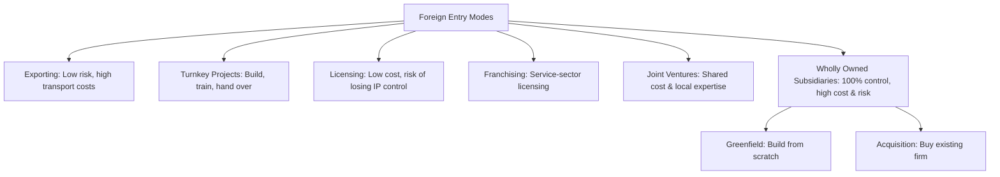
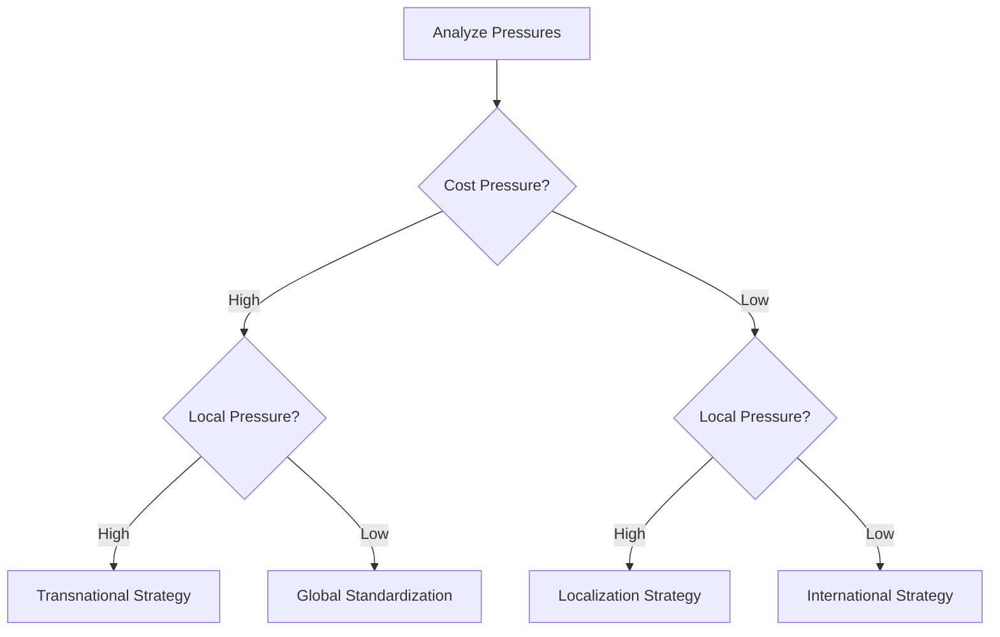

# Unit 4 — Strategy and Structure: Master Study Guide

Welcome to the Unit 4 Master Study Guide. This guide covers 100% of the syllabus, designed to take you from basic concepts to topper-level exam answers. It integrates theoretical frameworks, corporate case studies (Tesla & Alibaba), visual organizational layouts, current trends, and a solved question bank.

---

## 📌 Table of Contents
1. [Core Lectures: Concept Explanations](#1-core-lectures-concept-explanations)
   - [Strategy in International Business](#strategy-in-international-business)
   - [The Integration-Responsiveness (GLIT) Matrix](#the-integration-responsiveness-glit-matrix)
   - [Market Entry Strategies](#market-entry-strategies)
   - [Strategic Alliances: Selection, Structure, & Management](#strategic-alliances-selection-structure--management)
   - [MNC Organizational Structure & Control Systems](#mnc-organizational-structure--control-systems)
2. [Solved Corporate Case Studies](#2-solved-corporate-case-studies)
   - [Case 1: Tesla's Greenfield Strategy in Shanghai](#case-1-teslas-greenfield-strategy-in-shanghai)
   - [Case 2: Lenovo's Acquisition of IBM’s PC Division](#case-2-lenovos-acquisition-of-ibms-pc-division)
3. [Rapid Revision Cheat Sheet](#3-rapid-revision-cheat-sheet)
   - [Entry Modes Comparison Grid](#entry-modes-comparison-grid)
   - [GLIT Strategies Mnemonic Card](#glit-strategies-mnemonic-card)
4. [Exam Practice Q&A Bank](#4-exam-practice-qa-bank)
   - [2-Mark Short Compulsory Questions](#2-mark-short-compulsory-questions)
   - [5-Mark Medium-Length Questions](#5-mark-medium-length-questions)
   - [10-Mark Long/Analytical Questions (Topper Answers)](#10-mark-longanalytical-questions-topper-answers)

---

## 1. Core Lectures: Concept Explanations

### Strategy in International Business

#### What is Strategy?
A firm's strategy consists of the actions that managers take to attain the goals of the firm. Typically, the primary goal is to maximize the value of the firm for its owners by increasing profitability and growth.

#### Pressures in International Business
MNCs face two conflicting pressures when competing globally:
1.  **Pressures for Cost Reduction**: Requires the firm to lower unit costs by mass-producing standardized products in low-cost countries.
2.  **Pressures for Local Responsiveness**: Requires the firm to adapt its products, marketing, and distribution to match local consumer tastes, cultural preferences, distribution channels, and government regulations.

---

### The Integration-Responsiveness (GLIT) Matrix

Based on these two pressures, firms can choose one of four global strategies:

```
                  High │ 🟩 Global Standardization   🟪 Transnational
                       │ (e.g., Intel, Boeing)       (e.g., Caterpillar)
Pressure for           │
Cost Reduction         ├─────────────────────────────┼─────────────────────────────
                       │ 🟦 International            🟨 Localization
                   Low │ (e.g., Rolex, Xerox)        (e.g., McDonald's, Heinz)
                       └─────────────────────────────┴─────────────────────────────
                                     Low                         High
                                        Pressure for Local Responsiveness
```

#### 1. International Strategy
- **Pressures**: Low Cost / Low Local Responsiveness.
- **Description**: Transferring valuable core competencies to foreign markets where local competitors lack them. Product design and marketing remain centralized in the home country (e.g., luxury brands like Rolex).

#### 2. Global Standardization Strategy
- **Pressures**: High Cost / Low Local Responsiveness.
- **Description**: Focuses on achieving low costs by utilizing economies of scale, learning effects, and location economies. The product, marketing, and operations are highly standardized globally (e.g., Intel microprocessor chips).

#### 3. Localization (Multidomestic) Strategy
- **Pressures**: Low Cost / High Local Responsiveness.
- **Description**: Customizing the firm's goods, services, and marketing mix to match national tastes. Each country subsidiary acts as a self-contained unit (e.g., Heinz adapting ketchup flavors and McDonald's menu items).

#### 4. Transnational Strategy
- **Pressures**: High Cost / High Local Responsiveness.
- **Description**: Trying to simultaneously achieve low costs, adapt products locally, and foster a multidirectional flow of skills across global subsidiaries (e.g., Caterpillar, Unilever). Extremely difficult to implement due to high organizational complexity.

---

### Market Entry Strategies

How should a firm enter a foreign market? Each mode has distinct trade-offs in terms of risk, cost, and control.



- **Exporting**: Selling domestically produced products abroad.
- **Turnkey Projects**: A contractor handles every detail of a project for a foreign client, including training operating personnel. At completion, the key is handed over to the client (common in infrastructure, e.g., Metro rail lines).
- **Licensing**: A licensor grants rights to intangible property (patents, designs) to a licensee for a royalty fee.
- **Franchising**: A specialized form of licensing in which the franchisor sells intangible property and insists that the franchisee agree to abide by strict rules as to how it does business (common in service sectors, e.g., Subway, Domino's).
- **Joint Venture (JV)**: Establishing a firm that is jointly owned by two or more otherwise independent companies (e.g., Maruti Suzuki in India).
- **Wholly Owned Subsidiary (WOS)**: The firm owns 100% of the stock of the foreign subsidiary.
  - *Greenfield Investment*: Building a new operation from scratch in the foreign country.
  - *Acquisition*: Acquiring an established local firm to launch operations quickly.

---

### Strategic Alliances: Selection, Structure, & Management

Strategic alliances are cooperative agreements between potential or actual competitors (e.g., Starbucks partnering with Tata in India).

#### Alliance Life Cycle
1.  **Partner Selection**: A good partner must help the firm achieve strategic goals (market access, shared costs) and share the firm’s vision, without exploiting alliance data.
2.  **Alliance Structure**: Structuring the agreement to protect intellectual property (IP). Contracts can include clauses that prevent technology transfer without mutual consent.
3.  **Managing the Alliance**: Requires building interpersonal relationships and trust ("social capital") between managers, along with learning from the partner.

---

### MNC Organizational Structure & Control Systems

MNCs must align their structural configurations with their global strategies.

#### Vertical Differentiation: Centralization vs. Decentralization
- **Centralization**: Concentrates decision-making authority at the top (HQ) level.
  - *Pros*: Ensures decisions match corporate goals; avoids duplication of activities.
  - *Cons*: Stifles local initiatives; creates bureaucratic delays.
- **Decentralization**: Distributes decision-making authority to lower levels, such as country managers.
  - *Pros*: Quick response to local market changes; increases employee motivation.
  - *Cons*: Can lead to lack of coordination across country units.

#### Horizontal Differentiation (Structure Designs)
- **International Division Structure**: Foreign operations are grouped into a single division, separating them from domestic units.
- **Worldwide Area Structure**: The world is divided into geographic areas (e.g., North America, Europe, Asia-Pacific). Used by firms with low-cost, high-local-responsiveness needs (Localization strategy).
- **Worldwide Product Division Structure**: Business units are structured around product lines rather than geography. Used by firms with high-cost, low-local-responsiveness needs (Global Standardization strategy).
- **Global Matrix Structure**: Dual reporting lines. A country manager reports to both an Area Head and a Product Division Head. Highly complex, prone to power struggles.

#### Control Systems
- **Output Controls**: Setting quantitative performance targets (e.g., sales growth, profit margins) for subsidiaries.
- **Bureaucratic Controls**: Controlling behavior via budgets, rules, and standardized procedures.
- **Cultural Controls**: Internalizing the values and goals of the parent firm into employees, reducing the need for direct supervision.

---

## 2. Solved Corporate Case Studies

### Case 1: Tesla's Greenfield Strategy in Shanghai

**Background**: Historically, foreign automakers entering China were legally forced to form a 50/50 Joint Venture with a Chinese state-owned firm (e.g., BMW partnering with Brilliance). This posed high risks of IP leakage.

**The Action**: In 2018, China relaxed its foreign ownership rules for electric vehicle manufacturers. Tesla immediately capitalized on this and chose a **Greenfield Wholly Owned Subsidiary** to build "Gigafactory Shanghai".

**Why Greenfield over Acquisition / JV?**
- **100% Control**: Tesla retained complete control over its manufacturing technology, software systems, and battery designs.
- **Subsidies & Land**: The Chinese government provided low-cost loans and land tax incentives, making building from scratch cheaper than acquiring a local struggling manufacturer.
- **Speed**: Utilizing Greenfield, Tesla built the Shanghai plant and rolled out cars in just 10 months.

---

### Case 2: Lenovo's Acquisition of IBM’s PC Division

**Background**: In 2005, Chinese computer manufacturer Lenovo acquired IBM’s personal computer business for $1.75 billion.

**Why Acquisition?**
- **Speed to Market**: Lenovo instantly acquired a globally recognized brand ("ThinkPad"), established corporate clients, and advanced research facilities.
- **Access to Distribution**: Lenovo gained access to IBM’s massive global sales networks in the US and Europe.
- **Strategic Fit**: Combining Lenovo's low-cost manufacturing capabilities with IBM's premium brand name allowed Lenovo to become the world's largest PC manufacturer.

---

## 3. Rapid Revision Cheat Sheet

### Entry Modes Comparison Grid

| Mode | Key Advantage | Key Disadvantage | Optimal Strategy |
| :--- | :--- | :--- | :--- |
| **Exporting** | Low setup costs; location economies | High transport costs; tariff barriers | Initial market test |
| **Licensing** | Low financial risk and capital cost | Risk of losing control over technology/IP | Non-core technologies |
| **Franchising** | Fast global expansion; low cost | Difficulty in maintaining quality control | Service brands (Fast food) |
| **Joint Venture** | Shared costs; local partner expertise | Risk of partner conflict; loss of IP | Politically restricted sectors |
| **Acquisition** | Rapid entry; buy brand & clients | High integration costs; overpaying risk | High competition sectors |
| **Greenfield** | Clean slate; absolute control | Slow to build; high risk and cost | Proprietary core tech |

---

### GLIT Strategies Mnemonic Card

Use the acronym **GLIT** to remember the four global strategic choices:
*   **G**lobal Standardization (High cost pressure, low adaptation)
*   **L**ocalization (Low cost pressure, high adaptation)
*   **I**nternational (Low cost pressure, low adaptation)
*   **T**ransnational (High cost pressure, high adaptation)

---

## 4. Exam Practice Q&A Bank

### 2-Mark Short Compulsory Questions

#### Q1. What is the main disadvantage of a Global Matrix Structure?
*   **Topper's Answer**: The global matrix structure creates dual reporting channels (product and geographic), which often lead to power struggles, conflicts, slow decision-making, and high administrative overheads.

#### Q2. Distinguish between Greenfield investments and Acquisitions.
*   **Topper's Answer**: 
    - **Greenfield** involves building a new foreign subsidiary from the ground up, offering complete control but high setup times.
    - **Acquisition** involves purchasing an existing local company, offering rapid market entry but posing high integration risks.

#### Q3. Define the 'Pressures for Local Responsiveness'.
*   **Topper's Answer**: These are pressures on an MNC to customize its products and marketing to match the specific cultural, regulatory, and distribution demands of a host country.

#### Q4. What is a Turnkey Project?
*   **Topper's Answer**: A project in which a contractor handles all details of setup (design, construction, training) for a foreign client, handing over the completed facility ("turning the key") once it is ready for operations.

---

### 5-Mark Medium-Length Questions

#### Q5. Explain the concept of 'Value Creation' in International Business strategy.
*   **Topper's Answer**:
    Value creation is the difference between the utility value ($V$) a firm secures from a product and the cost ($C$) of producing that product. A firm creates value through two primary mechanisms:
    1.  **Low-Cost Strategy**: Lowering production costs ($C$) to offer competitive prices.
    2.  **Differentiation Strategy**: Enhancing the perceived value ($V$) of the product, allowing the firm to charge premium prices.
    
    In International Business, value creation is expanded by leveraging location economies (sourcing inputs from where they are cheapest/best) and transferring core competencies to global markets where local rivals cannot match them.

```
                    Utility Value (V)
                          │
                          ▼   ◄─── [Value Created = V - C]
                    Selling Price (P)
                          │
                          ▼
                     Cost (C)
```

---

#### Q6. Under what circumstances is a Joint Venture preferred over a Wholly Owned Subsidiary?
*   **Topper's Answer**:
    A Joint Venture is preferred over a Wholly Owned Subsidiary under the following conditions:
    1.  **Local Knowledge Requirement**: When the foreign market is culturally or politically complex, a local partner provides essential connections, distribution networks, and cultural expertise.
    2.  **Shared Financial Risk**: When capital requirements are massive, partnering splits the development costs and financial exposure.
    3.  **Host Government Restrictions**: In many developing nations (e.g., India's retail or defense sectors in the past), FDI rules legally prohibit 100% foreign ownership, forcing foreign firms to partner with domestic companies.

---

### 10-Mark Long/Analytical Questions (Topper Answers)

#### Q7. Critically evaluate the four strategic choices available to Multinational Corporations using the Integration-Responsiveness Matrix. Use corporate examples to support your analysis.

**Topper's Answer**:

##### 1. Introduction
MNCs operating in global markets must balance pressures for cost reduction against pressures for local responsiveness. The Integration-Responsiveness Grid outlines four primary strategic choices.

##### 2. The Four Strategies Evaluated

###### A. International Strategy
- **Pressures**: Low Cost / Low Local Responsiveness.
- **Description**: Firms take products first produced for their domestic market and sell them internationally with minimal local customization. They centralize product development at home.
- **Example**: **Rolex** sells the exact same premium watches globally.
- **Limitation**: Vulnerable to local competitors who adapt products to local tastes.

###### B. Global Standardization Strategy
- **Pressures**: High Cost / Low Local Responsiveness.
- **Description**: Focuses on reaping cost reductions from economies of scale and location economies. The product and marketing strategy are highly standardized.
- **Example**: **Intel** sells standardized microprocessors globally; there is no "Indian edition" of an i7 processor.
- **Limitation**: Lack of local responsiveness can alienate consumers in highly specialized markets.

###### C. Localization Strategy
- **Pressures**: Low Cost / High Local Responsiveness.
- **Description**: Customizes the firm's goods, services, and marketing mix to match local requirements. Country managers have high autonomy.
- **Example**: **Heinz** adjusts its food ingredients to match regional preferences (e.g., spicier ketchup in Latin America).
- **Limitation**: High cost duplication due to multiple regional manufacturing plants.

###### D. Transnational Strategy
- **Pressures**: High Cost / High Local Responsiveness.
- **Description**: A hybrid strategy trying to capture global efficiencies while responding to local tastes. Facilitates a multidirectional flow of skills across global units.
- **Example**: **Caterpillar** standardizes core components of its machinery to lower costs but customizes cabin attachments to meet regional safety and labor regulations.
- **Limitation**: Extremely complex to coordinate, often leading to matrix conflicts.

##### 3. Strategic Transition Flow


##### 4. Conclusion
There is no single "best" strategy. A firm must continuously analyze its industry's cost and localization pressures and adapt its strategy accordingly.
