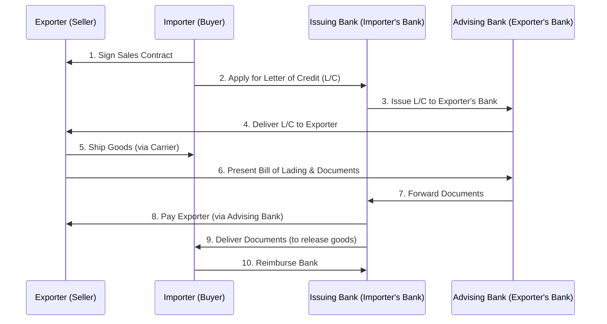

# 📘 UNIT 5: INTERNATIONAL BUSINESS OPERATIONS
### Master Study Notes | Core & Extended Curriculum

---

## 📌 TABLE OF CONTENTS

### PART 1: CORE LECTURE NOTES (BASED ON COURSE PPT)
1. [International Business Operations: Meaning & Scope](#1-international-business-operations)
2. [Exporting: Meaning & Features](#2-exporting)
3. [Advantages & Challenges of Exporting](#3-advantages--challenges-of-exporting)
4. [Importing: Meaning & Features](#4-importing)
5. [Advantages & Challenges of Importing](#5-advantages--challenges-of-importing)
6. [Countertrade: Meaning & Advantages](#6-countertrade)
7. [Global Production: Meaning & Features](#7-global-production)
8. [Outsourcing: Meaning & Types](#8-outsourcing)
9. [International Logistics: Meaning & Components](#9-international-logistics)
10. [Case Study: Apple's Global Business Operations](#10-case-study-apples-global-business-operations)

### PART 2: EXTENDED LECTURE NOTES (ADVANCED TOPICS)
11. [Export/Import Key Documentation: Bill of Lading & Commercial Invoice](#11-exportimport-key-documentation)
12. [The Letter of Credit (L/C) Trust Mechanism & Workflow](#12-the-letter-of-credit-lc-trust-mechanism--workflow)
13. [Detailed Types of Countertrade](#13-detailed-types-of-countertrade)
14. [Global Production Sourcing & Location Decisions](#14-global-production-sourcing--location-decisions)
15. [The Make-or-Buy Decision Framework](#15-the-make-or-buy-decision-framework)
16. [International Logistics Transportation Modes (Ocean vs. Air Freight)](#16-international-logistics-transportation-modes)
17. [Solved Sovereign & Corporate Case Studies (Amazon Logistics & Apple Sourcing)](#17-solved-sovereign--corporate-case-studies)

### PART 3: SELF-TEST PRACTICE
18. [Flashcards & Fill in the Blanks Practice](#18-flashcards--fill-in-the-blanks-practice)

---

## PART 1: CORE LECTURE NOTES (BASED ON COURSE PPT)

### 1. International Business Operations

#### Meaning
**International Business Operations** refer to the set of cross-border management activities, functions, and workflows required to run a business globally. It governs how products are designed, sourced, manufactured, transported, and sold across national boundaries. 

Core components include:
* Exporting and Importing
* Global Production and Outsourcing
* International Logistics and Supply Chain Management

#### Objective
To achieve maximum operational efficiency, minimize costs, bypass trade barriers, utilize global resource endowments, and build competitive advantage in the global marketplace.

---

### 2. Exporting

#### Meaning
The process of selling goods or services manufactured in the home country to customers located in another country. It is the most common entry mode and represents the initial step in international expansion.

#### Core Features
* **Domestic Production**: Goods are manufactured in the home country and shipped overseas, reducing the need for foreign production setup.
* **Cross-border Trade**: Involves transport, clearing customs, and selling products across national borders.
* **Low Capital Requirement**: Bypasses the need to build physical factories, warehouses, or offices abroad.
* **Intermediaries**: Exporters often work with trade agents, distributors, or export houses to reach foreign buyers.
* **Compliance**: Requires adhering to export licensing, customs documentation, and trade rules.
* **Foreign Currency Earnings**: Generates cash flows in international reserve currencies (e.g., USD, Euro).

---

### 3. Advantages & Challenges of Exporting

#### Advantages
1. **Market Expansion**: Reaches millions of new customers, increasing sales and revenues.
2. **Economies of Scale**: Increased production volume at home lowers unit costs, boosting margins.
3. **Low Financial Risk**: Bypasses the risk of foreign asset ownership, making it safer than direct foreign investment.
4. **Utilization of Surplus Production**: Excess domestic capacity can be sold abroad instead of depressing local prices.
5. **Global Brand Recognition**: Helps companies build an international reputation.

#### Challenges
* **Logistics Costs**: Shipping and packaging goods long distances increases expenses.
* **Tariffs & Quotas**: Host governments can levy import duties, reducing product price competitiveness.
* **Cultural Differences**: Adapting products to fit foreign buyer preferences can be complex.
* **Documentation Hassles**: Requires export licenses, bills of lading, and certificates of origin.
* **Non-Payment Risk**: Foreign buyers might default or delay payments due to distance and legal gaps.

---

### 4. Importing

#### Meaning
The process of purchasing goods, services, or resources from foreign countries and bringing them into the domestic market for consumption, industrial production, or resale.

#### Core Features
* **Purchase from International Suppliers**: Acquiring raw materials, inputs, or finished goods from foreign sellers.
* **Cross-border Transportation**: Shipping goods via sea, air, or land routes into the home country.
* **Regulatory Clearance**: Requires presenting import licenses and customs forms, and paying duties.
* **Foreign Exchange Transaction**: Converting domestic currency to international currency to pay suppliers.

#### Example
India importing crude oil from Saudi Arabia and Iraq to meet its energy demands, or importing semiconductor microchips from Taiwan to manufacture smartphones locally.

---

### 5. Advantages & Challenges of Importing

#### Advantages
1. **Access to High-Quality Goods**: Allows countries to obtain superior products not produced locally (e.g., German machine tools).
2. **Availability of Advanced Technology**: Modernizes local industries (e.g., importing industrial robotics from Japan).
3. **Cost Advantage**: Accesses raw materials or inputs at a lower cost than domestic alternatives (e.g., importing electronics from China).
4. **Increased Product Variety**: Provides domestic consumers with a wide selection of international brands.
5. **Supports Industrial Development**: Keeps domestic factories running by sourcing raw materials.

#### Challenges
* **Exchange Rate Volatility**: If the domestic currency depreciates, imports become more expensive.
* **Import Tariffs**: High government taxes increase the cost of imported goods.
* **Supply Chain Dependency**: Reliance on foreign suppliers creates high risk if trade disputes or bottlenecks occur.
* **Customs Clearance Delays**: Shipments can get stuck at ports due to missing paperwork.

---

### 6. Countertrade

#### Meaning
A specialized form of international trade in which goods and services are exchanged directly or indirectly for other goods and services, rather than for hard cash. It is used when countries face foreign exchange shortages or severe credit restrictions.

#### Advantages
1. **Enables Cashless Trade**: Allows trade to continue even if a nation has zero foreign exchange reserves.
2. **Maintains Trade Volumes**: Helps developing nations export surplus commodities.
3. **Bypasses Credit Crises**: Keeps cross-border commerce active during sovereign debt defaults.
4. **Strengthens Bilateral Ties**: Builds long-term trade relations between partner governments.

#### Example
A developing country exporting crude oil to an industrialized nation and receiving railway construction machinery in return, bypassing any cash conversion.

---

### 7. Global Production

#### Meaning
The process of dividing value-chain activities and manufacturing components across different countries to leverage location economies (such as low labor costs, cheap raw materials, or specialized engineering skills).

#### Core Features
* **Production in Multiple Countries**: Different stages of design, manufacturing, and assembly are carried out globally.
* **Cost-Focused Strategy**: Factories are located where labor and resource costs are lowest (e.g., Bangladesh for apparel, Vietnam for electronics).
* **Supply Chain Integration**: Components are shipped across multiple countries for final assembly.
* **Bulk Operations**: High-scale production designed for global distribution.

---

### 8. Outsourcing

#### Meaning
Outsourcing is the process of transferring non-core business activities, tasks, or functions to external, independent companies, often located in foreign countries, to reduce costs, improve efficiency, and focus on core strengths.

#### Core Types
* **Business Process Outsourcing (BPO)**: Outsourcing back-office operations like HR, finance, or customer support.
* **Knowledge Process Outsourcing (KPO)**: Outsourcing data analysis, research, or intellectual work.
* **Manufacturing Outsourcing**: Contract manufacturing where external firms build the physical products (e.g., Foxconn assembling iPhones).

#### Example
US tech firms outsourcing customer call centers and technical support to English-speaking IT companies in India due to lower wages.

---

### 9. International Logistics

#### Meaning
The planning, implementation, and control of the physical movement, storage, and clearance of raw materials and finished goods across international borders. It ensures the right goods reach the customer at the right time at the lowest cost.

#### Core Components
1. **Transportation**: Moving cargo via ocean, air, rail, or road.
2. **Warehousing**: Storing components and finished products at border distribution centers.
3. **Inventory Management**: Balancing stock levels to avoid shortages while minimizing warehousing costs.
4. **Packaging & Labeling**: Protecting goods during transit and complying with customs labeling rules.
5. **Customs Clearance**: Handling border paperwork and paying import/export duties.

---

### 10. Case Study: Apple's Global Business Operations

#### Background
Apple Inc. is one of the world's most profitable technology companies. Its operational success lies in its global manufacturing and sourcing model.

#### Sourcing & Assembly
Apple does not manufacture its own hardware. It designs products in California, focusing on core competencies like R&D, software, and marketing. It sources components globally:
* Microchips from TSMC (Taiwan)
* Displays from Samsung and LG (South Korea)
* Camera modules from Sony (Japan)

All these components are shipped to assembly plants in China, managed by contract manufacturers like **Foxconn** and Pegatron. Foxconn provides massive assembly lines and highly flexible, low-cost labor.

#### Distribution Logistics
Once assembled, Apple uses international logistics to ship iPhones worldwide. During product launches, Apple relies on **air freight** to ship devices directly from Chinese plants to global stores. While air shipping is expensive, it prevents delays, matches consumer demand, and keeps inventory costs low. Finishing products are also imported into the US and exported worldwide through Apple's retail network.

---

## PART 2: EXTENDED LECTURE NOTES (ADVANCED TOPICS)

### 11. Export/Import Key Documentation

International trade requires specific documents to verify transactions and establish legal title:

#### 1. Bill of Lading (B/L)
Issued by the carrier (shipping line or airline) to the exporter once goods are loaded. It serves three roles:
* **Receipt of Cargo**: Proof that the carrier has received the goods in good condition.
* **Contract of Carriage**: Details the transportation terms (destination, costs, and routes).
* **Document of Title**: The legal holder of the B/L owns the cargo. It can be traded or transferred, allowing the importer to claim the goods at the port.

#### 2. Commercial Invoice
The bill issued by the seller to the buyer. It contains the description of the goods, quantities, unit prices, total value, and delivery terms (Incoterms like FOB or CIF).

---

### 12. The Letter of Credit (L/C) Workflow

To solve the trust deficit between foreign buyers and sellers, banks act as intermediaries using a Letter of Credit.

#### Step-by-Step L/C Transaction Flow

---

### 13. Detailed Types of Countertrade

* **Barter**: Direct swap of goods without cash (e.g., Venezuela swapping oil for food with Cuba).
* **Counterpurchase**: A firm sells goods to a country for cash but agrees to spend a percentage of that cash buying unrelated goods from the same country.
* **Offset**: Similar to counterpurchase, but the firm can buy components from *any* company in the host country (common in large military aircraft sales).
* **Buyback (Compensation)**: A company builds a factory or provides industrial machinery to a foreign country and agrees to accept a portion of the factory's output as payment.
* **Switch Trading**: A third-party trading house buys the counterpurchase credits of a firm and sells them to another company that can use them.

---

### 14. Global Production Location Decisions

Firms decide where to locate production facilities by analyzing three factors:

#### 1. Country Factors
* Wages, land costs, taxes, energy costs, infrastructure quality, and political stability.

#### 2. Technological Factors
* **Fixed Costs**: If setup costs are massive (e.g., semiconductor fabrication plants costing $10+ billion), production should be centralized in one location.
* **Flexible Manufacturing (Lean Production)**: Allows customizing products at low unit costs, reducing the need for multiple plants.

#### 3. Product Factors
* **Value-to-Weight Ratio**: High-value/low-weight products (e.g., iPhones, medicines) are cost-effective to ship via air freight, allowing centralized production. Low-value/heavy products (e.g., cement, soft drinks) must be produced locally to avoid shipping costs.

---

### 15. The Make-or-Buy Decision Framework

Should an MNC manufacture a component in-house (Make) or outsource it (Buy)?

| Criteria | Prefer MAKE (In-house / Vertical Integration) | Prefer BUY (Outsource / Sourcing) |
| :--- | :--- | :--- |
| **Technology Protection** | **High**: Keeps proprietary patents and design secrets safe from competitor leaks. | **Low**: Risk of supplier copying technology and competing. |
| **Asset Specificity** | **High**: Requires highly specialized machinery or tools that only the firm can design. | **Low**: Uses standard, generic components easily bought on the market. |
| **Operational Flexibility** | **Low**: The firm is stuck with expensive factories and long-term labor commitments. | **High**: The firm can switch suppliers quickly if local costs rise. |
| **Cost & Quality Control** | **High**: MNC controls 100% of quality checks and delivery schedules. | **Low**: Relying on supplier quality control and transport schedules. |

---

### 16. International Logistics Transportation Modes

#### Ocean Freight
* **Pros**: Extremely cheap; handles bulk, heavy, and oversized cargo (e.g., oil, grain, coal).
* **Cons**: Slow transit times (takes weeks); vulnerable to port congestion and weather delays.

#### Air Freight
* **Pros**: Extremely fast delivery; lower inventory holding costs; high security and low damage risk.
* **Cons**: Highly expensive; restricted cargo capacity; high carbon footprint.

---

### 17. Solved Sovereign & Corporate Case Studies

#### Case 1: Amazon's Global Logistics Network
* **Background**: Historically, Amazon relied on external shippers like UPS, FedEx, and DHL. During peak holiday seasons, delivery delays hurt Amazon's brand reputation.
* **The Strategy**: Amazon pursued **vertical integration** by building its own global logistics network. It launched "Amazon Air" (a fleet of cargo aircraft), leased its own ocean cargo containers, and established thousands of local delivery hubs.
* **Key Takeaway**: Making your own logistics network reduces dependency on third-party carriers and protects against shipping bottlenecks, ensuring delivery reliability.

#### Case 2: Apple's Supply Chain Resiliency & Sourcing
* **Background**: To mitigate geopolitical risks and supply disruptions in China, Apple started diversifying its supply chain.
* **The Strategy**: Apple expanded contract manufacturing operations to India (partnering with Foxconn in Tamil Nadu) and Vietnam. By 2025, Apple aimed to produce 25% of all iPhones in India.
* **Key Takeaway**: Diversifying global production locations prevents over-reliance on a single country and protects against trade wars and supply chain shutdowns.

---

## PART 3: SELF-TEST PRACTICE

### 18. Flashcards & Fill in the Blanks Practice

---

#### 🔵 SECTION 1: Definitions Flashcards

| # | 🔴 QUESTION (Front of Card) | ✅ ANSWER (Back of Card) |
|---|-----------------------------|--------------------------|
| 1 | What is International Logistics? | The physical movement and storage of raw materials and finished goods across national borders. |
| 2 | What is Exporting? | Selling goods produced in one country to customers in another country. |
| 3 | What is Importing? | Sourcing goods and services from foreign countries for domestic use or sale. |
| 4 | What is Countertrade? | International trade agreements where payments are made in goods/services rather than hard cash. |
| 5 | What is Outsourcing? | Assigning business functions or production tasks to external, independent companies. |
| 6 | Define a "Bill of Lading". | A legal document issued by a carrier detailing cargo receipts, transport contracts, and ownership title. |
| 7 | Define a "Letter of Credit". | A bank-issued guarantee promising to pay an exporter once the correct shipping documents are presented. |
| 8 | What is Barter? | The direct exchange of goods between two parties without using cash. |
| 9 | What is a Counterpurchase? | Exporter agrees to purchase unrelated goods from a country in exchange for selling goods to that country. |
| 10 | What is a Buyback? | Exporter builds a factory for a client and agrees to accept the factory's output as payment. |
| 11 | What are Incoterms? | Standardized international trade terms defining risk and cost divisions between buyers and sellers during transport. |
| 12 | What is a Commercial Invoice? | The bill issued by the exporter showing goods descriptions, quantities, and pricing terms. |
| 13 | What is a Value-to-Weight Ratio? | The monetary value of a product relative to its physical weight (critical for transport choice). |
| 14 | What is Global Production? | Manufacturing components and assembling goods across multiple countries to capture cost advantages. |
| 15 | What is Business Process Outsourcing? | Outsource back-office tasks like customer service, accounting, or HR to foreign providers. |
| 16 | What is Flexible Manufacturing? | Production technology allowing firms to customize products at low unit costs. |
| 17 | What is Asset Specificity? | Specialized machinery or tools designed to produce a specific component that cannot be easily used for other tasks. |
| 18 | What is ocean freight? | The transport of cargo by sea, representing 90% of global trade volume. |
| 19 | What is air freight? | The transport of cargo by aircraft, used for high-value or urgent goods. |
| 20 | What is vertical integration? | An operations strategy where a company owns different stages of its supply chain (e.g., manufacturing and logistics). |

---

#### 🔵 SECTION 2: Examples Flashcards

| # | 🔴 CONCEPT / TERM | ✅ PRACTICAL REAL-WORLD EXAMPLE |
|---|-------------------|---------------------------------|
| 1 | Exporting | India exporting basmati rice to Saudi Arabia. |
| 2 | Importing | India importing crude oil from Iraq to meet domestic fuel demand. |
| 3 | Barter | Swapping Russian military jets directly for Indonesian palm oil. |
| 4 | Buyback | Krupp building a steel plant in India and accepting steel sheets as payment. |
| 5 | Offset | Boeing selling jets to the UK and buying aircraft wings from UK suppliers. |
| 6 | Value-to-Weight (High) | Sourcing computer microchips or diamonds and shipping them via air freight. |
| 7 | Value-to-Weight (Low) | Sourcing cement or coal and shipping them via cheap cargo ships. |
| 8 | Outsourcing | Apple contract-manufacturing iPhones through Foxconn in China. |
| 9 | Business Process Outsourcing | A US bank outsourcing customer call center services to India. |
| 10 | Incoterms | FOB (Free on Board) where risk transfers once goods cross the ship's rail. |
| 11 | Letter of Credit | A bank in New Delhi guaranteeing payment to a supplier in Tokyo. |
| 12 | Bill of Lading | A document from Maersk proving shipping receipt of 50 containers of electronics. |
| 13 | Global Production | Designing a car in Germany, sourcing parts from Italy, and assembling in Hungary. |
| 14 | Location Endowments | Locating apparel sewing factories in Bangladesh due to competitive wages. |
| 15 | Vertical Integration | Amazon launching its own "Amazon Air" fleet of cargo planes. |
| 16 | Make Decision | Intel choosing to manufacture its proprietary core processors in its own plants. |
| 17 | Buy Decision | Apple purchasing display panels from Samsung instead of building factories. |
| 18 | Supply Chain Resiliency | Apple expanding factory operations to India and Vietnam to reduce reliance on China. |
| 19 | Ocean Freight | Shipping bulk wheat or iron ore from Australia to Japan. |
| 20 | Air Freight | Shipping fresh roses from Kenya to Amsterdam for Valentine's Day. |

---

#### 🔵 SECTION 3: Acronym & Memory Flashcards

| # | 🔴 ACRONYM / MNEMONIC | ✅ FULL FORM / EXAM MEANING |
|---|----------------------|-----------------------------|
| 1 | B/L | Bill of Lading (Receipt, Contract, Title) |
| 2 | L/C | Letter of Credit (Bank payment guarantee) |
| 3 | BPO | Business Process Outsourcing |
| 4 | KPO | Knowledge Process Outsourcing |
| 5 | FOB | Free On Board (Incoterm) |
| 6 | CIF | Cost, Insurance, and Freight (Incoterm) |
| 7 | ICC | International Chamber of Commerce |
| 8 | FDI | Foreign Direct Investment |
| 9 | MNC | Multinational Corporation |
| 10 | JIT | Just-In-Time (Inventory management system) |
| 11 | RCT | **R**eceipt, **C**ontract, **T**itle (Bill of Lading functions) |
| 12 | Make vs Buy | Core operational decision: build internally or outsource |
| 13 | IBE | International Business Environment |
| 14 | BoP | Balance of Payments |
| 15 | USD | United States Dollar |

---

#### 📝 PART B: FILL IN THE BLANKS

##### 📝 Exercise 1: Exporting & Importing
1. Exporting is the process of selling goods manufactured in the __________ country to customers abroad.
2. Importing helps countries access resources and technologies not available __________.
3. Exporting is considered a __________-risk entry strategy compared to FDI.
4. Compliance with international trade laws requires exporters to prepare proper customs __________.
5. Selling surplus domestic production to foreign markets helps utilize excess __________.
6. A major challenge of exporting is the cost of international transport and __________.
7. High import tariffs and duties can reduce the __________ of imported goods in the local market.
8. If the domestic currency weakens, imports become __________ expensive.
9. Importers submit import licenses and invoices to the __________ authorities for clearance.
10. Sourcing inputs from low-cost countries helps MNCs achieve cost __________.

##### 📝 Exercise 2: Documentation & L/C
11. The Bill of Lading is issued to the exporter by the common __________.
12. The three functions of a Bill of Lading are Receipt, Contract, and Document of __________.
13. A Letter of Credit is a guarantee issued by the importer's __________ bank.
14. Under an L/C, the bank promises to pay the __________ once correct shipping documents are presented.
15. In an L/C transaction, the exporter's local bank is known as the __________ bank.
16. The commercial invoice is prepared by the __________ to detail goods specifications and pricing.
17. The document proving the origin of the goods is the Certificate of __________.
18. The Letter of Credit resolves the __________ deficit between foreign buyers and sellers.
19. Incoterms are standardized trade terms published by the International Chamber of __________.
20. In FOB terms, the risk transfers to the buyer once goods are loaded on the __________.

##### 📝 Exercise 3: Countertrade & Production
21. Countertrade is mainly used when countries face a shortage of __________ exchange.
22. Swapping wheat for oil directly without cash is called __________.
23. In a __________ agreement, the exporter agrees to purchase unrelated goods from the buying country.
24. In a __________ agreement, the exporter agrees to accept a portion of the factory's output as payment.
25. Sourcing components globally to utilize cheap labor represents __________ production.
26. Sourcing assembly lines to external companies is contract __________.
27. High-setup-cost facilities (like microchip plants) lead firms to __________ production in one location.
28. Flexible manufacturing technology is also known as __________ production.
29. High value-to-weight ratio items are cost-effective to ship via __________ freight.
30. Low value-to-weight ratio items must be shipped via __________ freight.

##### 📝 Exercise 4: Make-or-Buy & Logistics
31. The choice to manufacture in-house to protect proprietary technology is a __________ decision.
32. The choice to outsource to avoid high fixed capital costs is a __________ decision.
33. Specialized machinery designed for one specific component has high asset __________.
34. Outsourcing allows a firm to maintain strategic __________.
35. Apple outsources its physical iPhone assembly to contract manufacturer __________.
36. Apple designs its proprietary microchips in-house to protect its core __________.
37. Physical movement and storage of goods across borders is international __________.
38. Ocean freight handles approximately __________ percent of global trade volume.
39. Amazon built its own cargo plane fleet, known as Amazon __________.
40. Under the "RCT" mnemonic for a Bill of Lading, the letter "T" stands for __________.

---

#### ✅ ANSWER KEY — FILL IN THE BLANKS

##### Exercise 1:
1. home (or domestic)
2. domestically
3. low
4. documentation
5. capacity
6. logistics (or shipping)
7. competitiveness (or demand)
8. more
9. customs
10. advantages (or savings)

##### Exercise 2:
11. carrier (or shipping company)
12. Title
13. issuing
14. exporter (or beneficiary)
15. advising (or confirming)
16. exporter (or seller)
17. Origin
18. trust
19. Commerce
20. vessel (or ship)

##### Exercise 3:
21. foreign
22. barter
23. counterpurchase
24. buyback
25. global
26. manufacturing
27. centralize (or concentrate)
28. lean
29. air
30. ocean (or sea)

##### Exercise 4:
31. Make
32. Buy
33. specificity
34. flexibility
35. Foxconn
36. technology (or intellectual property)
37. logistics
38. 90
39. Air
40. Title

---

#### 📊 Score Yourself

**Fill in the Blanks Score:**
* **38–40 correct** → Excellent! Top-tier preparation. ⭐⭐⭐
* **32–37 correct** → Good. Re-read the sections you missed. ⭐⭐
* **25–31 correct** → Average. Focus on Part 2 (Extended Notes) and vocabulary. ⭐
* **Below 25** → Review all notes carefully.

---

*🃏 Flashcards + Fill-in-the-blanks = The fastest path to 100% exam confidence!*
