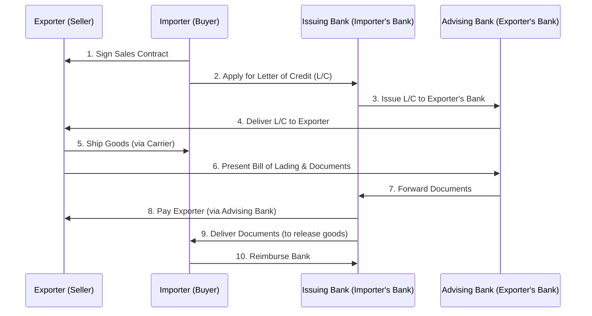

# 📝 UNIT 5 — ALL POSSIBLE SUBJECTIVE QUESTIONS WITH ANSWERS
### International Business Operations | Solved Question Bank

---

## 🔷 SECTION A: SHORT ANSWER QUESTIONS (2–4 Marks)

---

### Q1. Explain the three functions of a 'Bill of Lading' (B/L) in international trade.
**Answer:**
A Bill of Lading (B/L) is a critical shipping document issued by the carrier to the exporter. It serves three core functions, remembered by the mnemonic **"RCT"**:
1. **Receipt of Cargo (R)**: Legal proof that the carrier has received the goods from the exporter in the specified quantity and condition.
2. **Contract of Carriage (C)**: Details the terms, routes, freight charges, and conditions of transportation between the shipper and the carrier.
3. **Document of Title (T)**: Proves legal ownership of the goods. The holder of the B/L has the legal right to claim the goods from the ship at the destination port.

---

### Q2. What is 'Buyback' (or Compensation) in countertrade?
**Answer:**
A **Buyback** agreement occurs when an exporter builds a manufacturing plant, provides technology, or supplies industrial machinery to a foreign country (often a developing nation) and agrees to accept a predetermined percentage of the plant's future output as partial or full payment for its services.
* *Example*: A German engineering company builds a steel plant in India and agrees to take steel sheets produced by the plant as payment.

---

### Q3. Explain the term 'Value-to-Weight' ratio and its significance in logistics.
**Answer:**
The **Value-to-Weight** ratio measures the monetary value of a product relative to its physical weight.
* **Significance**: Determines the optimal transportation mode. High value-to-weight products (e.g., microchips, luxury watches, pharmaceuticals) are cost-effective to ship via expensive **Air Freight** because shipping costs represent a tiny fraction of the product's price. Low value-to-weight products (e.g., cement, coal, iron ore) must be shipped via cheap **Ocean Freight** to remain profitable.

---

### Q4. What are 'Incoterms'?
**Answer:**
**Incoterms** (International Commercial Terms) are a set of 11 standardized rules published by the International Chamber of Commerce (ICC). They define the exact division of costs, risks, and responsibilities (such as loading, insurance, and customs clearance) between the buyer and the seller during international transport (e.g., FOB - Free On Board, CIF - Cost, Insurance, and Freight).

---

### Q5. What is 'Asset Specificity' and how does it affect the Make-or-Buy decision?
**Answer:**
**Asset Specificity** refers to investments in specialized machinery, tools, or facilities designed to produce a specific component that cannot be easily adapted for other tasks.
* **Make-or-Buy Link**: High asset specificity drives firms to **Make** (integrate vertically) because external suppliers are reluctant to invest in specialized tooling without long-term guarantees, and the MNC wants to protect itself from supplier hold-up risks.

---

## 🔷 SECTION B: MEDIUM ANSWER QUESTIONS (5 Marks)

---

### Q6. Compare the operational advantages and disadvantages of Air Freight vs. Ocean Freight.
**Answer:**
MNCs select their transportation mode based on speed, cost, volume, and cargo nature.

| Feature | Ocean Freight | Air Freight |
| :--- | :--- | :--- |
| **Share of Global Trade** | ~90% of global trade volume. | ~1% of volume (but ~35% of value). |
| **Cost** | **Low**: Most cost-effective for large volumes. | **High**: Extremely expensive per kilogram. |
| **Speed** | **Slow**: Takes weeks to cross oceans. | **Fast**: Deliveries made within hours/days. |
| **Capacity** | **High**: Can handle heavy bulk and oversized goods. | **Low**: Restricted cargo size and weight limits. |
| **Risk of Damage/Theft**| Moderate (exposed to weather, port delays). | Low (high airport security, short transit times). |

*Strategic Conclusion*: Ocean freight is the backbone of bulk commodity movements (oil, grains, machinery), while air freight is reserved for urgent, high-value, or highly perishable goods (microchips, fresh flowers, emergency parts).

---

### Q7. Explain why a firm might prefer to 'Buy' (outsource) its manufacturing components rather than 'Make' them in-house.
**Answer:**
Outsourcing (buying) components is often preferred over vertical integration (making) due to the following strategic reasons:
1. **Strategic Flexibility**: The firm is not locked into owning physical factories. If local labor costs rise, trade barriers shift, or new technologies emerge, the MNC can quickly switch to a supplier in another country.
2. **Lower Capital Investment**: Outsourcing avoids the massive fixed capital costs of buying land, building factories, and purchasing machinery, freeing up funds for high-margin activities like R&D and marketing.
3. **Specialist Supplier Efficiencies**: Independent suppliers can often manufacture components cheaper and at higher quality because they specialize in that single technology and pool demand from multiple clients to achieve economies of scale.
4. **Focus on Core Competencies**: Allows the MNC to dedicate its management focus and resources to its primary strengths (e.g., Apple focusing on design and software while outsourcing assembly).

---

## 🔷 SECTION C: LONG/ANALYTICAL QUESTIONS (10 Marks)

---

### Q8. Describe the step-by-step mechanism of a Letter of Credit (L/C) transaction. Explain how it resolves the trust deficit in international trade. (10 Marks)

**Topper's Answer**:

##### 1. Introduction & The Concept of Trust Deficit
In international trade, the exporter and importer are separated by geography, legal jurisdictions, and currencies. This creates a **trust deficit**: the exporter fears shipping goods before receiving payment, while the importer fears paying before the goods are shipped. A Letter of Credit (L/C) resolves this deadlock by inserting a trusted financial intermediary—the bank—to guarantee the payment.

##### 2. Step-by-Step Transaction Flow


1. **Sales Contract**: The importer and exporter agree on terms and sign a contract.
2. **L/C Application**: The importer requests their local bank (**Issuing Bank**) to open an L/C in favor of the exporter.
3. **L/C Issuance**: The Issuing Bank sends the L/C to the exporter's local bank (**Advising Bank**).
4. **L/C Delivery**: The Advising Bank verifies the L/C and delivers it to the exporter, guaranteeing payment.
5. **Shipment**: The exporter ships the goods via a carrier and receives a **Bill of Lading**.
6. **Document Presentation**: The exporter presents the Bill of Lading and other documents (commercial invoice, packing list) to the Advising Bank.
7. **Document Forwarding**: The Advising Bank forwards the documents to the Issuing Bank.
8. **Payment Remittance**: The Issuing Bank verifies the documents. Once confirmed, it pays the exporter (via the advising bank).
9. **Document Release**: The Issuing Bank releases the shipping documents to the importer.
10. **Reimbursement & Claim**: The importer reimburses the bank, takes the Bill of Lading, and claims the goods from the carrier at the destination port.

##### 3. How the L/C Resolves the Trust Deficit
* **Bank Credit Guarantee**: The credit risk is shifted from the buyer to the bank. The exporter is guaranteed payment by a global bank, even if the buyer goes bankrupt, provided correct documents are presented.
* **Proof of Shipment for Buyer**: The importer is protected because the bank will not release the money until the exporter presents a valid Bill of Lading, which proves that the goods are actually in transit.
* **Strict Document Compliance**: Banks deal in documents, not goods. The bank check ensures that the exporter has complied with every term specified in the L/C (e.g., shipping deadlines and packaging terms) before paying.

##### 4. Conclusion
While a Letter of Credit adds transaction fees (bank charges), it remains the most trusted mechanism to facilitate global trade, converting buyer-seller default risk into bank-to-bank credit risk.

---

### Q9. Case-Based Application: Analyze Apple Inc.’s global business operations. Explain how Apple integrates exporting, importing, global production, outsourcing, and international logistics to achieve success. (10 Marks)

**Topper's Answer**:

##### 1. Introduction
Apple Inc. is a global technology leader. Its business model is a textbook example of an integrated, highly efficient global operations strategy. Rather than manufacturing in-house, Apple acts as a strategic orchestrator, combining specialized sourcing, outsourcing, and air-logistics.

##### 2. Apple's Operational Model Matrix
```
                             APPLE'S OPERATIONS MATRIX
  ┌─────────────────────────────────────────────────────────────────────────────┐
  │ 1. Core R&D (MAKE) ──► Designed in USA. Protects OS & CPU chip designs.    │
  ├─────────────────────────────────────────────────────────────────────────────┤
  │ 2. Sourcing (IMPORT) ──► Camera (Japan), Screen (S. Korea), Memory (Taiwan) │
  ├─────────────────────────────────────────────────────────────────────────────┤
  │ 3. Assembly (OUTSOURCE) ──► Assembled by Foxconn & Pegatron in China.       │
  ├─────────────────────────────────────────────────────────────────────────────┤
  │ 4. Logistics (AIR) ──► Shipped via Air Freight for rapid launches.          │
  └─────────────────────────────────────────────────────────────────────────────┘
```

##### 3. Key Components Analyzed

###### A. The Make-or-Buy Decision (Outsourcing)
Apple splits its make-or-buy decisions based on intellectual property (IP) sensitivity and manufacturing scale:
* **MAKE (In-house R&D)**: Apple designs its iOS software and proprietary A-series/M-series chips in Cupertino, USA. This protects its core intellectual property and guarantees product differentiation.
* **BUY (Contract Manufacturing)**: Apple outsources 100% of its physical hardware assembly to contract manufacturers like **Foxconn** and Pegatron in China. Foxconn provides massive factories, scale economies, and highly flexible, low-cost assembly labor that Apple cannot replicate in the US.

###### B. Global Production & Sourcing (Importing)
Apple operates a global sourcing web. It imports components from specialized suppliers around the world to leverage location endowments:
* Display panels from Samsung and LG (South Korea)
* Camera sensors from Sony (Japan)
* Flash memory and processors from TSMC (Taiwan)
These components are imported directly into assembly hubs in China, creating a highly integrated global production ecosystem.

###### C. Exporting Finished Products
Once assembled, the finished iPhones are exported from China to retail stores and distribution centers in over 100 countries. Apple manages this exporting process to comply with diverse global trade rules, customs duties, and local consumer standards.

###### D. International Logistics & Supply Chain
Apple manages its logistics to prevent inventory delays and minimize holding costs:
* **Air Freight for Product Launches**: During high-demand launch weeks, Apple uses cargo aircraft to ship iPhones directly from Chinese assembly plants to retail stores worldwide. While air shipping is far more expensive than ocean freight, its speed prevents inventory pile-ups and matches customer demand, keeping inventory costs close to zero.
* **Ocean Freight for Steady Demand**: For older models or bulky accessories, Apple uses ocean freight to minimize shipping costs once demand stabilizes.

##### 4. Supply Chain Diversification
To reduce geopolitical risks (US-China trade wars) and pandemic-related factory shutdowns, Apple is currently diversifying its global production by shifting assembly operations to countries like **India** (Foxconn plants in Tamil Nadu) and **Vietnam**, aiming to build a more resilient supply chain.

##### 5. Conclusion
Apple's success demonstrates that competitive advantage in international business does not require owning physical factories. By focusing on design (Make), outsourcing assembly (Buy), sourcing globally, and utilizing rapid logistics, Apple maintains a highly profitable and resilient global operations model.
