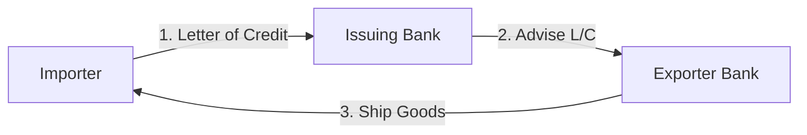

# Unit 5 — Global Production & Supply Chains

## 1. Introduction
Focusing on **Global Production & Supply Chains** and the operational aspects of supply chain, manufacturing, and transport logistics.

## 2. Core Operational Principles
- Export-Import Documentation (Bill of Lading, Letter of Credit).
- Countertrade types (Barter, Counterpurchase, Buyback).
- Sourcing decisions (Make-or-buy).

## 3. Real-World Case
- **Amazon Global Logistics**: Tech-driven inventory and ocean cargo tracking.
- **Apple Global Sourcing**: Outsourcing assembly to Foxconn in China, manufacturing components globally.

## 4. Visual Diagram

## 5. Exam prep
- **Short Question (2 Marks)**: Explain the role of a Bill of Lading.
- **Long Question (10 Marks)**: Discuss the different forms of countertrade and why firms use them.
