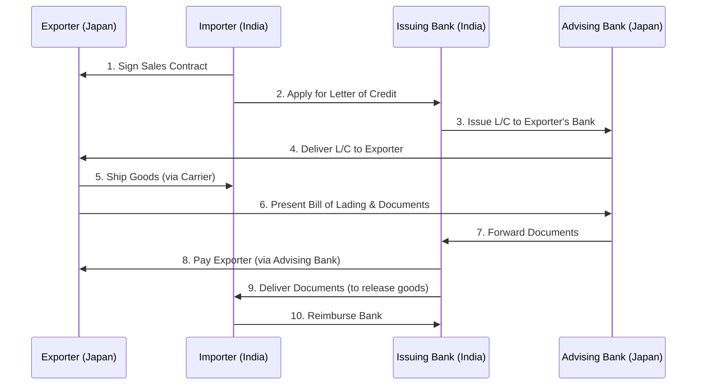
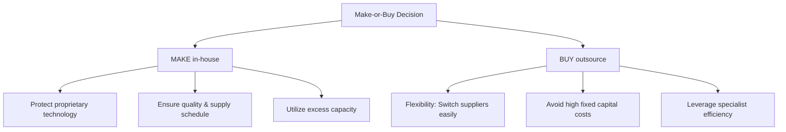
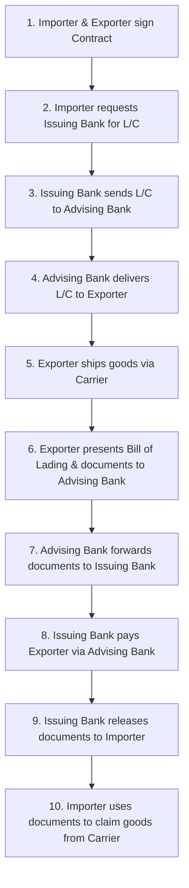

# Unit 5 — International Business Operations: Master Study Guide

Welcome to the Unit 5 Master Study Guide. This guide covers 100% of the syllabus, designed to simplify complex operational processes, logistics, and documentation. It integrates step-by-step flowcharts, corporate case studies (Amazon & Apple), current affairs, revision sheets, and a solved question bank.

---

## 📌 Table of Contents
1. [Core Lectures: Concept Explanations](#1-core-lectures-concept-explanations)
   - [Export/Import Process & Documentation](#exportimport-process--documentation)
   - [The Letter of Credit (L/C) Mechanism](#the-letter-of-credit-lc-mechanism)
   - [Types of Countertrade](#types-of-countertrade)
   - [Global Production & Outsourcing (Make-or-Buy)](#global-production--outsourcing-make-or-buy)
   - [International Logistics & Supply Chain Management](#international-logistics--supply-chain-management)
2. [Solved Corporate Case Studies](#2-solved-corporate-case-studies)
   - [Case 1: Apple's Supply Chain Resiliency & Sourcing](#case-1-apples-supply-chain-resiliency--sourcing)
   - [Case 2: Amazon's Global Logistics Network](#case-2-amazons-global-logistics-network)
3. [Rapid Revision Cheat Sheet](#3-rapid-revision-cheat-sheet)
   - [Make vs. Buy Decision Criteria](#make-vs-buy-decision-criteria)
   - [Countertrade Reference Guide](#countertrade-reference-guide)
4. [Exam Practice Q&A Bank](#4-exam-practice-qa-bank)
   - [2-Mark Short Compulsory Questions](#2-mark-short-compulsory-questions)
   - [5-Mark Medium-Length Questions](#5-mark-medium-length-questions)
   - [10-Mark Long/Analytical Questions (Topper Answers)](#10-mark-longanalytical-questions-topper-answers)

---

## 1. Core Lectures: Concept Explanations

### Export/Import Process & Documentation

Exporting and importing involve high transaction risks because partners are separated by geography, legal jurisdictions, and currencies. Documents act as the trust mechanism.

#### Key Trade Documents
1.  **Bill of Lading (B/L)**: Issued to the exporter by the common carrier transporting the goods. It serves three functions:
    - *Receipt*: Proof that the carrier has received the cargo.
    - *Contract*: Details the terms of transportation between shipper and carrier.
    - *Document of Title*: The legal owner of the B/L owns the cargo.
2.  **Commercial Invoice**: Prepared by the exporter, detailing the quantity, description, and price of the goods sold.
3.  **Letter of Credit (L/C)**: A guarantee issued by a bank on behalf of an importer, promising to pay the exporter a specific sum once the correct shipping documents are presented.

---

### The Letter of Credit (L/C) Mechanism

#### 💡 The Trust Analogy (Relate & Feel)
Imagine an exporter in Japan (Hiroshi) selling machinery to an importer in India (Raj). 
- Hiroshi is afraid: *"What if I ship the machinery and Raj never pays me?"*
- Raj is also afraid: *"What if I pay Hiroshi first and he never ships the machinery?"*
To solve this trust deadlock, they use a **Letter of Credit (L/C)**. Raj goes to a trusted bank in India. The bank acts as the referee, promising Hiroshi: *"If you ship the machinery and show us the Bill of Lading proving it, we will pay you, even if Raj goes bankrupt."*

#### Step-by-Step L/C Transaction Flow

---

### Types of Countertrade

Countertrade is a trade agreement where payments are made in goods/services instead of hard cash. Used when countries have low foreign exchange reserves.

1.  **Barter**: Direct exchange of goods between two parties without cash (e.g., oil for wheat).
2.  **Counterpurchase**: A reciprocal buying agreement. Company A sells goods to Country B, and agrees to spend a percentage of the cash received buying unrelated goods from Country B.
3.  **Offset**: Similar to counterpurchase, but the purchasing company can buy components from *any* firm in the host country (common in military/aircraft sales).
4.  **Buyback (Compensation)**: A company builds a factory or provides machinery to a foreign nation, and agrees to accept a percentage of the factory's output as payment.
5.  **Switch Trading**: A third-party trading house buys the counterpurchase credits of a firm and sells them to another company that can use them.

---

### Global Production & Outsourcing (Make-or-Buy)

#### Where to Produce? (Location Decisions)
Firms must decide where to locate manufacturing plants based on three factors:
1.  **Country Factors**: Wages, land costs, taxes, and political stability.
2.  **Technological Factors**:
    - **Fixed Costs**: If setup costs are massive (e.g., semiconductor fabrication plants), concentrate production in one centralized location.
    - **Flexible Manufacturing (Lean Production)**: Allows customizing products at low unit costs, reducing the need for multiple plants.
3.  **Product Factors**:
    - **Value-to-Weight Ratio**: High-value/low-weight products (e.g., microchips, medicine) can be produced in one location and shipped globally. Low-value/heavy products (e.g., bricks, soft drinks) must be produced locally.

#### The Make-or-Buy Decision
Should a firm manufacture a component in-house (Make) or outsource it to an external supplier (Buy)?

---

### International Logistics & Supply Chain Management

- **Logistics**: The physical movement and storage of raw materials and finished goods across national boundaries.
- **Transportation Modes**:
  - *Ocean Freight*: Handles 90% of global trade. Very cheap and handles bulk, but slow.
  - *Air Freight*: Fast, secure, but highly expensive. Used for high-value-to-weight items (e.g., iPhones, diamonds) or perishable goods (e.g., fresh flowers).
- **Global Supply Chain Management**: Coordinating suppliers, factories, and warehouses globally to minimize costs and inventory delays.

---

## 2. Solved Corporate Case Studies

### Case 1: Apple's Supply Chain Resiliency & Sourcing

**Background**: Apple Inc. designs hardware but outsources almost all manufacturing to suppliers like Foxconn. 

**Operations Strategy**:
- **Make-or-Buy**: Apple *buys* (outsources) assembly operations because Foxconn has massive factory scale and labor flexibility. However, Apple *makes* (designs in-house) its proprietary A-series and M-series chips, protecting its core intellectual property.
- **Logistics**: Apple uses air freight to ship new iPhones from China directly to global retail stores during launch weeks. This prevents inventory delays and bypasses slow ocean shipping, justifying the high cost.

---

### Case 2: Amazon's Global Logistics Network

**Background**: To maintain its "Prime" delivery promises, Amazon transitioned from a company that relied on shipping companies (like FedEx) to building its own global logistics network.

**The Action**: Amazon launched "Amazon Air" (a fleet of cargo planes) and leased its own ocean cargo containers. 

**Key Takeaways**:
- Illustrates how **vertical integration** (making your own logistics instead of buying it) protects a firm against shipping delays.
- Shows how warehousing optimization using AI keeps inventory costs low.

---

## 3. Rapid Revision Cheat Sheet

### Make vs. Buy Decision Criteria

| Criteria | Prefer MAKE (In-house) | Prefer BUY (Outsource) |
| :--- | :--- | :--- |
| **Technology Protection** | **High** (Keeps patents/designs secret) | **Low** (Risk of supplier copying tech) |
| **Asset Specificity** | **High** (Needs specialized machinery) | **Low** (Uses standard components) |
| **Flexibility** | **Low** (Stuck with fixed factories) | **High** (Can switch suppliers quickly) |
| **Cost Focus** | Lower cost if volume is high | Lower cost if supplier has economies of scale |

---

### Countertrade Reference Guide
- **Barter**: Directly swap goods (Wheat $\leftrightarrow$ Oil). No cash.
- **Counterpurchase**: Exporter sells for cash but agrees to spend some of that cash buying unrelated goods from the same country.
- **Offset**: Exporter sells for cash but agrees to buy components from *any* supplier in that country.
- **Buyback**: Exporter builds a factory and agrees to accept the factory's output as payment.

---

## 4. Exam Practice Q&A Bank

### 2-Mark Short Compulsory Questions

#### Q1. Explain the primary function of a 'Bill of Lading'.
*   **Topper's Answer**: A Bill of Lading is a legal document issued by a carrier to an exporter. It acts as a receipt for cargo, a contract of carriage, and a document of title (proving ownership of the goods).

#### Q2. What is 'Buyback' in countertrade?
*   **Topper's Answer**: Buyback occurs when a firm builds a manufacturing plant or supplies machinery to a foreign country and agrees to accept a portion of the plant's production as payment.

#### Q3. What is the 'Value-to-Weight' ratio and why is it important in logistics?
*   **Topper's Answer**: It is the monetary value of a product relative to its physical weight. High ratio items (like electronics) are cost-effective to ship via air freight, while low ratio items (like cement) must be shipped via cheap ocean cargo.

#### Q4. Define 'Incoterms'.
*   **Topper's Answer**: Standardized international trade terms published by the International Chamber of Commerce (ICC) that define the division of costs, risks, and responsibilities between buyers and sellers during transport.

---

### 5-Mark Medium-Length Questions

#### Q5. Compare the advantages and disadvantages of Air Freight vs. Ocean Freight.
*   **Topper's Answer**:
    
    ##### Air Freight:
    -   *Advantages*: Extremely fast delivery times; lower inventory holding costs; high security and low damage risk.
    -   *Disadvantages*: High cost per kilogram; restricted capacity; higher carbon footprint.
    
    ##### Ocean Freight:
    -   *Advantages*: Extremely cost-effective for large volumes; capable of handling heavy/bulk goods (like iron ore or oil); lower carbon emissions.
    -   *Disadvantages*: Very slow transit times (weeks vs. hours); susceptible to port congestion and weather delays.

*Strategic Summary*: Companies choose air freight for urgent, high-value, or perishable goods, while ocean freight remains the backbone for bulk commodity movements.

---

#### Q6. Explain why a firm might prefer to 'Buy' (outsource) its manufacturing components rather than 'Make' them in-house.
*   **Topper's Answer**:
    A firm prefers to outsource (buy) components due to the following reasons:
    1.  **Strategic Flexibility**: The firm is not locked into maintaining physical factories. If local wages rise or technology changes, it can easily switch to a supplier in another country.
    2.  **Lower Capital Investment**: Outsourcing avoids the massive fixed costs of purchasing machinery and land, freeing up capital for R&D and marketing.
    3.  **Specialist Efficiencies**: External suppliers often produce components cheaper and at higher quality because they specialize in that technology and achieve economies of scale.

---

### 10-Mark Long/Analytical Questions (Topper Answers)

#### Q7. Describe the step-by-step mechanism of a Letter of Credit (L/C) transaction. Explain how it resolves the trust deficit between exporters and importers in international trade.

**Topper's Answer**:

##### 1. Introduction & Concept of Trust Deficit
In international trade, the exporter and importer are separated by distance, laws, and currencies. The exporter fears shipping goods before receiving payment, while the importer fears paying before shipping occurs. A Letter of Credit (L/C) resolves this trust deficit by inserting a trusted financial intermediary—the bank—to guarantee the payment.

##### 2. The Key Parties Involved
-   **Applicant (Importer)**: The buyer who requests the bank to issue the L/C.
-   **Beneficiary (Exporter)**: The seller who receives the payment guarantee.
-   **Issuing Bank**: The importer's bank that issues the L/C and guarantees payment.
-   **Advising/Confirming Bank**: The exporter's local bank that verifies and delivers the L/C to the exporter.

##### 3. Step-by-Step Transaction Flow Diagram

##### 4. How the L/C Resolves the Trust Deficit
1.  **Payment Guarantee**: The bank's promise to pay is independent of the buyer's ability or willingness to pay. Once the exporter presents the exact documents (Bill of Lading, Commercial Invoice) proving the goods were shipped, the bank *must* pay.
2.  **Proof of Shipment**: The importer is protected because the bank will not release the money until the exporter presents a valid Bill of Lading, which proves that the goods are actually in transit.
3.  **Strict Compliance**: Banks deal in documents, not goods. The bank meticulously checks that all documents match the L/C terms, ensuring safety for both parties.

##### 5. Conclusion
While the Letter of Credit adds banking fees to the transaction cost, it remains the most reliable mechanism to facilitate high-value global trade by converting buyer-seller trust risk into bank-to-bank credit risk.
