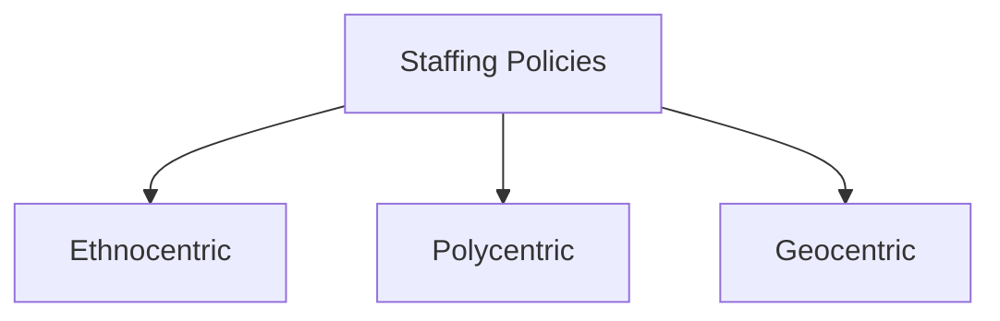

# Unit 6 — Global Marketing Strategy (4Ps)

## 1. Introduction
Exploring **Global Marketing Strategy (4Ps)** and the integration of marketing, R&D, and staffing policies (Ethnocentric, Polycentric, Geocentric).

## 2. Marketing Mix in International Context
- Product Standardization vs Adaptation.
- Pricing policies (dumping, skimming, penetration).
- Place (distribution channels) and Promotion strategies.

## 3. Global HRM Staffing Policies
- Ethnocentric: Parent-country nationals run foreign subsidiaries.
- Polycentric: Host-country nationals run local subsidiaries.
- Geocentric: Best people for the job regardless of nationality.

## 4. Visual Diagram

## 5. Exam prep
- **Short Question (2 Marks)**: What is Expatriate Failure?
- **Long Question (10 Marks)**: Critically analyze the advantages and disadvantages of Ethnocentric, Polycentric, and Geocentric staffing policies.
