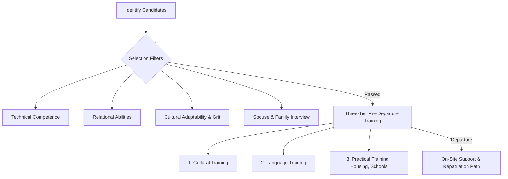

# 📝 UNIT 6 — ALL POSSIBLE SUBJECTIVE QUESTIONS WITH ANSWERS
### Global Marketing and HRM | Solved Question Bank

---

## 🔷 SECTION A: SHORT ANSWER QUESTIONS (2–4 Marks)

---

### Q1. Define 'Expatriate Failure' and identify its primary statistical cause.
**Answer:**
**Expatriate Failure** is the premature return of an expatriate manager (Parent-Country National or Third-Country National) to their home country before their international assignment is completed. It often results in lost subsidiary performance and high relocation costs.
* **Primary Cause**: Statistically, the **inability of the spouse and family to adjust** to the host country's culture, climate, language, and social environment is the number one cause of expatriate failure.

---

### Q2. Distinguish between PCNs, HCNs, and TCNs.
**Answer:**
These terms classify employees based on nationality and MNC subsidiary location:
* **PCN (Parent-Country National)**: Citizen of the country where the MNC's headquarters is located (e.g., a Japanese manager working at a Toyota plant in Kentucky, USA).
* **HCN (Host-Country National)**: Citizen of the country where the subsidiary is located (e.g., an American engineer working at Toyota's plant in Kentucky, USA).
* **TCN (Third-Country National)**: Citizen of a neutral country that is neither the HQ country nor the host country (e.g., a German accountant working at Toyota's plant in Kentucky, USA).

---

### Q3. Explain the term 'Price Escalation' in international marketing.
**Answer:**
**Price Escalation** is the inevitable increase in a product's retail price when sold in foreign markets compared to its domestic market. It is caused by additional expenses incurred during cross-border trade, including international shipping fees, cargo packaging, import tariffs, customs clearance, and profit margins for foreign distributors and retailers.

---

### Q4. What is 'Repatriation' and why do firms often fail at it?
**Answer:**
**Repatriation** is the process of bringing an expatriate manager back to their home country organization after their overseas assignment is completed.
* **Why firms fail**: MNCs often lack career path planning for returned expats. Expat managers frequently return to find they have been demoted, their international experience is ignored, or their old roles are filled, leading to high turnover (often leaving the firm within a year of return).

---

### Q5. What is the difference between Concentrated and Fragmented Retail Systems?
**Answer:**
* **Concentrated Retail System**: A few large retail chains (e.g., supermarkets like Walmart, Costco) dominate the market, common in developed countries. This leads to **short channel lengths** as MNCs deal directly with the retailer.
* **Fragmented Retail System**: Thousands of small, independent mom-and-pop shops (e.g., Kirana stores in India) dominate the market, common in developing countries. This leads to **long channel lengths** as wholesalers and distributors are needed to reach individual shops.

---

## 🔷 SECTION B: MEDIUM ANSWER QUESTIONS (5 Marks)

---

### Q6. Explain the three main staffing policies defined by Perlmutter's EPG framework.
**Answer:**
The EPG framework classifies multinational staffing orientations into three distinct policies:

```
                     [EPG Staffing Policies]
                               │
         ┌─────────────────────┼─────────────────────┐
         ▼                     ▼                     ▼
   [Ethnocentric]        [Polycentric]         [Geocentric]
     (PCNs Rule)          (HCNs Rule)        (Best Person Wins)
```

1. **Ethnocentric Staffing**:
   * *Rule*: Key management positions in foreign subsidiaries are held by Parent-Country Nationals (PCNs).
   * *Circumstance*: Preferred when the MNC wants to maintain unified control, transfer core competencies, or when the host country lacks skilled local managers.
   * *Strategic Fit*: International Strategy.
2. **Polycentric Staffing**:
   * *Rule*: Host-Country Nationals (HCNs) manage the local subsidiaries, while PCNs run corporate headquarters.
   * *Circumstance*: Preferred when the MNC wants to ensure the subsidiary is managed by people who understand the local culture, language, and laws.
   * *Strategic Fit*: Localization Strategy.
3. **Geocentric Staffing**:
   * *Rule*: Hires the best candidate for key jobs throughout the MNC, regardless of nationality.
   * *Circumstance*: Preferred when the MNC wants to build a global management team and transfer knowledge multi-directionally.
   * *Strategic Fit*: Transnational Strategy.

---

### Q7. Differentiate between Marketing Standardization and Marketing Adaptation.
**Answer:**
MNCs choose their global marketing posture based on cost efficiency and local customization needs.

| Basis of Comparison | Marketing Standardization | Marketing Adaptation |
| :--- | :--- | :--- |
| **Product Design** | Selling the exact same product features globally. | Customizing product features to match local preferences. |
| **Pricing Strategy** | Standardized pricing models; uniform globally. | Price discrimination based on local purchasing power. |
| **Promotion & Ads** | Unified global advertising campaigns (e.g., iPhone). | Localized ad copy, language translation, and local actors. |
| **Cost Focus** | **Low**: High economies of scale in manufacturing. | **High**: Duplicate design and manufacturing costs. |
| **Market Penetration** | Lower in highly specialized or traditional sectors. | Higher due to precise alignment with consumer tastes. |

*Strategic Summary*: Standardization maximizes cost efficiency and brand unity, while adaptation maximizes local responsiveness and market share.

---

## 🔷 SECTION C: LONG/ANALYTICAL QUESTIONS (10 Marks)

---

### Q8. Critically evaluate the causes of Expatriate Failure. How can multinational corporations structure their selection and training programs to minimize this failure rate? (10 Marks)

**Topper's Answer**:

##### 1. Introduction
Sending managers on foreign assignments (expatriation) is crucial for MNCs to transfer knowledge, build international controls, and develop global leaders. However, the failure rate of expatriates remains high, ranging from 15% to 40%. An expatriate failure costs a firm between $250,000 and $1 million in relocation fees, training, and lost operations, making it a critical HR issue.

##### 2. Primary Causes of Expatriate Failure
Research (specifically Rosalie Tung’s studies) identifies the primary reasons for premature return:
1. **Spouse/Family Inability to Adjust (Ranked #1)**: The spouse struggles with culture shock, isolation, lack of career options, or language barriers, leading to family stress.
2. **Manager's Personal Inability to Adapt**: The manager faces personal culture shock, stress, and difficulty adjusting to host-country business styles.
3. **Lack of Emotional Maturity**: The manager lacks empathy, cultural sensitivity, or relational skills, alienating local staff.
4. **Overwhelming Job Scale**: Coping with complex overseas operations without a home-office support network.

##### 3. Strategic Selection & Training Process


##### 4. Strategic Solutions to Minimize Failure

###### A. Selection Criteria (Beyond Technical Competency)
MNCs must stop choosing expatriates based *solely* on their technical performance in the home country. Selection filters must evaluate:
* **Cultural Adaptability (Self-Orientation)**: High self-esteem, self-confidence, and mental adaptability.
* **Relational Skills (Others-Orientation)**: Empathy and the ability to communicate with host-country nationals.
* **Family Readiness**: Interviewing the spouse and children to ensure they are enthusiastic about relocating.

###### B. Pre-Departure Training (Three Tiers)
1. **Cultural Training**: Educating the expat and family on the host country's history, values, and work culture (e.g., teaching an American manager about hierarchical corporate norms in Japan).
2. **Language Training**: Basic conversational fluency to help the manager build relationships with local staff and help the spouse navigate daily tasks.
3. **Practical Training**: Helping the family find housing, schools, and banking, reducing initial settlement stress.

###### C. Post-Arrival Support & Repatriation Pathing
Assigning a local host-country mentor to guide the expat through local customs, and maintaining communication with the home office to guarantee career path security upon return (Repatriation planning).

##### 5. Conclusion
Expatriate success requires viewing the assignment as a holistic family transition. By investing in family-centric selection and pre-departure training, MNCs can drastically reduce expat failure rates and build competitive global teams.

---

### Q9. Case-Based Application: Analyze McDonald’s entry and marketing mix strategy in India. How did the company adapt its Product, Price, Place, and Promotion (the 4Ps) to achieve success in a culturally challenging environment? (10 Marks)

**Topper's Answer**:

##### 1. Introduction
When McDonald's entered the Indian market in 1996, it faced severe cultural, religious, and economic barriers. Over 80% of the Indian population is Hindu (do not consume beef), and over 10% is Muslim (do not consume pork). Furthermore, India was a highly price-sensitive market with a strong preference for vegetarian food. Rather than using its standardized global menu, McDonald’s adopted a **"Glocal" (think global, act local) marketing mix strategy**.

##### 2. The 4Ps Adaptations Analyzed

```
                       MCDONALD'S GLOCAL 4Ps IN INDIA
       ├── PRODUCT ──► Removed beef & pork. Segregated veg/non-veg kitchens.
       │               Created McAloo Tikki & Maharaja Mac.
       ├── PRICE ──► Launched "Happy Price Menu" to target middle class.
       ├── PLACE ──► Built local cold chains & sourced ingredients locally.
       └── PROMOTION ──► Localized emotional ads focusing on family gatherings.
```

###### A. Product Adaptation
* **Elimination of Beef and Pork**: McDonald’s completely removed beef and pork from its menu to respect Hindu and Muslim religious beliefs.
* **Introduction of Local Menu Items**: It developed potato-based patties (the **McAloo Tikki Burger**), veggie wraps (Pizza McPuff), and chicken-based versions of the Big Mac (the **Maharaja Mac**).
* **Strict Kitchen Segregation**: McDonald's redesigned its restaurant kitchens, splitting them into separate vegetarian and non-vegetarian preparation areas to assure vegetarian customers of purity.

###### B. Price Adaptation
* **Happy Price Menu**: Recognizing India’s high price sensitivity, McDonald’s launched a budget-friendly menu (starting at 20-30 INR). This positioned McDonald's not as an expensive luxury, but as an affordable family dining option.
* **Value Meals**: Bundling burgers, fries, and drinks at a discount to appeal to cost-conscious students and families.

###### C. Place (Distribution) Adaptation
* **Building a Local Cold Chain**: McDonald's could not rely on imports due to high tariffs and transport delays. It worked with Indian farmers and suppliers (e.g., Vista Processed Foods) to build local cold-storage transport systems for lettuce and potatoes, improving quality and lowering logistics costs.
* **Store Locations**: Opening outlets in high-traffic retail malls, railway stations, and high-street shopping areas.

###### D. Promotion (Communication) Adaptation
* **Localized Slogans and Sponsoring**: McDonald's adapted its marketing communication to focus on family gatherings, children's birthday parties, and everyday celebrations. Slogans like *"I'm lovin' it"* were translated and supplemented with localized emotional campaigns like *"Har Choti Khushi Ka Jashn"* (Celebrating every small joy).
* **Community Alignment**: Sponsoring local cricket matches and festivals to integrate the brand into Indian social life.

##### 3. Strategic Outcome
By systematically adapting its marketing mix, McDonald's successfully bypassed cultural taboos and price barriers, converting a hostile foreign market into one of its most loyal global customer bases.

##### 4. Conclusion
McDonald's success in India demonstrates that a global brand must remain flexible. Standardizing brand systems (standardized processes, kitchen safety, and service speed) while adapting local customer-facing touchpoints (product ingredients, local pricing, and localized ads) is the key to global-local marketing success.
