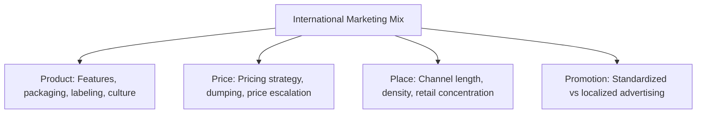
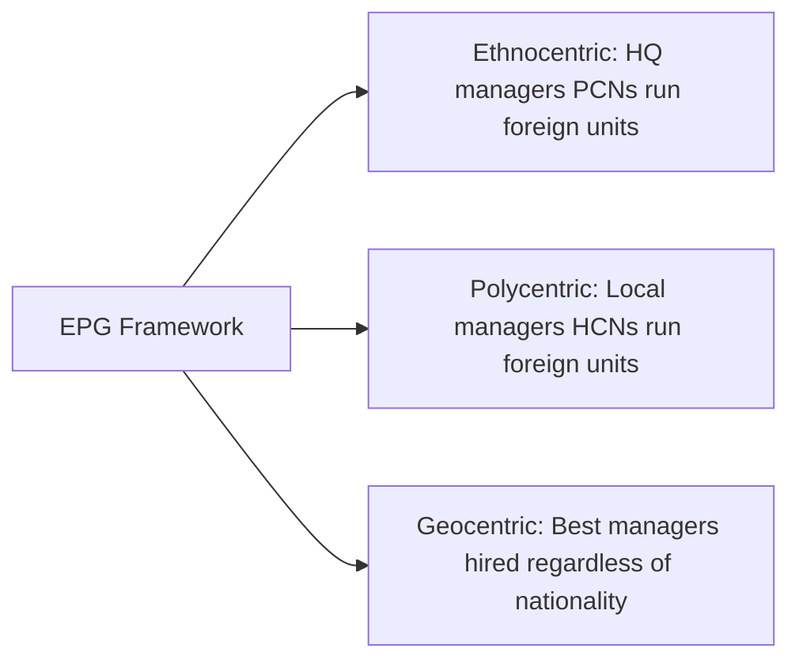
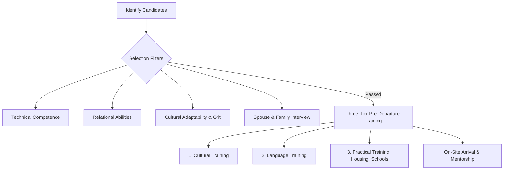

# Unit 6 — Global Marketing and HRM: Master Study Guide

Welcome to the Unit 6 Master Study Guide. This guide covers 100% of the syllabus, written in a clear, structured format to help you master the complexities of Global Marketing, R&D coordination, and Global Human Resource Management (GHRM). It integrates real-world corporate cases (McDonald's & Sony), visual frameworks, current trends, and a solved question bank.

---

## 📌 Table of Contents
1. [Core Lectures: Concept Explanations](#1-core-lectures-concept-explanations)
   - [Global Marketing: Standardization vs. Adaptation](#global-marketing-standardization-vs-adaptation)
   - [The International Marketing Mix (4Ps)](#the-international-marketing-mix-4ps)
   - [Global R&D and New Product Development](#global-rd-and-new-product-development)
   - [Global Human Resource Management (GHRM)](#global-human-resource-management-ghrm)
   - [Staffing Policies: The EPG Framework](#staffing-policies-the-epg-framework)
   - [Expatriate Management & Repatriation](#expatriate-management--repatriation)
2. [Solved Corporate Case Studies](#2-solved-corporate-case-studies)
   - [Case 1: McDonald's Glocal Marketing Mix in India](#case-1-mcdonalds-glocal-marketing-mix-in-india)
   - [Case 2: Sony's Geocentric GHRM Strategy](#case-2-sonys-geocentric-ghrm-strategy)
3. [Rapid Revision Cheat Sheet](#3-rapid-revision-cheat-sheet)
   - [EPG Staffing Policies Comparison Table](#epg-staffing-policies-comparison-table)
   - [Standardization vs. Adaptation Pros & Cons](#standardization-vs-adaptation-pros--cons)
4. [Exam Practice Q&A Bank](#4-exam-practice-qa-bank)
   - [2-Mark Short Compulsory Questions](#2-mark-short-compulsory-questions)
   - [5-Mark Medium-Length Questions](#5-mark-medium-length-questions)
   - [10-Mark Long/Analytical Questions (Topper Answers)](#10-mark-longanalytical-questions-topper-answers)

---

## 1. Core Lectures: Concept Explanations

### Global Marketing: Standardization vs. Adaptation

MNCs must decide how to position their brand internationally:
-  **Standardization**: Selling the exact same product, using the same advertising campaign and distribution channels, in all global markets (e.g., Apple iPhone, Coca-Cola branding).
   - *Pros*: Massive cost savings due to economies of scale in manufacturing and marketing; consistent global brand image.
   - *Cons*: Ignores local cultural tastes, religious beliefs, and varying purchasing power.
-  **Adaptation**: Modifying the marketing mix (the 4Ps) to match the unique cultural, economic, and legal characteristics of each host country (e.g., McDonald's selling vegetarian items in India).
   - *Pros*: Higher customer satisfaction; easier entry into highly competitive markets.
   - *Cons*: High costs of product redesign, separate production lines, and localized advertising.

---

### The International Marketing Mix (4Ps)



1.  **Product**: Adapting product design to match local norms.
    - *Cultural factors*: Restricting ingredients (e.g., no beef in India).
    - *Economic factors*: Offering smaller packaging sizes (sachet packs) in developing countries to make items affordable.
2.  **Price**:
    - *Price Discrimination*: Charging different prices for the same product in different countries based on local demand elasticity.
    - *Dumping*: Selling goods in a foreign market below their cost of production to drive out local rivals.
    - *Price Escalation*: Exporters face higher prices in foreign markets due to transport costs, tariffs, and distribution margins.
3.  **Place (Distribution)**:
    - *Retail Concentration*: In concentrated systems (e.g., US), a few large retailers dominate. In fragmented systems (e.g., India), thousands of small mom-and-pop shops (*Kirana* stores) dominate.
    - *Channel Length*: The number of intermediaries between the producer and consumer. Fragmented retail systems require long distribution channels.
4.  **Promotion (Communication)**:
    - Choosing between standardized global advertisements and localized campaigns (translating slogans, hiring local actors).

---

### Global R&D and New Product Development

R&D is the engine of value creation. In the modern era, R&D is decentralized into global centers:
- **Location factors**: Establish R&D centers where specialized talent is concentrated (e.g., Silicon Valley for software, Germany for automotive engineering).
- **Managing Teams**: Successful product development requires integrating R&D, Marketing, and Production teams. This prevents designing products that are too expensive to manufacture (Production mismatch) or that consumers do not want (Marketing mismatch).

---

### Global Human Resource Management (GHRM)

Human resources are critical to executing global strategies. GHRM deals with managing employees across international borders.

#### Staffing Terminology
- **Parent-Country Nationals (PCNs)**: Employees from the country where the MNC's headquarters is located (e.g., a German manager working at a BMW plant in India).
- **Host-Country Nationals (HCNs)**: Employees from the local country where the subsidiary is operating (e.g., an Indian engineer working at a BMW plant in India).
- **Third-Country Nationals (TCNs)**: Employees from a country that is neither the HQ country nor the host country (e.g., a French manager working at a BMW plant in India).

---

### Staffing Policies: The EPG Framework

MNCs select key managers based on three strategic orientations:



1.  **Ethnocentric Staffing**:
    - *Rule*: Key management positions in foreign subsidiaries are filled by PCNs.
    - *Why*: Believes host-country managers lack the skills to run the business; helps maintain corporate culture.
    - *Flaw*: Creates resentment among local staff; leads to cultural myopia (inability to adapt to local culture).
2.  **Polycentric Staffing**:
    - *Rule*: HCNs manage foreign subsidiaries, while PCNs hold key positions at corporate headquarters.
    - *Why*: Local managers understand host-country culture, language, and legal frameworks.
    - *Flaw*: Creates a gap between headquarters and subsidiaries; limits career growth for local managers.
3.  **Geocentric Staffing**:
    - *Rule*: The best people are sought for key jobs throughout the MNC, regardless of nationality.
    - *Why*: Builds a global cadre of managers; aligns with a Transnational strategy.
    - *Flaw*: Highly expensive due to immigration visas, relocation costs, and global salary standardization.

---

### Expatriate Management & Repatriation

#### Expatriate Failure
An expatriate (expat) is a PCN or TCN sent to work in a foreign subsidiary. **Expatriate Failure** is the premature return of an expat to their home country. 
- *Primary Cause*: The inability of the spouse/family to adjust to the foreign culture, followed by the manager's own inability to adapt.

#### Repatriation
This is the process of reintegrating an expatriate manager back into the home-country operations of the firm. 
- *The Problem*: Many firms fail at repatriation. Expat managers return to find they have been demoted, their new global skills are ignored, or their previous roles have been filled, leading to high turnover.

---

## 2. Solved Corporate Case Studies

### Case 1: McDonald's Glocal Marketing Mix in India

**Background**: When McDonald's entered India, it faced massive cultural and religious challenges. Over 80% of the population is Hindu (does not consume beef), and over 10% is Muslim (does not consume pork). 

**The Response (4Ps Adaptation)**:
-  **Product**: McDonald's eliminated beef and pork. It developed localized menu items: the **McAloo Tikki** (potato-based patty) and **Maharaja Mac** (chicken-based double decker). It also split its kitchens into strict veg and non-veg sections.
-  **Price**: Since India is a price-sensitive market, McDonald's launched the "Happy Price Menu" to make meals affordable for students and middle-class families.
-  **Place**: Partnered with local cold chain suppliers to source lettuce and potatoes locally, bypassing import costs.
-  **Promotion**: Leveraged advertising focused on family celebrations, using slogans like *"Har Choti Khushi Ka Jashn"* (Celebrating every small joy).

---

### Case 2: Sony's Geocentric GHRM Strategy

**Background**: Sony Corporation transitioned from a traditional Japanese-managed firm to a global entity, hiring its first non-Japanese CEO (Howard Stringer) in 2005.

**The Action**: Sony implemented a geocentric staffing policy. It set up global talent boards to identify high-potential managers in the US, Europe, and Asia, and rotated them through headquarters in Tokyo. 

**Key Takeaways**:
- Illustrates how geocentric staffing breaks down the "bamboo ceiling" (where foreign managers cannot reach Japanese corporate heights).
- Highlights that geocentric staffing facilitates global knowledge sharing.

---

## 3. Rapid Revision Cheat Sheet

### EPG Staffing Policies Comparison Table

| Staffing Policy | Who Fills Key Roles? | Key Advantage | Key Disadvantage | Strategy Fit |
| :--- | :--- | :--- | :--- | :--- |
| **Ethnocentric** | PCNs (HQ citizens) | Protects core corporate culture | Cultural myopia; local resentment | International |
| **Polycentric** | HCNs (Local citizens) | High cultural & language alignment | Headquarters-subsidiary isolation | Localization |
| **Geocentric** | Anyone (Best candidate) | Builds a global management cadre | Very high cost; visa barriers | Transnational |

---

### Standardization vs. Adaptation Pros & Cons

- **Standardization**:
  - *Pros*: Economies of scale, lower R&D costs, brand consistency.
  - *Cons*: Risk of cultural rejection, ignores varying local incomes.
- **Adaptation**:
  - *Pros*: High local market share, regulatory compliance, customer trust.
  - *Cons*: High unit costs, complex global operations, fragmented brand.

---

## 4. Exam Practice Q&A Bank

### 2-Mark Short Compulsory Questions

#### Q1. Define 'Expatriate Failure'.
*   **Topper's Answer**: Expatriate failure is the premature return of an expatriate manager to their home country due to poor performance or inability of the manager or their family to adjust to the foreign cultural environment.

#### Q2. What is the difference between PCNs and HCNs?
*   **Topper's Answer**: 
    - **PCNs (Parent-Country Nationals)** are citizens of the country where the MNC's headquarters is located.
    - **HCNs (Host-Country Nationals)** are citizens of the country where the local subsidiary is operating.

#### Q3. Explain 'Price Escalation' in international marketing.
*   **Topper's Answer**: Price escalation is the increase in a product's retail price when sold in foreign markets, caused by additional expenses like tariffs, shipping costs, and margins for international distributors.

#### Q4. What is 'Repatriation'?
*   **Topper's Answer**: Repatriation is the process of bringing an expatriate manager back to their home country organization after their foreign assignment is completed.

---

### 5-Mark Medium-Length Questions

#### Q5. Explain the three main staffing policies defined by the EPG framework.
*   **Topper's Answer**:
    The EPG framework, developed by Howard Perlmutter, categorizes MNC staffing strategies into three types:
    1.  **Ethnocentric**: Key subsidiary roles are held by Parent-Country Nationals (PCNs). This is used when the firm believes host-country managers lack technical competencies or to transfer core corporate culture.
    2.  **Polycentric**: Host-Country Nationals (HCNs) manage the local subsidiaries, while PCNs occupy roles at HQ. This ensures the business is managed by people who understand the local culture and regulatory environment.
    3.  **Geocentric**: Hires the best candidate for key roles regardless of their nationality. This builds a global talent pool but is highly complex and costly to manage.

```
                    [EPG Staffing Policies]
                               │
         ┌─────────────────────┼─────────────────────┐
         ▼                     ▼                     ▼
   [Ethnocentric]        [Polycentric]         [Geocentric]
     (PCNs Rule)          (HCNs Rule)        (Best Person Wins)
```

---

#### Q6. Differentiate between Marketing Standardization and Marketing Adaptation.
*   **Topper's Answer**:
    
    | Parameter | Marketing Standardization | Marketing Adaptation |
    | :--- | :--- | :--- |
    | **Product** | Identical product features globally. | Custom features based on local tastes. |
    | **Cost Structure** | Low unit cost (Economies of scale). | High unit cost (Design & setup costs). |
    | **Brand Image** | Unified, globally consistent. | Varied, locally customized. |
    | **Risk** | High risk of market rejection. | Lower risk due to local alignment. |
    | **Example** | Apple iPhone positioning. | McDonald's India veg menu. |

*Strategic Summary*: Standardization maximizes cost efficiency and brand unity, while adaptation maximizes market responsiveness and consumer satisfaction.

---

### 10-Mark Long/Analytical Questions (Topper Answers)

#### Q7. Critically evaluate the causes of Expatriate Failure in Multinational Enterprises. How can organizations structure their selection and training programs to minimize this failure rate?

**Topper's Answer**:

##### 1. Introduction
Sending managers on foreign assignments (expatriation) is vital for MNCs to transfer knowledge, build international controls, and develop global leaders. However, the failure rate of expatriates is high, ranging from 15% to 40%, costing firms billions in relocation fees and lost operations.

##### 2. Primary Causes of Expatriate Failure
Research (such as Tung's studies) indicates the primary causes of failure:
1.  **Spouse/Family Adjustment (Ranked #1)**: The inability of the manager’s spouse or children to adapt to the new language, climate, school systems, and social environments.
2.  **Manager's Inability to Adjust**: The manager faces "culture shock," leading to stress and operational mistakes.
3.  **Lack of Emotional Maturity**: The manager lacks empathy or cultural sensitivity, alienating local staff.
4.  **Overwhelming Responsibilities**: The manager struggles with the increased scale of running a foreign subsidiary without local networks.

##### 3. Strategic Selection & Training Process (Mermaid Flow)


##### 4. Minimizing Failure: Strategic Solutions
To minimize failure, MNCs must reform their Selection and Training practices:

###### A. Selection Criteria (Beyond Technical Skills)
Firms must stop selecting expats based *only* on their technical performance in the home country. Selection must evaluate:
- **Cultural Adaptability**: Willingness to learn new behaviors and respect local norms.
- **Relational Skills**: Ability to build relationships with host-country nationals.
- **Family Readiness**: Interviewing the spouse to assess their adaptability.

###### B. Pre-Departure Training (Three Tiers)
1.  **Cultural Training**: Educating the expat and family on the host country's history, values, and work culture (e.g., teaching them about hierarchical corporate norms in Japan).
2.  **Language Training**: Basic conversational fluency helps the manager and family build local connections.
3.  **Practical Training**: Helping the family find housing, schools, and bank accounts, resolving everyday stressors.

###### C. Post-Arrival Support & Mentorship
Assigning a host-country mentor to guide the expat through local customs, and maintaining communication with the home office to guarantee career path security upon return (Repatriation planning).

##### 5. Conclusion
Expatriate success requires viewing the assignment as a holistic transition. By investing in family-centric selection and pre-departure training, MNCs can drastically reduce expat failure rates and build competitive global teams.
